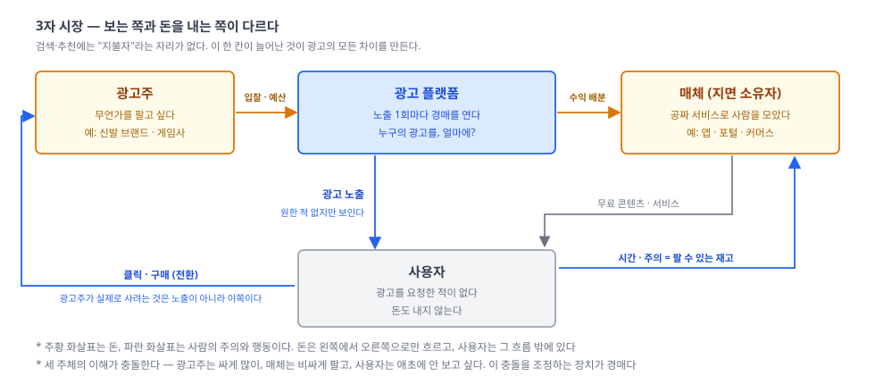
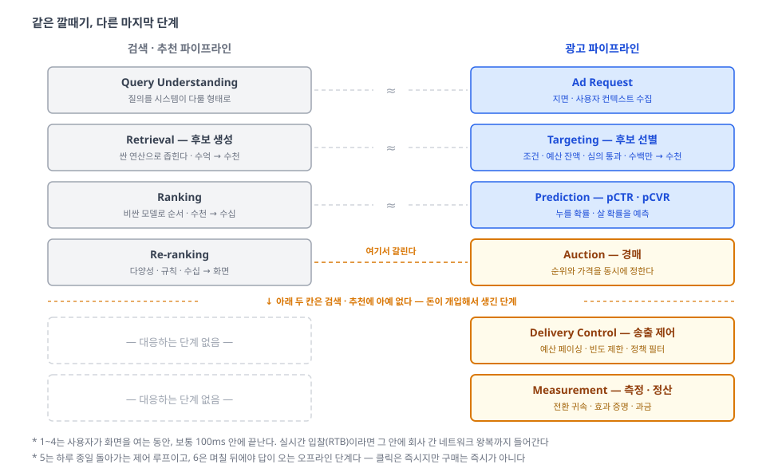
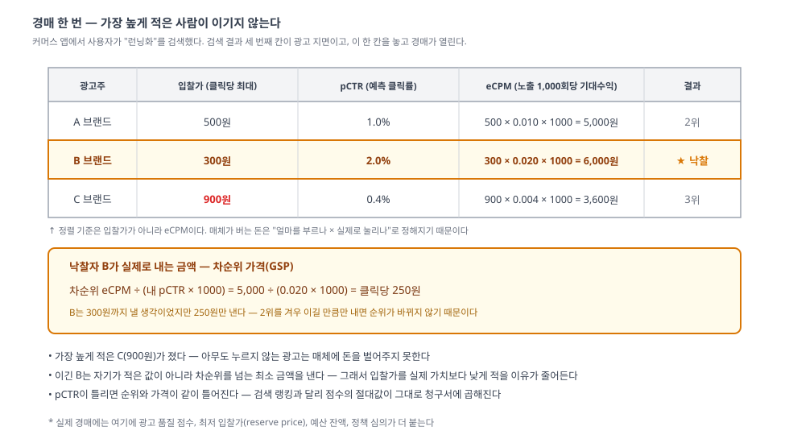
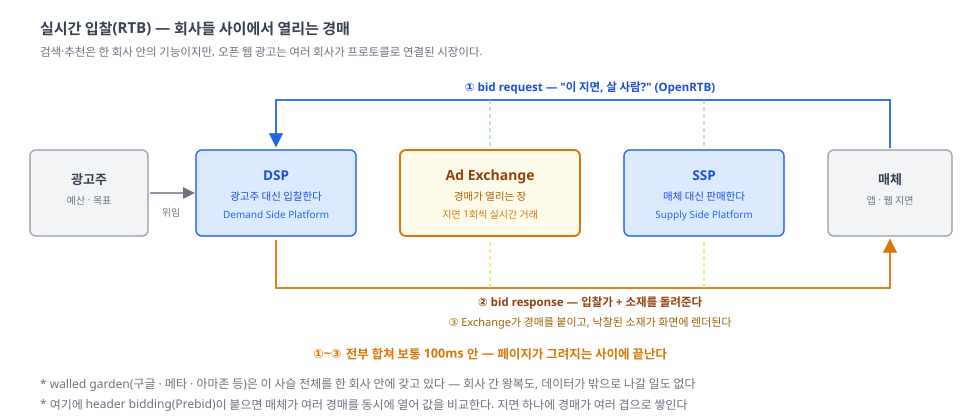

이 글은 **Advertising** 시리즈의 출발점입니다. 특정 플랫폼(Google Ads 등)의 사용법이 아니라, 광고 시스템을 이루는 각 단계의 개념 — 무엇을 하는가, 왜 필요한가, 무엇이 어려운가 — 을 정리합니다.

이 시리즈는 [Search](../../search/overview/)·[Recommendation](../../recommendation/overview/)와 **같은 깔때기 위에 서 있다**. 그래서 여기서는 파이프라인을 처음부터 다시 설명하지 않고, **돈이 얹히면 무엇이 더 붙는가**를 중심으로 쓴다.

## 1. 왜 필요한가?
- **배경(공짜 서비스의 청구서)**: 앱과 포털은 사용자에게 돈을 받지 않는다. 그런데 서버비와 인건비는 나간다. 한편 광고주는 자기 상품을 **아직 모르는 사람**을 찾아야 하는데, 그 사람이 어디 있는지 모른다. 사람이 모여 있는 곳과 돈을 낼 사람이 따로 있다
- **해결책(광고 시스템)**: 화면의 한 칸, 즉 **노출 1회를 상품으로 만들어** 요청이 들어올 때마다 즉석에서 판다. 누구의 광고를 보여줄지, 얼마를 받을지를 매번 **경매**로 정하는 시스템
- **검색·추천과의 관계**: 검색은 의도가 질의에 담겨 있고, 추천은 그 의도를 추측한다. 둘 다 **의도의 주인은 사용자**다. 광고는 다르다 — **요청한 쪽은 사용자가 아니라 광고주**이고, 그 요청에는 돈이 붙어 있다. 그래서 문제가 "무엇이 관련 있나"에서 **"누구의 것을, 얼마에 보여줄까"** 로 옮겨간다

- 사용자만 **아무 대가도 지불하지 않는다**. 대신 시간과 주의를 낸다 — 그리고 그 주의가 곧 매체가 파는 재고다
- 그래서 광고 시스템의 목적함수는 한 줄로 안 끝난다. `매체 수익을 최대화하되, 사용자가 떠나지 않고, 광고주가 손해 보지 않게` — **세 주체의 제약을 동시에 만족시켜야 한다**
- 사용자가 떠나면 재고가 사라지고, 광고주가 손해를 보면 예산이 빠진다. 어느 쪽도 단기 수익을 위해 갈아 넣을 수 없다는 것이 이 판의 구조적 긴장이다

세 시스템을 나란히 놓으면 차이가 선명해진다.

| | Search | Recommendation | **Advertising** |
|---|---|---|---|
| 누가 원했나 | 사용자 (질의로 명시) | 사용자 (추측) | **광고주 (돈으로 명시)** |
| 목적 | 관련성 | 만족·체류 | **수익 · 광고주 성과 · 사용자 이탈 억제** |
| 마지막 단계 | Re-ranking | Re-ranking | **경매 (순위 + 가격)** |
| 점수의 성격 | 순서만 맞으면 됨 | 순서만 맞으면 됨 | **절대값이 가격에 곱해짐** |
| 틀렸을 때 비용 | 나쁜 결과 | 안 누름 | **잘못된 청구 · 예산 이탈** |

**이 시리즈의 범위** — 여기서 다루는 것은 **노출 1회마다 값이 정해지는 광고**다. 아래에 해당하면 이 시리즈의 구조는 과하거나 아예 필요 없다.

- **예약형·보장형 판매(guaranteed)** — 가격과 물량이 미리 계약으로 정해져 있다. 경매가 없으니 문제는 "누구에게 팔까"가 아니라 **약속한 물량을 기간 안에 채우는 배분(delivery)** 이 된다
- **자체 프로모션·고정 배너** — 후보가 하나거나 사람이 손으로 정한다. 순위도 가격도 물을 이유가 없다
- **TV·옥외 같은 매스미디어** — 노출 한 건씩 의사결정하지 않는다. 개별 요청이 없으므로 실시간 시스템 자체가 성립하지 않는다

## 2. 무엇을 재료로 쓰는가?
- **지면(impression)**: 광고 한 칸이 노출될 기회 한 번. 재고인데 **썩는 재고**다 — 사용자가 화면을 지나가면 그 기회는 영영 사라진다. 그래서 "안 팔리면 재고로 남기는" 선택지가 없고, 매번 무조건 뭔가를 채워야 한다
- **사용자 컨텍스트**: 지금 보고 있는 페이지, 검색어, 기기, 시간대, 과거 행동. 검색·추천이 쓰는 것과 같은 재료지만 — **개인정보 규제가 직접 겨냥하는 재료**이기도 하다
- **광고주 캠페인**: 소재(이미지·문구), 타겟팅 조건, 입찰가, 예산, 목표(클릭인가 구매인가). 여기서 **입찰가**가 검색·추천에 없던 신호다 — 광고주가 스스로 매긴 가치
- **상호작용 로그**: 노출 → 클릭 → 전환. 클릭은 1초 뒤에 오지만 **구매는 3일 뒤에 온다**. 이 시차가 학습을 어렵게 만든다
- **돈과 예산**: 다른 시스템에 없는 재료. 예산은 **쓰면 줄어드는 상태값**이다. 같은 광고가 오전에는 후보였다가 오후에는 후보에서 빠진다 — 시스템이 **상태를 가진다**는 뜻이고, 이게 생각보다 큰 차이다

## 3. 구성 요소

### 파이프라인 — 검색의 깔때기가 그대로 온다

| 단계 | 역할 | 규모 |
|---|---|---|
| Ad Request (요청) | 어떤 지면인지, 누가 보고 있는지 수집 | 요청 1건 |
| Targeting (후보 선별) | 타겟 조건·예산 잔액·심의 통과 여부로 거른다 | 수백만 → 수천 |
| Prediction (예측) | 이 사람이 이 광고를 누를 확률(pCTR)·살 확률(pCVR) | 수천 |
| Auction (경매) | eCPM으로 순위를 세우고 **낙찰가까지 정한다** | 수천 → 화면의 1~3칸 |
| Delivery Control (송출 제어) | 예산 페이싱·빈도 제한·정책 필터 | 상시 |
| Measurement (측정) | 전환 귀속·효과 증명·정산 | 사후 (며칠) |

- 위 네 단계까지는 검색과 **구조가 같다**. Targeting은 Retrieval이고, Prediction은 Ranking이다. "싸게 많이 거르고, 비싸게 조금 정렬한다"는 원리도 그대로다
- 갈라지는 곳은 **네 번째 칸**이다. 검색의 Re-ranking은 목록의 **순서만** 바꾸지만, 광고의 Auction은 순서를 정하면서 **동시에 가격을 정한다**. 랭킹 함수가 곧 가격 결정 함수라는 것 — 이게 광고 기술의 출발점이다
- 그리고 **다섯째·여섯째 칸이 통째로 추가된다**. 예산은 지켜야 하고(5), 돈을 받았으니 효과를 증명해야 한다(6). 검색·추천에는 이 두 단계에 대응하는 것이 없다

### 경매 — 순위와 가격을 함께 정한다는 것

말로 하면 추상적이니 숫자로 보자. 커머스 앱 검색 결과의 광고 칸 하나를 놓고 세 광고주가 붙었다.

- **정렬 기준이 입찰가가 아니다.** 매체가 실제로 버는 돈은 `입찰가 × 눌릴 확률`이기 때문이다. 클릭당 900원을 부른 C는 아무도 안 누르는 광고라서 3위로 밀린다 — **돈만으로는 이길 수 없는 구조**이고, 이것이 사용자 경험을 지키는 첫 번째 장치다
- **이긴 사람이 자기가 적은 값을 내지 않는다.** B는 300원을 적었지만 250원만 낸다. 2위를 겨우 넘는 만큼만 내도 순위는 그대로이기 때문이다(**차순위 가격, GSP**). 그래서 광고주는 "얼마까지 낼 의향이 있나"를 그대로 적어도 손해 보지 않는다 — 입찰을 눈치싸움에서 **가치 신고**로 바꾸는 설계다
- 여기서 **pCTR의 성격이 검색과 달라진다.** 검색 랭킹의 점수는 순서만 맞으면 되고 절대값은 무의미하다. 그런데 위 식에서 pCTR은 **가격에 직접 곱해진다**. 2%를 4%로 잘못 예측하면 순위도 틀리고 청구액도 틀린다
- 그래서 광고 CTR 모델의 1급 요구사항은 정확도(AUC)가 아니라 **보정(calibration)** 이다 — "예측 3%인 광고들을 모아 보면 실제로도 3%가 눌리는가". 검색·추천 글에서는 나올 이유가 없던 개념이 여기서는 시스템의 중심에 온다

### 그런데 이 파이프라인을 한 회사가 다 돌리지 않는다

검색·추천은 한 회사 안의 **기능**이다. 광고는 회사들 사이의 **시장**이다. 이 차이가 산업 구조를 만든다.

- 사용자가 앱을 여는 순간, 매체는 "이 지면 살 사람?"을 **밖으로 물어본다**(bid request). 여러 DSP가 각자 입찰가를 돌려주고, Exchange가 경매를 붙이고, 낙찰된 소재가 화면에 그려진다
- 이 전부가 **100ms 안**에 끝나야 한다. 검색도 지연 예산이 빡빡하지만, 광고는 그 예산 안에 **다른 회사와의 네트워크 왕복**까지 넣어야 한다 — 내가 제어할 수 없는 구간이 지연 예산에 포함된다는 뜻이다
- 그래서 실무에서 "느린 DSP는 그냥 버린다"(timeout)가 정상 동작이다. 경매에 참여 못 한 입찰은 없었던 것으로 친다
- 판은 크게 둘로 갈린다. **오픈 웹**은 위 그림처럼 여러 회사가 프로토콜로 붙는 구조이고, **walled garden**(구글·메타·아마존 등)은 사슬 전체를 한 회사가 갖는다. 데이터가 밖으로 안 나가니 측정도 타겟팅도 유리하다 — 프라이버시 규제가 강해질수록 이쪽이 상대적으로 강해진 이유다
- 최근 가장 빠르게 커지는 쪽은 **리테일 미디어**(커머스가 자사 지면에 광고를 파는 형태)다. 이미 검색·추천 시스템과 구매 데이터를 가진 회사가 그 위에 **경매·예산·측정 축만 얹으면** 되기 때문에 진입 경로가 짧다

## 4. 시리즈 로드맵 — 네 개의 축
파이프라인은 "**어디서** 일어나나" 한 축을 나눈 것이다. 경매 이론·보정·귀속 같은 주제들은 이 축의 7번째 항목이 아니라, **다른 축**에 놓인다.

| 축 | 답하는 질문 | 편 |
|---|---|---|
| 시장 설계 | 노출 1회를 어떻게 파나 | Auction (GSP · VCG · First-price · Reserve) |
| 예측 | 이 노출은 얼마짜리인가 | CTR/CVR Prediction, Calibration, 지연 피드백 |
| 제약 최적화 | 예산과 목표를 어떻게 지키나 | Bidding & Pacing (autobidding · tCPA/tROAS · 빈도 제한) |
| 측정 | 효과가 진짜 있었나 | Attribution, Incrementality, 프라이버시 이후의 측정 |

- **시장 설계** 축은 검색·추천에 대응물이 아예 없는 축이다. 어떤 규칙으로 값을 받느냐에 따라 광고주의 **행동 자체가 바뀐다** — 1등가로 받으면 다들 값을 낮춰 적고(shading), 차순위로 받으면 정직하게 적는다. 알고리즘이 아니라 **게임의 규칙**을 설계하는 문제다
- **예측** 축은 검색의 Ranking과 재료는 같지만 요구사항이 다르다. 순서가 아니라 **절대값**이 맞아야 하고(보정), 정답이 며칠 뒤에 도착하며(지연 피드백), 전환은 노출 만 건에 몇 건 나올까 말까 한 **극단적 불균형** 데이터다
- **제약 최적화** 축은 "가장 좋은 광고"가 아니라 "**예산 안에서** 가장 좋은 광고"를 고르는 문제다. 오전에 예산을 다 태우면 오후의 좋은 트래픽을 통째로 놓친다. 요즘은 광고주가 입찰가를 직접 적지 않고 목표(전환당 5,000원)만 주면 시스템이 대신 입찰하는 **자동입찰**이 기본값이라, 이 축이 사실상 광고 최적화의 본체가 됐다
- **측정** 축은 광고에서 유난히 무거운데, **돈을 받았기 때문**이다. 추천은 "A/B로 클릭률이 올랐다"로 충분하지만, 광고는 **"광고를 안 봤어도 어차피 샀을 사람"** 을 걷어내야 한다. 이걸 재는 것이 증분 효과(incrementality)이고, 3자 쿠키 종료·ATT 이후로는 그 측정 자체가 다시 어려워졌다

## 5. 구체적 사례 — 노출 한 번에 무슨 일이 벌어지나
사용자가 커머스 앱에서 `"런닝화"`를 검색했다. 결과 세 번째 칸이 광고다.

1. **요청**: 앱이 "이 사용자에게 보여줄 광고 하나 줘"라고 부른다. 함께 실려 가는 것은 지면 정보(검색 결과 3번째, 모바일), 검색어, 대략의 사용자 정보 — **여기까지 걸린 시간 0ms**
2. **후보 선별**: 전체 캠페인 300만 개 중 조건에 맞는 것만 남긴다. "런닝화 키워드", "20~30대", "오늘 예산 남음", "심의 통과" → **3,200개**
3. **예측**: 3,200개 각각에 대해 이 사람이 누를 확률을 예측한다. 최근 이 사용자가 러닝 관련 상품을 여러 번 봤다면 러닝화 광고의 pCTR이 올라간다
4. **경매**: `입찰가 × pCTR`로 정렬해 1위를 뽑고, 2위를 겨우 이기는 금액으로 과금액을 정한다 → **낙찰: B 브랜드, 클릭당 250원**
5. **송출 제어**: 그런데 이 사용자는 오늘 B 광고를 이미 5번 봤다. 빈도 제한에 걸려 **탈락**, 2위가 대신 나간다
6. **렌더**: 소재가 화면에 그려진다. **여기까지 100ms**
7. **로그**: 노출이 기록된다. 사용자가 누르면 클릭이 기록되고, 광고주는 그 순간 과금된다
8. **전환**: 사용자가 **3일 뒤** 그 신발을 산다. 시스템은 이 구매를 3일 전의 클릭에 연결해야 한다 — **귀속(attribution)**
9. **정산과 학습**: 이 전환이 학습 데이터로 돌아가 pCVR 모델을 갱신하고, 광고주 리포트의 ROAS를 바꾼다

### 왜 한 단계로는 안 되는가
1. **타겟팅만 있으면**: 조건에 맞는 광고가 3,200개다. 그중 뭘 보여줄지 정하지 못한다 → **예측·경매**가 필요
2. **입찰가 높은 순으로만 세우면**: 아무도 안 누르는 광고가 이겨서 매체 수익이 오히려 **줄어든다** → `입찰가 × pCTR`(eCPM)로 세워야 하는 이유
3. **pCTR이 부풀면**: 그 광고가 부당하게 이기고, 실제로는 안 눌려 매체도 광고주도 손해다 → **보정(calibration)**
4. **1등가로 청구하면**: 광고주는 진짜 가치보다 낮게 적는 게 이득이 되어 입찰이 눈치싸움이 된다 → **차순위 가격(GSP)** 같은 시장 설계
5. **예산을 무시하면**: 오전 10시에 하루치를 다 태우고, 정작 구매가 몰리는 저녁에 광고가 사라진다 → **페이싱**
6. **같은 광고를 20번 보여주면**: 클릭률이 떨어지는 정도가 아니라 사용자가 앱을 떠난다 → **빈도 제한**
7. **클릭만 세면**: 클릭은 늘었는데 매출은 그대로일 수 있다. 봇이 눌렀거나, 어차피 살 사람이 눌렀거나 → **전환 귀속과 증분 효과**

- 검색이 그랬듯 광고도 **한 단계가 앞 단계의 결과 안에서만** 일한다. 후보 선별에서 빠진 캠페인은 아무리 좋아도 나가지 못한다
- 다만 검색과 결정적으로 다른 것은 **되먹임의 대상**이다. 검색에서 잘못된 랭킹은 나쁜 결과 하나로 끝나지만, 광고에서 잘못된 예측은 **잘못된 가격**이 되어 광고주의 예산 배분을 바꾸고, 그 예산이 다시 다음 경매의 입력이 된다. 시스템이 시장을 만들고, 시장이 다시 시스템의 입력이 되는 구조다

## 6. 링크
- 시장 설계 · 경매
  - [Internet Advertising and the Generalized Second-Price Auction (Edelman, Ostrovsky & Schwarz, 2007)](https://www.aeaweb.org/articles?id=10.1257/aer.97.1.242) — GSP의 원 논문
  - [Position Auctions (Varian, 2007)](https://people.ischool.berkeley.edu/~hal/Papers/2006/position.pdf)
  - [Vickrey auction — Wikipedia](https://en.wikipedia.org/wiki/Vickrey_auction) — 차순위 가격의 원형
- 예측 · 보정
  - [Ad Click Prediction: a View from the Trenches (McMahan et al., KDD 2013)](https://research.google/pubs/pub41159/) — 구글 광고 CTR 시스템의 실무 보고서
  - [Practical Lessons from Predicting Clicks on Ads at Facebook (He et al., ADKDD 2014)](https://research.facebook.com/publications/practical-lessons-from-predicting-clicks-on-ads-at-facebook/)
  - [Modeling Delayed Feedback in Display Advertising (Chapelle, KDD 2014)](https://dl.acm.org/doi/10.1145/2623330.2623634) — 전환이 늦게 오는 문제
- 측정 · 증분 효과
  - [Ghost Ads: Improving the Economics of Measuring Online Ad Effectiveness (Johnson, Lewis & Nubbemeyer, 2017)](https://www.journals.uchicago.edu/doi/10.1509/jmr.15.0297)
  - [Attribution (marketing) — Wikipedia](https://en.wikipedia.org/wiki/Attribution_(marketing))
- 산업 구조 · 프로토콜
  - [OpenRTB Specification — IAB Tech Lab](https://iabtechlab.com/standards/openrtb/) — bid request/response 스펙
  - [Prebid.js Documentation](https://docs.prebid.org/) — header bidding
  - [Real-time bidding — Wikipedia](https://en.wikipedia.org/wiki/Real-time_bidding)
- 프라이버시
  - [Privacy Sandbox](https://privacysandbox.com/) — Topics, Protected Audience API
  - [SKAdNetwork — Apple Developer](https://developer.apple.com/documentation/storekit/skadnetwork)

## 참고
- 이 시리즈는 [Search](../../search/overview/)·[Recommendation](../../recommendation/overview/) 시리즈와 짝을 이룬다. 그쪽이 "무엇을 보여줄까"를 다룬다면, 이 시리즈는 그 위에 **"누구의 것을, 얼마에"** 를 얹는다
- 특히 Search의 [Re-ranking](../../search/re-ranking/) 편에서 비즈니스 규칙 항목으로 스쳐 지나간 **광고 슬롯**이, 이 시리즈에서는 시스템 하나로 열린다
- Recommendation의 밴딧·탐색이 다룬 **피드백 루프** 문제는 광고에서 더 날카롭게 나타난다. 노출되지 않은 광고는 데이터가 없고, 데이터가 없으니 pCTR이 낮게 예측되어 계속 노출되지 않는다 — 게다가 그 광고에는 **돈을 낸 사람이 붙어 있다**
