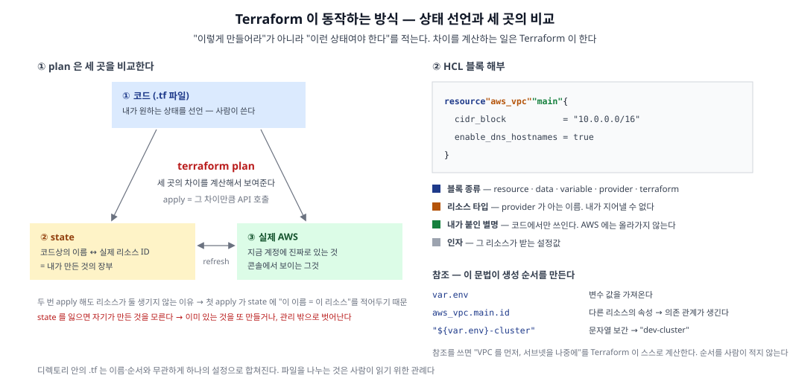

인프라 코드를 읽기 전에 도구 자체를 먼저 본다. `resource` 블록 하나를 읽으려면 **HCL 문법**과 **state** 라는 개념이 먼저 필요하다.



## 1. 정의

- **IaC(Infrastructure as Code)**: 인프라를 콘솔 클릭이 아니라 코드로 선언해 관리하는 방식. 코드 리뷰로 변경을 검증하고, git 히스토리가 곧 변경 이력이 되고, 같은 코드로 다른 환경을 복제할 수 있다
- **Terraform**: 원하는 인프라 상태를 코드로 선언하면 **실제 상태와의 차이를 계산해 API 호출로 맞춰주는** 도구
- **핵심은 "절차"가 아니라 "상태"를 적는다는 것**

|구분|스크립트 (절차)|Terraform (상태)|
|---|---|---|
|적는 내용|"VPC 를 만들어라"|"VPC 가 있어야 한다"|
|두 번 실행|VPC 가 2개 생김|아무 일도 일어나지 않음|
|이미 있을 때|중복 생성 또는 에러|차이 없음으로 판단|
|지울 때|삭제 명령을 따로 작성|코드에서 블록을 지우면 됨|

- 두 번 실행해도 결과가 같은 이 성질을 **멱등성(idempotency)** 이라 한다. Terraform 의 거의 모든 설계가 여기서 나온다
- **멱등성이 가능한 이유가 state** 다. Terraform 은 세 곳을 비교한다

|무엇|정체|누가 만드나|
|---|---|---|
|① 코드|`.tf` 파일. 원하는 상태|사람이 작성|
|② state|"코드상의 이름 ↔ 실제 리소스 ID" 매핑을 적어둔 JSON|Terraform 이 apply 때 갱신|
|③ 실제 AWS|지금 계정에 진짜로 있는 것|AWS|

- **`plan` = 이 셋의 3자 비교**, **`apply` = 그 차이만큼 API 호출**
- 코드에 `resource "aws_vpc" "main"` 이 하나 있을 때 `apply` 를 두 번 해도 VPC 가 둘 생기지 않는 이유 → 첫 apply 에서 state 에 *"`aws_vpc.main` = 실제 `vpc-0abc…`"* 를 적어두기 때문

## 2. 종류

### 2-1. HCL 블록 — 문법의 90%

`.tf` 파일이 쓰는 언어는 **HCL(HashiCorp Configuration Language)** 이다. 블록 구조 하나만 알면 대부분 읽힌다.

```hcl
resource "aws_vpc" "main" {
  cidr_block           = "10.0.0.0/16"
  enable_dns_hostnames = true

  tags = {
    Name = "example-dev-vpc"
  }
}
```

|위치|이름|의미|
|---|---|---|
|`resource`|블록 종류|무엇에 관한 선언인가|
|`"aws_vpc"`|리소스 타입|provider 가 아는 이름. **내가 지어낼 수 없다**|
|`"main"`|내가 붙인 별명|**코드에서만** 쓰인다. AWS 에는 올라가지 않는다|
|`cidr_block = …`|인자(argument)|그 리소스가 받는 설정값|
|`tags = { … }`|블록/맵|중첩된 설정|

- **`"main"` 과 `Name = "example-dev-vpc"` 는 완전히 별개다.** 앞은 코드상의 식별자, 뒤는 AWS 콘솔에 보이는 이름표(태그)

### 2-2. 블록 종류 다섯 개

|블록|의미|지우면|
|---|---|---|
|`terraform`|Terraform 자체 설정 (필요한 provider, 버전, backend)|—|
|`provider`|어디에·어떻게 접속하는가 (계정, 리전, 공통 태그)|리소스를 만들 대상이 없어짐|
|`variable`|바깥에서 값을 받는 빈칸 선언|`var.…` 참조가 에러|
|`resource`|**내가 만들고 관리하는** 것|`apply` 시 **실제로 삭제된다**|
|`data`|**이미 있는 것을 읽기만** 하는 것|참조만 끊김. 실물은 그대로|

- `resource` 와 `data` 의 차이가 초반에 가장 많이 헷갈린다. **`resource` 는 소유, `data` 는 조회**다
- 소유한다는 말은 곧 **코드에서 지우면 실물도 사라진다**는 뜻이다

### 2-3. 참조 — 생성 순서를 만드는 문법

```hcl
var.env                       # 변수 값             → "dev"
aws_vpc.main.id               # 다른 리소스의 속성  → "vpc-0abc…"
"${var.env}-eks-cluster"      # 문자열 보간         → "dev-eks-cluster"
```

- **참조는 값만 가져오는 게 아니라 의존 관계를 만든다**

```hcl
resource "aws_subnet" "public" {
  vpc_id = aws_vpc.main.id     # ← 이 한 줄이 "VPC 먼저, 서브넷 나중"을 결정
}
```

- Terraform 은 참조를 훑어 **의존 그래프**를 만들고 스스로 순서를 정한다. 순서를 사람이 적지 않는다. 서로 의존하지 않는 리소스는 **병렬로** 만든다
- 반대로 **참조 없이 ID 문자열을 직접 적으면 그래프가 끊긴다**. 값은 같아도 Terraform 은 두 리소스가 관계있다는 사실을 모른다
- 참조로 표현할 수 없는 숨은 의존(예: IAM 정책이 반영되어야 다음 리소스가 동작)만 `depends_on` 으로 직접 적는다

### 2-4. 루트 모듈 — 파일을 나누는 기준

- **파일 이름은 Terraform 에 의미가 없다.** 디렉토리 안의 모든 `.tf` 를 이름·순서와 무관하게 읽어 **하나의 설정(루트 모듈)으로 병합**한다
- 따라서 `vpc.tf`, `iam.tf` 같은 분리는 **순수하게 사람이 읽기 위한 관례**다. 한 파일에 다 써도 동작은 같다
- 예외: `terraform.tfvars` 와 `*.auto.tfvars` 는 **이름이 정해진 자동 로드 파일**
- 자주 쓰는 분리 관례

|파일|담는 것|
|---|---|
|`provider.tf`|`terraform` 블록 + `provider` 블록|
|`backend.tf`|state 보관 위치|
|`variables.tf` / `terraform.tfvars`|빈칸 선언 / 값|
|`<도메인>.tf`|`vpc.tf`, `eks.tf`, `iam.tf` … 리소스를 주제별로|

### 2-5. 명령 네 개

```bash
terraform init      # 플러그인 다운로드 + backend(state) 연결   (처음 1회, 설정 바뀌면 다시)
terraform validate  # 문법·참조 관계가 올바른가
terraform plan      # 무엇이 바뀔지 미리 보기
terraform apply     # 실행
```

- 명령마다 **요구하는 것이 다르다**

|명령|변수 값|backend(state)|AWS 자격증명|
|---|---|---|---|
|`fmt`|✗|✗|✗|
|`validate`|✗|✗|✗|
|`providers`|✗|✓|✗|
|`plan`|✓|✓|✓|
|`apply`|✓|✓|✓|

- `validate` 는 **"문법과 참조 관계가 올바른가"만** 본다. 변수 값도, AWS 접속도 요구하지 않는다
- `plan` 부터 실제 AWS 를 읽는다. 그래서 자격증명과 state 가 필요하다
- **`apply` 전에 `plan` 을 읽는 것이 IaC 의 안전장치다.** diff 에 `destroy` 가 섞여 있는지 확인하는 습관이 사고를 막는다

## 3. 대안

- **콘솔·스크립트 vs 선언형 도구**

|구분|콘솔 클릭|CLI 스크립트|Terraform|
|---|---|---|---|
|현재 구성 파악|아무도 모름|코드를 읽어 추론|코드가 곧 현재 구성|
|변경 이력|없음|git 히스토리(절차만)|git 히스토리(상태)|
|환경 복제|수동 반복|스크립트 수정|변수만 교체|
|삭제|수동|삭제 스크립트 별도 작성|블록 제거|

- **IaC 도구 비교**

|도구|대상|작성 언어|state 보관|
|---|---|---|---|
|CloudFormation|AWS 전용|YAML / JSON|AWS 가 관리 (스택)|
|Terraform|provider 플러그인 구조로 멀티 클라우드·Kubernetes·Helm|HCL|**직접 관리** (S3 등)|
|AWS CDK|AWS 전용 (CloudFormation 으로 합성)|TypeScript · Python 등|AWS 가 관리|
|Pulumi|멀티 클라우드|TypeScript · Python 등|자체 서비스 또는 직접|

- **Terraform 을 고르는 이유**: AWS 전용이 아니라 provider 플러그인 구조라 **AWS·Kubernetes·Helm 을 한 코드베이스에서** 다룬다. EKS 를 만들고 그 위에 Helm 릴리스까지 이어지는 구성에서 특히 유리하다
- **트레이드오프**: state 를 직접 보관해야 한다. CloudFormation 은 AWS 가 상태를 들고 있어 이 부담이 없다. 대신 AWS 를 벗어날 수 없다
- **프로그래밍 언어(CDK·Pulumi) vs 선언형 언어(HCL)**: 반복·조건이 많으면 언어 쪽이 편하지만, 코드가 무엇을 만드는지 읽기 어려워진다. HCL 은 표현력을 일부러 제한해 **"읽으면 결과가 보이는"** 쪽을 택했다

## 4. 참고

**1. `apply` 를 두 번 하면 왜 리소스가 둘 생기지 않나?**
- 첫 `apply` 가 state 에 *"`aws_vpc.main` = `vpc-0abc…`"* 를 기록한다. 두 번째 `plan` 은 state 를 보고 "이미 있음"으로 판단해 `No changes` 를 낸다
- 즉 **멱등성은 도구의 마법이 아니라 state 라는 기록의 결과**다

**2. 코드상의 별명을 바꾸면 어떻게 되나?**

```hcl
resource "aws_vpc" "main" { … }   →   resource "aws_vpc" "primary" { … }
```

- state 의 키가 `aws_vpc.main` 에서 `aws_vpc.primary` 로 바뀌므로, Terraform 은 **"main 은 없어졌고 primary 는 새로 필요하다"** 로 해석한다 → **삭제 후 재생성**
- 이름만 바꾸고 싶으면 `moved` 블록(1.1+)이나 `terraform state mv` 로 state 의 키를 옮겨야 한다
- **별명 변경은 위험한 작업**이라는 감각이 필요하다. 반대로 `tags` 의 `Name` 을 바꾸는 것은 태그 수정일 뿐 재생성이 아니다

**3. `resource` 와 `data` 는 언제 갈리나?**
- 내가 만들고 생명주기를 책임지면 `resource`, 남이 만든 것을 읽어 쓰기만 하면 `data`
- 같은 리소스를 두 사람이 `resource` 로 선언하면 서로 덮어쓴다. 소유자는 한 명이어야 한다

**4. `.terraform/`, `.terraform.lock.hcl`, `terraform.tfstate` 중 git 에 올릴 것은?**

|파일|정체|git|
|---|---|---|
|`.terraform/`|다운로드된 provider 바이너리·모듈 캐시|❌ 무시 (수백 MB, `init` 이 다시 만듦)|
|`.terraform.lock.hcl`|설치된 provider 의 정확한 버전 + 체크섬|✅ **커밋** (`package-lock.json` 과 같은 역할)|
|`terraform.tfstate`|state 본체. DB 비밀번호 같은 값이 **평문**으로 들어갈 수 있음|❌ **절대 금지** (원격 backend 로)|

**5. 리소스 생성 순서는 누가 정하나?**
- 참조 관계로 만든 의존 그래프가 정한다. `terraform graph` 로 출력해볼 수 있다
- 파일에 적은 순서, 파일 이름 순서는 **아무 영향이 없다**

**6. 파일을 여러 개로 나누는 게 성능이나 격리에 영향을 주나?**
- 없다. 병합해서 하나로 읽으므로 완전히 동일하다. 영향을 주는 분리는 **디렉토리(루트 모듈) 단위**다 — state 가 갈리는 경계는 파일이 아니라 디렉토리다

**7. state 를 잃어버리면?**
- Terraform 이 자기가 만든 것을 모르게 된다 → 이미 있는 리소스를 또 만들려 하거나, 실물이 관리 밖으로(고아 상태로) 남는다
- 복구는 `import` 로 하나씩 다시 등록하는 것뿐이다. 리소스가 수십 개면 매우 고통스럽다
- 그래서 state 는 **버전 관리되는 원격 저장소**에 두고, 동시 실행 락을 건다
