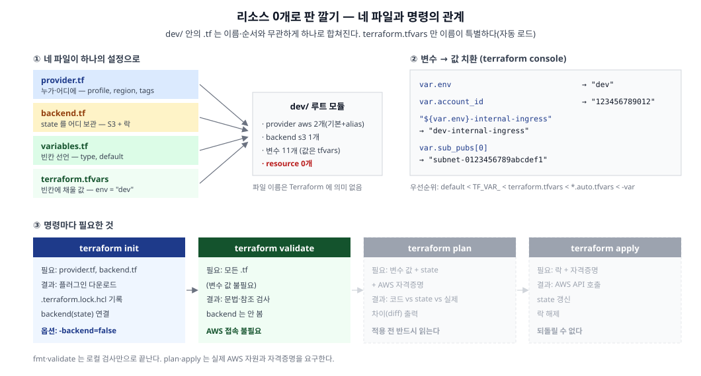

인프라 코드의 첫 단계. 아직 `resource` 블록은 0개고, 판만 깐다. 이번 글은 뼈대 네 파일 편.



## 1. 정의
- Terraform: 원하는 인프라 상태를 코드로 선언하면, 실제 상태와의 차이를 계산해 API 호출로 맞춰주는 도구
- **파일 이름은 Terraform에 의미가 없다**: 디렉토리 안의 모든 `.tf`를 이름·순서와 무관하게 읽어 **하나의 설정(루트 모듈)으로 병합**함. `provider.tf`, `vpc.tf` 같은 분리는 순수하게 사람이 읽기 위한 관례
  - 예외 하나: `terraform.tfvars`와 `*.auto.tfvars`는 **이름이 정해진 자동 로드 파일**
- 뼈대 네 파일의 역할

| 파일 | 역할 | 비유 |
|---|---|---|
|`provider.tf`|누가·어디에 만드는가 (계정, 리전, 공통 태그)|작업자 등록증|
|`backend.tf`|무엇을 만들었는지 기록(state)을 어디 보관하는가|작업 대장 보관소|
|`variables.tf`|코드에 어떤 빈칸이 있는가 (이름·타입 선언)|함수 매개변수 선언|
|`terraform.tfvars`|그 빈칸에 채울 실제 값|함수에 넘기는 인자|

## 2. 종류

### 2-1. provider.tf — 누가·어디에

```hcl
terraform {
  required_providers {
    aws  = { source = "hashicorp/aws" }
    helm = { source = "hashicorp/helm", version = "~> 3.0" }
  }
  required_version = ">= 1.10"
}

provider "aws" {
  profile = "dev-infra"
  region  = var.region

  default_tags {
    tags = {
      Environment = var.env_pascal
      Team        = "Infra"
      Managed     = "Terraform"
    }
  }
}
```

- **`terraform` 블록 = Terraform 자체 설정**
  - Terraform 본체는 AWS를 직접 모른다. AWS를 다루는 법은 `aws` **provider**(플러그인)가, Kubernetes는 `kubernetes` provider가 안다 → "이 프로젝트가 필요한 플러그인"을 `required_providers`로 선언
  - `source`: 플러그인 출처. `hashicorp/aws`는 `registry.terraform.io/hashicorp/aws`의 축약
  - `version = "~> 3.0"`: **비관적 제약(pessimistic constraint)**. `3.0` 이상 `4.0` 미만 → 마이너 업그레이드는 허용하고 메이저는 막음 (`~> 3.0.0`으로 쓰면 `3.0.x`만 허용)
  - `required_version`: provider가 아니라 **Terraform CLI 본체**의 버전 요구. `>= 1.10`인 이유는 아래 `use_lockfile`이 1.10에서 추가된 기능이기 때문
- **`provider "aws"` 블록 = 실제 접속 설정**
  - `profile`: `~/.aws/credentials`의 프로필 이름. **어느 AWS 계정에 만들지**를 결정하는 줄
  - `region = var.region`: `var.<이름>`은 변수 참조 문법. 여기서 네 파일이 서로 맞물린다
  - `default_tags`: **이 provider로 만드는 모든 리소스(태그 지원 시)에 자동으로 붙는 태그**. 리소스마다 조직 표준 태그를 반복하지 않아도 됨
- **`alias` — 같은 provider를 여러 개 두는 이유**
  - alias 없는 provider가 기본값이고, alias가 붙은 것은 리소스에서 명시적으로 골라 씀

    ```hcl
    provider "aws" {
      alias   = "prod-infra"
      profile = "prod-infra"
    }

    resource "aws_route53_record" "delegation" {
      provider = aws.prod-infra   # ← 이 리소스만 prod 계정에 만든다
    }
    ```

  - 필요한 상황: **한 코드가 여러 계정·리전을 동시에** 다룰 때. 대표적으로 dev 계정의 서브도메인을 prod 계정 hosted zone에 위임하는 cross-account Route53
- **kubernetes provider는 EKS가 생긴 뒤에 켠다**

  ```hcl
  provider "kubernetes" {
    host                   = aws_eks_cluster.eks_cluster.endpoint
    cluster_ca_certificate = base64decode(aws_eks_cluster.eks_cluster.certificate_authority[0].data)
    exec {
      api_version = "client.authentication.k8s.io/v1beta1"
      command     = "aws"
      args        = ["eks", "get-token", "--cluster-name", "...", "--profile", "dev-infra"]
    }
  }
  ```

  - `host`/`cluster_ca_certificate`: 어느 클러스터 API에 붙고, 그 서버가 진짜인지 검증할 CA. EKS가 base64로 주므로 `base64decode`로 풀어서 전달
  - `exec`: EKS 토큰은 수명이 짧아(기본 15분) 정적으로 적을 수 없음 → `aws eks get-token`을 **매번 실행**해 토큰을 받아옴
  - 이 블록은 `aws_eks_cluster` **리소스를 참조**한다. 리소스가 없는 단계에서 켜두면 `validate`가 깨지므로 EKS 편까지 주석 처리 (참고 6번)

### 2-2. backend.tf — 무엇을 만들었는지 기록(state)

```hcl
terraform {
  backend "s3" {
    bucket       = "dev-infra-example-ap-northeast-2"
    key          = "tfstate/infra/terraform.tfstate"
    region       = "ap-northeast-2"
    profile      = "dev-infra"
    use_lockfile = true
    encrypt      = true
  }
}
```

- **state가 무엇인가**: Terraform이 "코드상의 이름 ↔ 실제 AWS 리소스"를 매핑해 기록해두는 JSON
  - 코드에 `resource "aws_vpc" "main"`이 하나 있을 때 `apply`를 두 번 해도 VPC가 둘 생기지 않는 이유 → 첫 apply에서 state에 *"`aws_vpc.main` = 실제 `vpc-0abc…`"* 를 적어두기 때문
  - `plan`은 결국 3자 비교: **코드(원하는 상태) vs state(기억하는 상태) vs 실제 AWS(현재 상태)**
  - state를 잃으면 Terraform은 자기가 만든 걸 몰라서 이미 있는 리소스를 또 만들려 하거나 관리 불가(고아) 상태가 됨
- **왜 로컬 파일이 아니라 S3인가**: `backend` 블록이 없으면 작업 디렉토리에 `terraform.tfstate`로 저장되는데
  - 내 노트북에만 있어 팀원과 공유 불가 → 서로의 작업을 모르고 리소스 중복 생성
  - 디스크 유실 = 복구 불가
  - state에는 DB 비밀번호 같은 값이 **평문으로** 들어갈 수 있어 git 커밋 금지 대상 (`.gitignore`에 `*.tfstate`)
  - Atlantis 같은 CI가 접근할 수 없음
- **옵션별 의미**
  - `key`: 버킷 내 경로. 여러 프로젝트가 버킷 하나를 공유할 때 `key`로 구분
  - `encrypt`: 저장 시 서버측 암호화 (민감값이 들어가므로)
  - `use_lockfile`: **동시 실행 방지 락**. 없으면 두 사람이 동시에 apply → 둘 다 "VPC 없네"로 판단해 중복 생성 + state 덮어쓰기로 기록 유실. 켜두면 먼저 시작한 쪽이 `<key>.tflock` 객체로 잠그고, 뒤에 온 쪽은 대기/실패
- **`required_version = ">= 1.10"`과 짝**: 예전에는 락을 걸려면 **DynamoDB 테이블을 따로** 만들어야 했음(`dynamodb_table = "..."`). 1.10부터 S3의 conditional write로 락을 구현해 DynamoDB가 필요 없어졌다

### 2-3. variables.tf — 빈칸 선언

```hcl
variable "env" {
  description = "Environment name (e.g., prod | dev)"
  type        = string
}

variable "region" {
  type    = string
  default = "ap-northeast-2"
}
```

- 프로그래밍의 함수 매개변수와 같은 개념
  - `type`: `string`, `number`, `bool`, `list(string)`, `map(string)` 등. 타입 불일치는 에러
  - `default`: **있으면 선택(optional), 없으면 필수(required)** 변수
- 값을 안 주면 실제로 이렇게 실패한다 (tfvars를 뺀 복사본에서 `plan`)

  ```text
  Error: No value for required variable

    on variables.tf line 1:
     1: variable "env" {

  The root module input variable "env" is not set, and has no default value.
  ```

- 이 프로젝트의 변수들

| 변수 | 값 예시 | 왜 필요한가 |
|---|---|---|
|`env`|`"dev"`|리소스 **이름**에 붙는 소문자 환경명 (`dev-internal-ingress`)|
|`env_pascal`|`"Dev"`|**태그**에 쓰는 PascalCase 환경명. 조직 태그 규칙이 `Dev`/`Prod` 형태라 별도 변수|
|`account_id`|`"123456789012"`|IAM 정책·ARN 문자열을 조립할 때 계정 번호가 필요 (`arn:aws:iam::123456789012:role/...`)|
|`vpc_id`, `vpc_cidr`|`"vpc-0123…"`, `"10.0.0.0/16"`|기존 VPC 참조, SG 규칙에서 "VPC 내부 통신 허용"에 사용|
|`sub_pubs`, `sub_privs`|`["subnet-…1", "subnet-…2"]`|퍼블릭/프라이빗 서브넷 목록. `list(string)` 타입|
|`eks_node_sg_id`|`"sg-0123…"`|기존 노드 Security Group|
|`elb_log_bucket`|`"dev-example-elb-logs"`|ALB 액세스 로그 대상 버킷|
|`region`, `office_cidr`|`"ap-northeast-2"`, `"192.168.0.0/16"`|바뀔 일이 없어 `default` 보유 (사내 IP 허용 규칙 등에 사용)|

- 변수 파일 아래쪽을 `# --- Fix --- #` 주석으로 나눠 **"환경마다 바뀌는 값"과 "고정값(default 보유)"** 을 분리하는 관례를 씀

### 2-4. terraform.tfvars — 값 주입

```hcl
env        = "dev"
env_pascal = "Dev"
vpc_id     = "vpc-0123456789abcdef0"
sub_pubs   = ["subnet-0123456789abcdef1", "subnet-0123456789abcdef2"]
account_id = "123456789012"
```

- **이름이 특별한 파일**: `terraform.tfvars`, `terraform.tfvars.json`, `*.auto.tfvars`는 **자동 로드**됨. 다른 이름(`dev.tfvars`)은 `-var-file=dev.tfvars`로 명시해야 함
- **값이 실제로 어떻게 치환되나** (`terraform console` 실행 결과)

  ```text
  var.env                        => "dev"
  var.account_id                 => "123456789012"
  "${var.env}-internal-ingress"  => "dev-internal-ingress"
  var.sub_pubs[0]                => "subnet-0123456789abcdef1"
  ```

- 세 번째 줄이 핵심. `"${...}"`는 **문자열 보간(interpolation)** 으로, 이 덕분에 코드는 한 벌이고 값만 환경별로 갈린다

  ```hcl
  name = "${var.env}-internal-ingress"   # dev → dev-internal-ingress, prod → prod-internal-ingress
  ```

- `.tfvars`를 커밋해도 되나: 비밀키가 아니라 **식별자**만 들어있고, CI가 읽어야 하므로 커밋함. DB 비밀번호 같은 진짜 비밀값은 tfvars에 두지 않고 Secrets Manager나 `TF_VAR_` 환경변수로 넘긴다

## 3. 대안

- **state 위치: 로컬 vs 원격(S3)**

|구분|로컬 `terraform.tfstate`|S3 remote backend|
|---|---|---|
|공유|불가 (내 디스크에만)|팀·CI 공유|
|유실 위험|디스크 사고 시 복구 불가|버전 관리 + 복제|
|락|없음|`use_lockfile`로 동시 실행 차단|
|어울리는 곳|혼자 하는 실험|실제 운영, 자동화(Atlantis)|

- **락: DynamoDB 테이블 vs `use_lockfile`**

|구분|DynamoDB (구방식)|`use_lockfile` (1.10+)|
|---|---|---|
|추가 리소스|락 전용 테이블 필요|없음 (S3에 `.tflock` 객체)|
|비용·운영|테이블 1개 상시 유지|버킷만 있으면 됨|
|요구 버전|제약 없음|Terraform 1.10 이상|

- **값 주입 방식과 우선순위** (아래로 갈수록 강함)
  1. `variable` 블록의 `default`
  2. 환경변수 `TF_VAR_env=...`
  3. `terraform.tfvars`
  4. `*.auto.tfvars` (알파벳 순)
  5. 명령행 `-var-file=...`, `-var env=...`
  - 실제로 확인: `TF_VAR_env=staging`을 줘도 tfvars가 이겨서 `"dev"`가 나온다

    ```text
    $ TF_VAR_env=staging terraform console
    > var.env
    "dev"
    ```

- **환경 분리: 디렉토리 vs workspace**

|구분|디렉토리 분리 (`dev/`, `prod/`)|`terraform workspace`|
|---|---|---|
|state|완전히 별개 (backend key 자체가 다름)|한 backend 안에서 `env:/<이름>/` 으로 갈림|
|코드|환경별로 파일이 따로 존재 (중복 발생)|한 벌 공유, 차이는 조건문으로 처리|
|사고 위험|낮음 — 다른 환경을 건드릴 수 없음|현재 workspace를 착각하면 prod에 apply|
|환경별 차이|자유롭게 다르게 구성 가능|provider·backend 설정을 공유해야 해서 제약|

  - 이 프로젝트는 **디렉토리 분리**를 택했다. dev와 prod가 구성 자체가 다르고(prod에만 RDS·ElastiCache 등), 실수로 prod에 apply되는 사고를 구조적으로 막는 게 중복 비용보다 크다고 봄

## 4. 참고

**1. `validate`는 왜 변수 값 없이도 통과하나?**
- `validate`는 "문법과 참조 관계가 올바른가"만 본다. 변수 **값**은 요구하지 않음

  ```text
  $ terraform validate      # tfvars 없는 상태에서도
  Success! The configuration is valid.
  ```

- 명령마다 요구하는 게 다르다

|명령|변수 값|backend(state)|AWS 자격증명|
|---|---|---|---|
|`fmt`|✗|✗|✗|
|`validate`|✗|✗|✗|
|`providers`|✗|✓|✗|
|`console`|평가하는 식에 필요하면|✓|`data` 평가 시|
|`plan`|✓|✓|✓|
|`apply`|✓|✓|✓|

**2. `console`·`providers`가 backend를 요구한 이유**
- 이 시리즈는 state 버킷을 실제로 만들지 않으므로 `init -backend=false`로 초기화한다. 이 상태에서 `console`을 실행하면

  ```text
  Error: Backend initialization required, please run "terraform init"
  Reason: Initial configuration of the requested backend "s3"
  ```

- `console`은 state를 읽는 명령이라 backend 연결을 요구하기 때문. 변수 값만 굴려보고 싶으면 **`backend.tf`를 뺀 복사본**에서 하면 된다 (참고 7번)
- **`terraform providers`도 같은 에러를 낸다.** 이름만 보면 "코드가 요구하는 provider 목록"이라 정적 검사처럼 보이지만, state에 기록된 provider까지 함께 출력하는 명령이라 backend 연결이 필요하다

**3. `default_tags`는 리소스 태그와 어떻게 합쳐지나?**
- 리소스에 고유 태그만 써도 provider의 `default_tags`가 합쳐져 들어간다

  ```hcl
  resource "aws_vpc" "main" {
    cidr_block = "10.0.0.0/16"
    tags = { Name = "dev-vpc" }     # 이것만 씀
  }
  ```

  실제 생성 결과: `Name=dev-vpc` + `Environment=Dev`, `Team=Infra`, `Managed=Terraform` …
- 같은 키가 겹치면 **리소스 쪽이 이긴다**. 조직 표준 태그는 provider 한 곳에서 관리하고, 리소스에는 `Name` 같은 고유 태그만 두는 패턴

**4. `.terraform.lock.hcl`은 커밋해야 하나?**
- `init`이 자동 생성하며, 설치된 provider의 **정확한 버전 + 체크섬**을 기록한다

  ```hcl
  provider "registry.terraform.io/hashicorp/helm" {
    version     = "3.2.0"
    constraints = "~> 3.0"
    hashes      = ["h1:3WcDkgmMy9vTO6hSMzqI7o4nNeSa5AXDENxk6WphT6w=", ...]
  }
  ```

- `package-lock.json`·`poetry.lock`과 같은 역할 → **커밋 권장**. 팀원·CI가 동일 버전을 쓰고, 플러그인 변조도 체크섬으로 잡힘
- `constraints`는 내가 코드에 적은 제약, `version`은 그 제약을 만족한 실제 설치 버전

**5. state 버킷의 닭과 달걀 문제**
- "state를 보관할 S3 버킷을 Terraform으로 만들 수 있나?" → 버킷이 없으면 state를 둘 곳이 없고, 버킷을 만들려면 Terraform을 돌려야 하는 순환
- 흔한 해법: 버킷만 먼저 로컬 state로 만들고 → `backend`를 S3로 바꿔 state를 마이그레이션. 그 뒤로는 같은 코드가 자기 state 버킷을 관리
- 실수로 지워지면 전체 관리 이력이 날아가므로 `prevent_destroy = true`를 걸어 보호한다

**6. provider 블록도 참조 검사 대상**
- `provider "kubernetes"`가 `aws_eks_cluster.eks_cluster`를 참조하는데 그 리소스가 아직 없으면 `validate`가 실패한다
- 즉 "리소스가 없어도 provider는 먼저 다 적어두자"가 안 된다. **provider ↔ 리소스는 의존 관계가 있으므로 단계적으로 켠다** → EKS 편에서 주석 해제

**7. 직접 굴려보기**

```bash
# state 를 요구하지 않는 검사 (여기까지가 이 프로젝트의 성공 기준)
terraform -chdir=dev init -backend=false
terraform -chdir=dev validate
terraform -chdir=dev fmt -check

# 변수 값을 굴려보려면 backend 없는 복사본에서
mkdir -p /tmp/tfdemo && cp dev/*.tf dev/terraform.tfvars /tmp/tfdemo/
rm /tmp/tfdemo/backend.tf
terraform -chdir=/tmp/tfdemo init
terraform -chdir=/tmp/tfdemo console
```

```text
> var.env
> "${var.env}-eks-cluster"
> var.sub_privs
> length(var.sub_pubs)
> upper(var.env)
```

- `console`은 읽기 전용이라 아무것도 만들지 않는다. `exit` 또는 Ctrl-D로 나옴
