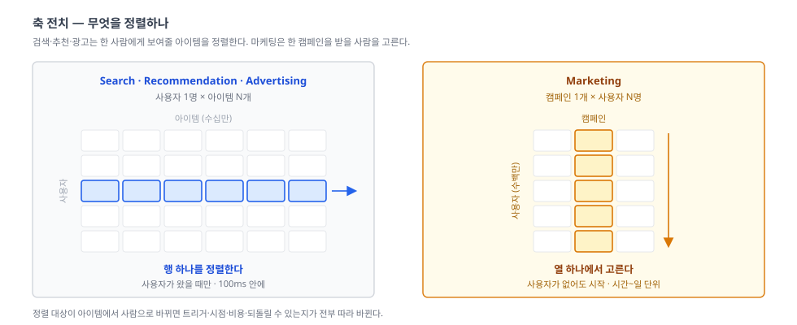
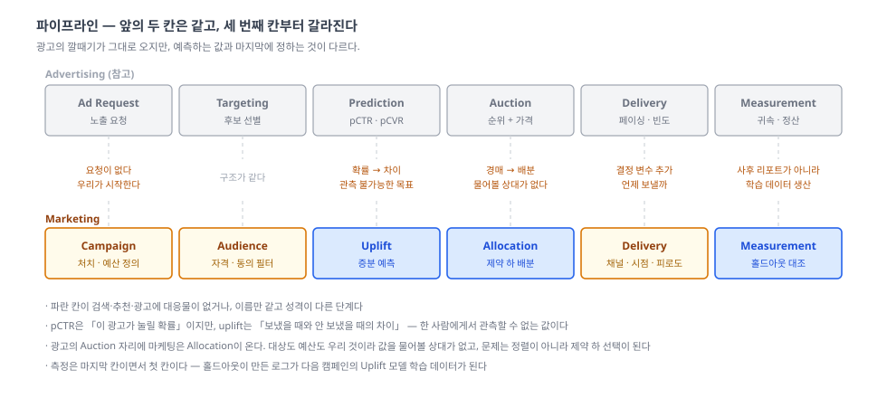
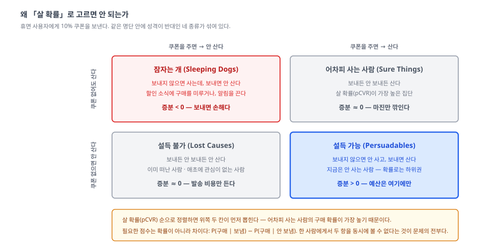

이 글은 **Marketing** 시리즈의 출발점입니다. 특정 도구(Braze, Airbridge 등)의 사용법이 아니라, 마케팅 시스템을 이루는 각 단계의 개념 — 무엇을 하는가, 왜 필요한가, 무엇이 어려운가 — 을 정리합니다.

이 시리즈는 [Search](../../search/overview/)·[Recommendation](../../recommendation/overview/)·[Advertising](../../advertising/overview/)와 **재료를 거의 공유한다**. 그런데 문제의 축이 한 번 전치된다. 그래서 여기서는 모델링을 처음부터 다시 설명하지 않고, **정렬 대상이 아이템에서 사람으로 바뀌면 무엇이 달라지는가**를 중심으로 쓴다.

## 1. 왜 필요한가?
- **배경(오지 않는 사용자)**: 검색·추천·광고는 전부 **사용자가 화면을 열었을 때** 작동한다. 그런데 매출의 상당 부분은 지금 앱에 없는 사람에게 걸려 있다 — 한 달째 안 들어온 사람, 장바구니만 채우고 나간 사람, 첫 구매 후 소식이 없는 사람. 이들에게 추천 시스템은 아무것도 할 수 없다. **보여줄 화면이 없기 때문이다**
- **해결책(마케팅 시스템)**: 우리가 먼저 말을 건다. 푸시·이메일·카톡·쿠폰. 사용자의 요청 없이도 시작할 수 있는 유일한 시스템이고, 그 대신 **언제 할지까지 우리가 정해야 한다**
- **검색·추천·광고와의 관계**: 앞의 셋은 전부 `사용자 1명 × 아이템 N개`를 정렬한다. 광고에서 파는 것이 아이템이 아니라 지면일 뿐, 구조는 같다. 마케팅은 `캠페인 1개 × 사용자 N명`을 고른다 — **행렬이 전치된다**. 그리고 이 한 번의 전치가 나머지 전부를 바꾼다

- **정렬 대상이 사람이 된다.** 익숙한 랭킹 모델을 그대로 쓸 수 있을 것 같지만, 점수의 의미가 달라진다 (뒤의 4분면)
- **트리거가 사라진다.** 노출 요청이 없으니 시작 신호를 우리가 만들어야 한다. 검색·광고에 없던 결정 변수 하나가 늘어난다 — **시점**
- **지연 예산이 사라지고, 대신 되돌릴 수 없는 비용이 생긴다.** 100ms가 아니라 하루가 있다. 그런데 잘못된 추천은 다음 화면에서 만회할 수 있지만, 잘못 보낸 푸시는 **알림 차단**으로 돌아온다. 그 사용자의 채널이 영구히 닫힌다
- **비용이 마진에서 나간다.** 광고비는 비용 항목이지만 할인은 매출에서 직접 깎인다. 그리고 대상이 틀리면 손실이 두 배가 된다 — 어차피 살 사람에게 준 할인

네 시스템을 나란히 놓으면 차이가 선명해진다.

| | Search | Recommendation | Advertising | **Marketing** |
|---|---|---|---|---|
| 무엇을 고르나 | 아이템 | 아이템 | 광고(지면 낙찰자) | **사람** |
| 누가 시작하나 | 사용자 (질의) | 사용자 (방문) | 사용자 (노출 발생) | **우리** |
| 시간 제약 | 수십 ms | 수십 ms | 100ms | **시간 ~ 일 (배치)** |
| 결정 변수 | 순서 | 순서 | 순서 + 가격 | **대상 + 시점 + 채널 + 빈도** |
| 예측하는 값 | 관련성 | 선호 확률 | pCTR · pCVR (절대값) | **증분 (두 세계의 차이)** |
| 비용 | 연산 | 연산 | 광고비 | **마진 + 채널 수신권** |
| 최악의 결과 | 나쁜 결과 | 안 누름 | 잘못된 청구 | **음수 효과 · 채널 영구 상실** |

**이 시리즈의 범위** — 여기서 다루는 것은 **사용자 개인 단위로 의사결정이 가능한 마케팅**이다. 아래는 다루지 않는다.

- **브랜드·크리에이티브** — 무슨 메시지를 어떻게 쓸까. 중요하지만 개인 단위 최적화 문제가 아니다 (소재를 고르는 문제라면 그건 Recommendation의 밴딧·탐색과 같은 문제다)
- **매체 구매(paid)** — 어느 지면에 얼마를 입찰할까. [Advertising](../../advertising/overview/) 시리즈의 자리다. 이 시리즈는 **이미 우리 것인 채널**(푸시·이메일·앱 내 프로모션)에서 출발한다
- **매스 캠페인** — TV·옥외처럼 대상을 고르지 않는 것. 고를 수 없으면 아래 도구가 전부 무의미하다

## 2. 무엇을 재료로 쓰는가?
- **사용자 상태**: 마지막 방문·구매일, 누적 구매액, 생애주기 단계(신규·활성·휴면·이탈). 추천이 쓰는 행동 이력과 **원본은 같은데 집계 축이 다르다** — 추천은 "무엇을 좋아하나"로 요약하고, 마케팅은 "지금 어디쯤 있나"로 요약한다
- **채널 수신권**: 푸시 토큰, 수신 동의, 유효한 이메일. 다른 시스템에 없는 재료이고, **소진되는 자산**이다. 잘못 쓰면 줄어들고, 한 번 줄면 거의 돌아오지 않는다
- **피로도 상태**: 최근 며칠간 이 사람에게 몇 번 보냈나. 광고의 빈도 제한과 개념은 같지만, 여기서는 **모든 캠페인이 하나의 예산을 공유한다** — 여러 팀이 같은 사용자에게 각자 보내기 때문이다
- **실험 로그(홀드아웃)**: 가장 중요한 재료이자 **의도적으로 만들어야 하는 재료**다. 아무것도 보내지 않은 대조군이 없으면 이 시리즈의 절반이 성립하지 않는다. 검색·추천의 로그는 서비스가 돌아가면 저절로 쌓이지만, 마케팅의 핵심 데이터는 **일부러 안 보내서** 만든다
- **처치와 그 원가**: 쿠폰 금액·할인율·무료배송. 각 처치에는 원가가 붙어 있고, 대상마다 그 원가가 만드는 효과가 다르다
- **LTV**: 목적함수의 단위. 이번 구매액이 아니라 관계의 총가치. 여기를 잘못 정하면 위의 전부가 잘못된 방향으로 최적화된다

## 3. 구성 요소

### 파이프라인 — 앞의 두 칸은 같고, 세 번째 칸부터 갈라진다

| 단계 | 역할 | 규모 |
|---|---|---|
| Campaign Definition (캠페인 정의) | 목표·처치·예산·기간을 정한다 | 캠페인 1건 |
| Audience (후보 선별) | 자격·수신 동의·제외 조건으로 거른다 | 수백만 → 수십만 |
| Uplift (증분 예측) | 이 사람은 처치하면 **달라지는가** | 수십만 |
| Allocation (배분) | 예산·정원·피로도 제약 안에서 대상을 확정한다 | 수십만 → 수만 |
| Delivery (송출) | 어떤 채널로, 언제, 얼마나 자주 | 상시 |
| Measurement (측정) | 홀드아웃 대조로 증분을 확인한다 | 사후 (일~주) |

- 앞의 두 칸은 검색·광고와 **구조가 같다**. Audience는 Retrieval·Targeting이고, "싸게 많이 거르고 비싸게 조금 정렬한다"는 원리도 그대로 온다
- 갈라지는 곳은 **세 번째 칸**이다. 검색의 Ranking과 광고의 Prediction은 `이것이 좋을 확률`을 예측한다. 마케팅의 Uplift는 **두 세계의 차이**를 예측한다 — 보냈을 때와 안 보냈을 때. 관측할 수 없는 값을 목표로 삼는다는 뜻이고, 이게 마케팅 모델링의 출발점이다
- 네 번째 칸은 광고의 Auction 자리인데, 여기서는 **경매가 아니라 배분**이다. 값을 물어볼 상대가 없다 — 대상도 예산도 우리 것이기 때문이다. 대신 문제가 "정렬"에서 **"제약 하 선택"** 으로 바뀐다. 상위 N명을 자르는 문제이고, 예산·정원·피로도가 동시에 걸린다
- 다섯째 칸(송출)에는 다른 시스템에 없는 결정 변수가 있다. 노출은 사용자가 시점을 정해주지만, 푸시는 **우리가 정한다**
- 여섯째 칸(측정)은 광고에도 있지만 역할이 다르다. 광고의 측정은 받은 돈에 대한 **증명**이고, 마케팅의 측정은 다음 모델의 **학습 데이터 생산 공정**이다

### 왜 「살 확률」로 고르면 안 되는가

말로 하면 추상적이니 4분면으로 보자. 30일 미방문 사용자에게 10% 쿠폰을 보내는 캠페인이다.

- **추천·광고에서 쓰던 점수(pCVR)로 정렬하면 위쪽 두 칸이 먼저 뽑힌다.** 어차피 살 사람의 구매 확률이 가장 높기 때문이다. 그들에게 나간 쿠폰은 매출을 올리지 않고 **마진만 깎는다**. 그런데 캠페인 리포트에는 그 구매가 성과로 잡힌다 — 지표가 가장 좋아 보이는 선택이 가장 손해인 구조다
- 우리가 원하는 것은 오른쪽 아래 한 칸(**설득 가능**)뿐이다. 그리고 이 칸은 `살 확률`로 정렬해서는 위로 올라오지 않는다 — 정의상 지금은 안 사는 사람들이니까
- 더 나쁜 칸이 왼쪽 위(**잠자는 개**)다. 할인 소식에 "지금 사면 손해"라고 판단해 구매를 미루는 사람, 푸시에 짜증나 알림을 끄는 사람. **증분이 음수인 구간이 존재한다**는 것 — 검색·추천에는 없던 현상이다. 나쁜 추천의 최악은 무반응이지만, **나쁜 마케팅의 최악은 마이너스**다
- 그래서 필요한 점수는 확률이 아니라 차이다: `P(구매 | 보냄) − P(구매 | 안 보냄)`. 문제는 한 사람에게서 두 항을 동시에 관측할 수 없다는 것이고, 여기서 인과추론이 들어온다 (Uplift 편)

### 그리고 캠페인은 하나가 아니다
- 검색·추천은 화면 하나에 시스템 하나다. 마케팅은 **여러 팀이 같은 사용자에게 각자 보낸다** — 유입팀의 온보딩 푸시, 카테고리팀의 프로모션, CRM팀의 휴면 복귀 쿠폰
- 각 캠페인이 개별로 최적이어도 합치면 하루에 푸시 6개가 된다. 그래서 캠페인 위에 **조율 계층**이 필요하다: 사용자당 접촉 예산, 우선순위, 충돌 규칙
- 광고의 빈도 제한과 형태는 같지만 성격이 다르다. 광고의 재고(지면)는 시간이 지나면 새로 생기지만, **사용자의 인내는 회복이 느리고 차단은 회복되지 않는다**

## 4. 시리즈 로드맵 — 네 개의 축
파이프라인은 "**어디서** 일어나나" 한 축을 나눈 것이다. 인과추론·시점 최적화·예산 배분 같은 주제들은 이 축의 7번째 항목이 아니라, **다른 축**에 놓인다.

| 축 | 답하는 질문 | 편 |
|---|---|---|
| 대상 | 누구를 후보로 볼까 | Segmentation & Audience (RFM · propensity · 이탈 예측 · LTV · lookalike) |
| 인과 | 건드리면 달라지는가 | Uplift Modeling (S/T/X-learner · causal forest · Qini) |
| 여정·채널 | 언제, 어디로, 얼마나 자주 | Lifecycle & Channel (트리거 · 시점 최적화 · 피로도 · 캠페인 조율) |
| 자원 배분 | 한정된 마진을 어떻게 나눌까 | Allocation & Measurement (쿠폰 최적화 · 홀드아웃 · geo 실험 · MMM) |

- **대상** 축은 재료가 추천과 거의 같다. 다른 것은 **라벨**이다 — 추천은 "이 아이템을 좋아할까"를 맞히고, 여기서는 "이탈할까 / 앞으로 얼마를 쓸까(LTV)"를 맞힌다. 모델 자체는 익숙한 것이고, **무엇을 예측하기로 정하느냐**가 이 축의 내용이다
- **인과** 축이 이 시리즈의 중심이다. 검색·추천·광고의 모델은 전부 관측된 라벨을 맞히지만, 여기서는 정답을 **한 사람에게서 절대 볼 수 없다**. 그래서 학습도 평가도 다르게 설계된다 — AUC 대신 Qini, 개인 단위 정확도 대신 집단 단위 검증. 광고의 측정 축이 "효과가 있었나"를 사후에 재는 문제라면, 이 축은 **그 값을 의사결정 함수로 쓰는** 문제다
- **여정·채널** 축은 문제 설정을 바꾼다. 앞의 축들이 "이번 한 번의 접촉"을 다룬다면, 이 축은 접촉의 **시퀀스**를 다룬다. 오늘 보낼지 말지가 내일의 선택지를 바꾸므로(피로도·차단), 단발 최적화의 합이 전체 최적이 아니다. Recommendation의 세션·시퀀스 축과 문제 모양이 닮았고, 실제로 밴딧·강화학습이 같은 이유로 등장한다
- **자원 배분** 축은 두 층으로 나뉜다. **사용자 간** 배분(쿠폰 예산을 누구에게 — knapsack·LP 형태의 제약 최적화)과 **채널 간** 배분(예산을 어느 채널에 — geo 실험·MMM). 그리고 이 축은 측정과 분리할 수 없다. **증분을 못 재면 배분의 근거가 없기 때문**이다

## 5. 구체적 사례 — 휴면 사용자 복귀 캠페인
30일 이상 미방문 사용자에게 10% 쿠폰을 보낸다. 예산은 쿠폰 3만 장.

1. **캠페인 정의**: 목표는 복귀 구매, 처치는 10% 쿠폰(7일 유효), 예산은 3만 장. 여기서 이미 결정되는 것이 있다 — **성공의 정의**. 복귀 구매 1건인가, 복귀 후 3개월 매출인가에 따라 아래 전부가 달라진다
2. **후보 선별**: 전체 500만 명 중 조건에 맞는 사람 — "30일 이상 미방문", "푸시 수신 동의", "최근 7일 내 다른 캠페인 미접촉", "쿠폰 남용 이력 없음" → **62만 명**
3. **증분 예측**: 62만 명 각각의 uplift를 예측한다. 과거 캠페인의 처치군·대조군 로그로 학습한 모델이다 — **그 로그가 없으면 이 단계는 통째로 불가능하다**
4. **배분**: uplift 높은 순으로 3만 명을 자른다. 여기서 제약이 결정을 바꾼다 — 양수 구간이 12만 명이어도 예산 때문에 3만 명만 고르고, 반대로 음수 구간은 **예산이 남아도 보내지 않는다**
5. **송출 제어**: 3만 명 중 2천 명은 오늘 다른 팀 푸시를 이미 받았다. 조율 규칙에 걸려 **내일로 밀린다**. 나머지는 각자 과거 앱 사용 시간대에 맞춰 발송 시점이 흩어진다
6. **홀드아웃**: 3만 명 중 3천 명에게는 **일부러 보내지 않는다**. 이 3천 명이 이번 캠페인의 대조군이고 다음 모델의 학습 데이터다 — 즉 **수익을 의도적으로 포기해서 데이터를 산다**
7. **관측**: 7일간 처치군 2.7만 명 중 8.1%가 구매, 홀드아웃 3천 명 중 6.4%가 구매
8. **정산**: 증분 구매율은 1.7%p — 약 460건이 이 캠페인 덕분이다. 나머지 6.4%는 쿠폰 없이도 샀을 사람들이고, 그들에게 나간 할인은 순손실이다. **성과는 8.1%가 아니라 1.7%p다**
9. **학습**: 이번 처치·대조 로그가 다음 캠페인의 uplift 모델로 들어간다. 캠페인이 모델을 만들고, 모델이 다음 캠페인의 대상을 고른다

### 왜 한 단계로는 안 되는가
1. **조건 필터만 있으면**: 62만 명 전원에게 보내게 된다. 예산이 안 되고, 되더라도 상당수는 손해다 → **증분 예측**이 필요
2. **살 확률 순으로 세우면**: 어차피 살 사람이 1등이 된다. 매출은 그대로인데 마진만 깎이고, 리포트 숫자는 오히려 좋아진다 → **uplift로 세워야 하는 이유**
3. **증분 예측만 있으면**: 3만 장을 어디서 자를지, 음수 구간을 어디서 끊을지 정하지 못한다 → **제약 하 배분**
4. **캠페인별로 최적화하면**: 각자는 최적인데 사용자는 하루에 푸시 6개를 받는다 → **조율과 피로도 관리**
5. **시점을 무시하면**: 새벽 3시에 푸시가 간다. 클릭률이 떨어지는 정도가 아니라 알림이 꺼진다 → **시점 최적화와 비가역 비용**
6. **홀드아웃을 안 두면**: 8.1%가 성과로 보고된다. 실제 기여는 1.7%p인데 부풀려진 숫자로 다음 예산이 정해진다 → **증분 측정**
7. **전체 매출로만 재면**: 캠페인 효과가 계절성과 다른 캠페인에 묻힌다 → **geo 실험 · MMM**

- 검색·광고가 그랬듯 마케팅도 **한 단계가 앞 단계의 결과 안에서만** 일한다. 후보에서 빠진 사람은 uplift가 아무리 높아도 받지 못한다
- 다만 결정적으로 다른 것은 **데이터를 만드는 방식**이다. 검색·추천의 로그는 서비스가 돌아가면 쌓이지만, 마케팅의 핵심 데이터는 **보내지 않기로 결정해서** 만든다. 측정이 파이프라인의 사후 단계가 아니라 **학습 데이터의 생산 공정**이라는 뜻이고, 그래서 이 시리즈에서는 측정이 마지막이 아니라 처음에 온다

## 6. 링크
- 증분 효과 · uplift
  - [Real-World Uplift Modelling with Significance-Based Uplift Trees (Radcliffe & Surry, 2011)](https://www.research.ed.ac.uk/en/publications/real-world-uplift-modelling-with-significance-based-uplift-trees/) — 실무 관점의 고전 백서, 4분면과 Qini의 출처
  - [Causal Inference and Uplift Modelling: A Review of the Literature (Gutierrez & Gérardy, 2017)](https://proceedings.mlr.press/v67/gutierrez17a.html) — 계열 정리
  - [Metalearners for estimating heterogeneous treatment effects (Künzel et al., PNAS 2019)](https://arxiv.org/abs/1706.03461) — S/T/X-learner
  - [Recursive Partitioning for Heterogeneous Causal Effects (Athey & Imbens, PNAS 2016)](https://arxiv.org/abs/1504.01132) — causal tree/forest
  - [Criteo Uplift Prediction Dataset](https://ailab.criteo.com/criteo-uplift-prediction-dataset/) — incrementality 테스트로 만든 공개 데이터
  - [CausalML (Uber)](https://github.com/uber/causalml) · [EconML (PyWhy)](https://github.com/py-why/EconML) · [scikit-uplift](https://github.com/maks-sh/scikit-uplift)
- LTV · 생애주기
  - ["Counting Your Customers" the Easy Way (Fader, Hardie & Lee, 2005)](https://brucehardie.com/papers/018/) — BG/NBD, 확률 모형 계열의 LTV
  - [lifetimes](https://github.com/CamDavidsonPilon/lifetimes) — BTYD 모형 구현
- 측정 · 배분
  - [Measuring Ad Effectiveness Using Geo Experiments (Vaver & Koehler, 2011)](https://research.google/pubs/measuring-ad-effectiveness-using-geo-experiments/) — 개인 단위 홀드아웃이 불가능할 때
  - [Bayesian Methods for Media Mix Modeling with Carryover and Shape Effects (Jin et al., 2017)](https://research.google/pubs/bayesian-methods-for-media-mix-modeling-with-carryover-and-shape-effects/) — MMM의 adstock·포화
  - [Meridian (Google)](https://github.com/google/meridian) · [Robyn (Meta)](https://github.com/facebookexperimental/Robyn) — 오픈소스 MMM
  - [GeoexperimentsResearch (Google)](https://github.com/google/GeoexperimentsResearch) — geo 실험 분석 구현

## 참고
- 이 시리즈는 [Search](../../search/overview/)·[Recommendation](../../recommendation/overview/)·[Advertising](../../advertising/overview/)와 한 묶음이다. 앞의 셋이 "온 사람에게 무엇을 보여줄까"라면, 이 시리즈는 **"오지 않은 사람에게 먼저 말을 걸까"** 를 다룬다
- [Advertising](../../advertising/overview/)의 측정 축과 주제가 겹치는데, 각도가 다르다. 광고는 **돈을 받았으니 효과를 증명**해야 하고(귀속·정산), 마케팅은 **효과의 추정치를 대상 선택에 직접 쓴다**(uplift 랭킹). 같은 인과추론이 한쪽에서는 리포트이고, 다른 쪽에서는 목적함수다
- Recommendation의 [밴딧·탐색](../../recommendation/overview/)이 다룬 피드백 루프는 여기서도 나타나지만 모양이 다르다. 추천에서 노출되지 않은 아이템은 데이터가 없을 뿐이지만, 마케팅에서 **보내지 않은 사람은 대조군이 되어 오히려 가장 값진 데이터가 된다**
