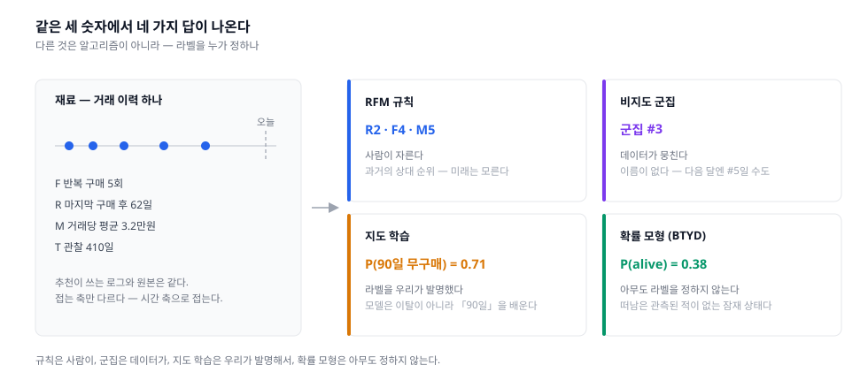
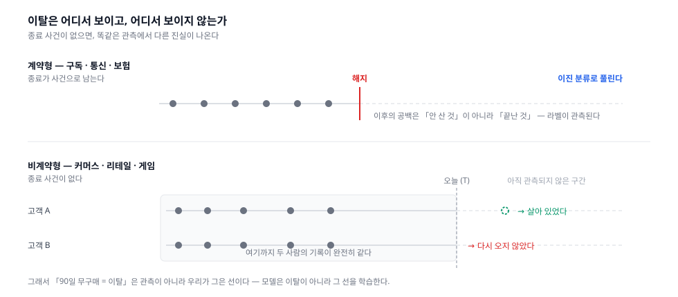

대상 축의 첫 편, Segmentation & Audience. 파이프라인 축에서 "Audience가 후보를 거른다"고만 하고 넘어간 그 안을 연다 — **누구를 후보로 볼 것인가**.

## 1. 정의
- 사용자를 **행동과 가치로 묶어, 묶음마다 다르게 대하는 것**. 마케팅 파이프라인의 Audience 칸이고, 검색으로 치면 Retrieval 자리다 — 수백만을 수십만으로 줄이는 첫 깔때기
- 이 단계가 답하는 질문: **누구를 후보로 볼까**. "건드리면 달라지는가"는 다음 축(Uplift)의 질문이고, 여기서는 아직 답하지 않는다. 이 경계를 흐리면 이 편의 모든 기법이 오용된다 (4장 4)
- 재료는 `(사용자, 시점, 거래)` 로그 하나. 추천이 쓰는 것과 **원본은 같고 접는 축만 다르다** — 추천은 아이템 축으로 접어 "무엇을 좋아하나"를 만들고, 여기서는 시간 축으로 접어 **"지금 어디쯤 있나"**를 만든다. 한 사람이 결국 몇 개의 숫자로 요약된다: 마지막 거래가 언제(**R**), 몇 번(**F**), 얼마(**M**), 그리고 우리가 이 사람을 본 기간(**T**)
- 실제 Audience는 두 층이다. **세그먼트**(누가 위쪽인가 — 이 편의 주제)와 **자격 필터**(보낼 수 있는가 — 수신 동의·차단 이력·법적 제외). 뒤엣것은 모델이 아니라 하드 규칙이고, 순서가 중요하다. 검색의 filter-then-score와 같은 문제다 — 자격에서 떨어진 사람은 점수가 아무리 높아도 존재하지 않는다

이 계열의 성격은 **태어난 곳**이 거의 다 설명한다.

- 검색·추천은 지면이 무한하고 노출 비용이 0에 수렴하는 웹에서 태어났다. 그래서 기본 동작이 **정렬**이다 — 다 보여주되 순서를 정한다
- 세그먼테이션은 우편 카탈로그에서 태어났다. 한 통마다 인쇄비와 우표값이 붙으니 "누구에게 보낼까"가 곧 손익계산이었다. 그래서 기본 동작이 **가르기(cut)** 다 — 보낼 사람과 안 보낼 사람이 갈린다. RFM이 1980년대 다이렉트 마케팅에서 나온 이유가 이것이고, 개념 자체는 그보다 30년 앞선 시장 세분화(Smith, 1956)까지 올라간다
- 그리고 결정적으로 다른 것 하나 — **산출물을 사람이 읽는다.** 추천 점수는 사람이 볼 일이 없지만 세그먼트는 마케터가 보고 캠페인을 짠다. 그래서 이 계열의 합격 기준은 정확도가 아니다 (4장 6)

## 2. 종류(비교)
1차 분기는 **라벨을 누가 정하나**이다. 사람이 자르나, 데이터가 뭉치나, 우리가 발명하나, 아무도 안 정하나. 경쟁하는 갈래라기보다 **하나의 계보**에 가깝다 — 앞의 결함을 뒤가 고치면서 내려온다.



- 규칙 기반 — RFM
  - 역할 및 정의: R·F·M을 각각 5분위로 잘라 격자에 배치한다. `555`는 최우수, `155`는 "예전엔 잘 샀는데 요즘 안 오는 사람"
  - 이 계열의 BM25다. **학습 데이터 없이 오늘 돌아가고, 결과를 완전히 설명할 수 있고, 놀랄 만큼 강하다.** 새 방법은 언제나 RFM과 비교되고, 이기지 못하는 경우도 흔하다
  - 결함 첫째, **기준이 상대적이다.** 5분위는 정의상 항상 20%를 만든다. 고객 기반 전체가 반토막 나도 상위 20%는 그대로 존재하고 세그먼트 크기도 그대로다. "지금 누가 위쪽인가"는 알려주지만 **"우리가 나아지고 있나"는 원리상 답할 수 없다** (4장 3)
  - 결함 둘째, **칸이 125개다.** 사람이 다룰 수 없으니 결국 손으로 병합한다. 병합 기준은 데이터가 아니라 취향이고, 그래서 팀마다 달라진다
  - 결함 셋째, **과거만 본다.** R이 좋다는 건 최근에 샀다는 뜻이지 앞으로 산다는 뜻이 아니다. 아래 세 계열은 전부 이 결함을 고치려는 시도다
- 비지도 군집 — k-means · GMM · latent class
  - 역할 및 정의: 라벨을 주지 않고 데이터가 스스로 뭉치게 둔다. 사람이 미리 정하지 않은 축을 찾자는 것
  - 장점: RFM처럼 축을 3개로 못 박지 않는다. 카테고리 편중·할인 민감도·방문 주기 같은 축이 데이터에서 나올 수 있다
  - 결함 첫째, **정답이 없다.** silhouette·엘보는 군집이 잘 뭉쳤는지를 재는 **내부 지표**일 뿐이고, 좋은 세그먼트인지는 말해주지 않는다. 점수가 최고인 분할이 액션으로는 무의미한 경우가 흔하다
  - 결함 둘째, **재현되지 않는다.** 실무에서는 이쪽이 더 치명적이다. 다음 달 다시 돌리면 군집 번호가 뒤바뀌고 사람들이 칸을 옮겨 다닌다. "군집 3에게 매주 발송"이라는 캠페인은, 지난달의 군집 3과 이번 달의 군집 3이 다른 사람들이라는 뜻이 된다 (4장 2)
  - 결함 셋째, **거리 가정이 데이터와 안 맞는다.** 구매액은 로그정규에 가깝고 꼬리가 길다. 유클리드 거리와 구형 군집을 가정하면 큰손 몇 명이 축을 통째로 지배한다. 로그 변환·스케일링이 사실상 필수인데, **그 변환 선택이 결과를 바꾼다** — 전처리가 모델보다 결정적이다
  - 그래서 흔한 절충이 **탐색은 군집으로, 운영은 규칙으로**다. 군집이 찾아 준 경계를 사람이 읽고 규칙으로 고정한다. 안정성을 되찾는 대신 발견을 1회성으로 소비하는 셈
- 지도 학습 — propensity · churn
  - 역할 및 정의: 라벨을 정하고 예측한다. `P(이탈)`·`P(구매)`·`P(쿠폰 사용)`. 점수를 임계값으로 잘라 세그먼트를 만든다. **오늘 실무의 주류**다
  - 장점 둘. **미래를 본다**는 것, 그리고 **공변량에 제한이 없다**는 것 — RFM은 세 숫자뿐이지만 여기엔 앱 세션·문의 이력·기기·유입 경로를 다 넣을 수 있다
  - 결함은 하나인데, 이 계열 전체를 위협한다. **라벨을 우리가 발명한다는 것**
    - 구독·통신이라면 문제가 없다. 해지 버튼이라는 **사건**이 있고, 라벨은 현실에서 관측된 것이다
    - 커머스에는 그런 사건이 없다. 아무도 "이제 그만 사겠습니다"라고 선언하지 않는다. 그래서 "90일 무구매 = 이탈"이라고 **정한다**. 그 순간 모델이 학습하는 것은 이탈이 아니라 **90일이라는 우리 규칙**이다
    - 그러면 AUC 0.92 같은 숫자가 나온다. 예측력의 대부분은 "최근에 안 샀으면 앞으로 90일도 안 살 것"이라는 동어반복에서 온다. 지표는 훌륭한데 의사결정에 더해 주는 정보가 없다
    - 이 함정을 피하려면 먼저 우리가 어느 세계에 있는지 알아야 한다 (4장 1)
- 확률 모형 (BTYD) — Pareto/NBD · BG/NBD
  - 역할 및 정의: 이탈을 라벨로 만들지 않는다. 대신 **구매가 생성되는 과정**을 모델로 쓰고, "아직 살아 있는가"를 관측되지 않는 잠재 상태로 남긴다
    - 살아 있는 동안 각자 자기 속도 `λ`로 산다 (포아송, `λ`는 사람마다 다르게 Gamma 분포)
    - 그리고 어느 시점에 **조용히 떠난다** — 선언 없이. BG/NBD는 매 구매 직후 확률 `p`로, Pareto/NBD는 시간에 대해 지수적으로
  - 입력이 놀랍도록 적다. `(x, t_x, T)` — 반복 구매 횟수, 마지막 구매 시점, 관찰 기간. 이 세 숫자에서 개인별 `P(alive)`와 향후 기대 구매 횟수가 나온다
  - 금액은 별도 모듈이다. **Gamma-Gamma**로 거래당 지출을 모델링해 곱하면 예측 LTV가 된다. 거래 빈도와 지출액이 독립이라는 가정이 붙는다
  - 장점: 라벨 발명이 불필요하고, 파라미터가 몇 개뿐이며, 홀드아웃 예측이 강하다. **비계약형 세계의 기준선**
  - 단점 첫째, **공변량이 안 들어간다.** 우리가 지난달 쿠폰을 뿌렸다는 사실을 모델이 모른다. 그 효과는 `λ` 추정치에 녹아들 뿐 분리되지 않는다 — 즉 이 모형은 **마케팅을 하지 않았을 때의 자연스러운 흐름**을 기술한다
  - 단점 둘째, **정상성 가정.** 개인의 `λ`와 이탈 성향이 시간에 대해 고정이다. 계절성·가격 정책 변경·앱 개편을 담지 못한다
  - 단점 셋째, 반복 구매가 있는 코호트에서만 의미가 있다. 1회 구매자가 대부분이면 `x=0`이 대다수라 추정이 불안정하다

    

- LTV — 위쪽의 정의를 정하는 문제
  - 앞의 넷이 "누가 위쪽인가"를 정한다면 LTV는 **위쪽이라는 말의 뜻**을 정한다. 목적함수의 단위이고, 여기가 틀리면 나머지 전부가 잘못된 방향으로 정확해진다
  - **과거 LTV**(누적 구매액)는 계산이 쉽고 틀리기 쉽다. 이미 다 쓴 사람과 이제 시작하는 사람을 같은 칸에 넣는다
  - **예측 LTV**는 두 갈래다
    - 확률 모형: BG/NBD × Gamma-Gamma. 데이터가 적어도 되고 파라미터에 의미가 있다
    - 회귀·딥러닝: 자유롭지만 **분포가 문제다.** 값의 절반 이상이 0(재구매 없음)이고 꼬리는 두껍다. MSE로 학습하면 모델이 전부 평균 근처를 찍는다. 그래서 **ZILN(zero-inflated lognormal)** 처럼 "다시 살 것인가 × 산다면 얼마나"를 분리한 손실을 쓴다
  - 평가도 다르다. RMSE가 아니라 **정규화 Gini·decile chart** — 금액을 맞혔는지가 아니라 **순서가 맞는지**를 본다. 예산이 한정된 이상 우리가 실제로 쓰는 것은 값이 아니라 순위이기 때문이다. 결국 이 축도 랭킹 문제로 되돌아온다
- Lookalike — 우리 로그 밖으로
  - 역할 및 정의: seed 세그먼트를 주고 "닮은 사람"을 찾는다. 대상이 우리 로그에 행이 없는 사람이므로 **위의 넷이 하나도 적용되지 않는다** — R도 F도 M도 없다
  - 방법: seed를 양성으로 두고 분류기를 학습하거나(positive-unlabeled), 유저 임베딩 공간에서 kNN. **추천의 user-user 유사도와 같은 문제**이고, 이 축이 추천과 가장 직접 맞닿는 지점이다
  - 제약: 대개 광고 플랫폼 안에서만 가능하다. 우리는 seed만 넘기고 모델은 그쪽 것이다. 그리고 프라이버시 규제의 직격탄을 맞는 자리다 — [Advertising](../../advertising/overview/) 시리즈의 주제

한눈 비교:

|구분|RFM 규칙|비지도 군집|지도 학습|확률 모형|
|---|---|---|---|---|
|라벨 출처|없음 — 사람이 자른다|없음|**우리가 발명한다**|없음 — 잠재 변수|
|보는 시제|과거|과거|미래|미래|
|공변량|3개 고정|자유|자유|**넣을 수 없다**|
|설명가능성|완전|낮음|중간|높음 — 파라미터에 의미|
|재계산 안정성|높음|**낮음**|중간|높음|
|비계약형에서|무해|무해|**함정**|**설계된 답**|
|현재 위치|기준선|탐색 도구|실무 주류|강한 기준선|

## 3. 사용 예시
- RFM은 쿼리 한 장이면 끝난다

  ```sql
  WITH base AS (
    SELECT user_id,
           MAX(ordered_at) AS last_order_at,
           COUNT(*)        AS freq,
           SUM(amount)     AS monetary
    FROM orders
    WHERE ordered_at >= CURRENT_DATE - INTERVAL '365 day'
    GROUP BY user_id
  )
  SELECT user_id,
         NTILE(5) OVER (ORDER BY last_order_at) AS r,  -- 최근일수록 5
         NTILE(5) OVER (ORDER BY freq)          AS f,
         NTILE(5) OVER (ORDER BY monetary)      AS m
  FROM base;
  ```

  - 이 쿼리에 없는 것이 있다 — **관찰 기간 `T`**. 어제 가입한 사람과 3년 된 사람이 같은 `F` 칸에서 경쟁한다. 신규 고객은 구조적으로 저빈도로 분류되고, 그래서 늘 하위 칸에 깔린다 (4장 5)
  - `WHERE`의 365일도 결정이다. 창을 줄이면 최근 신호가 선명해지고 큰손의 연 1회 구매가 사라진다
- 확률 모형 구현
  - **PyMC-Marketing** — BG/NBD·Pareto/NBD·Gamma-Gamma가 CLV 모듈로 들어 있다. `lifetimes`가 오래 표준이었지만 지금은 아카이브 상태이고, README가 이쪽을 후계로 가리킨다
  - 입력이 `(frequency, recency, T, monetary_value)` 네 컬럼짜리 요약 테이블이라, 위의 SQL에 `T`만 더하면 그대로 이어진다
- LTV 회귀
  - **google/lifetime_value** — ZILN 손실 구현과 decile chart 평가 코드. 0 과다·두꺼운 꼬리를 다루는 표준 출발점
- 세그먼트를 어디에 두나
  - 실시간 계산이 아니다. **배치 산출물**이다 — 일 단위로 계산해 세그먼트 테이블에 적재하고, 캠페인 툴·CDP가 그걸 읽는다. 검색의 색인과 같은 성격이다. 미리 만들어 두고, 갱신 주기가 곧 신선도의 상한이 된다
  - 그래서 정의의 **SSOT**가 필요하다. "휴면"이 CRM 팀 60일, 데이터 팀 90일, 리포트 30일이면 세 조직이 같은 단어로 다른 이야기를 한다
- 자격 필터는 세그먼트 뒤에 하드 규칙으로 붙인다
  - 수신 동의·야간 발송 제한·최근 접촉 이력·법적 제외. **모델 점수가 이 규칙을 이길 수 없어야 한다**
  - 순서도 중요하다. 자격 필터를 먼저 걸면 그 뒤 분위수가 자격자 안에서 다시 계산된다 — 같은 `상위 20%`가 다른 사람들을 가리킨다
- 검증
  - 세그먼트를 만든 것으로 끝이 아니다. **홀드아웃 없이는 이 세그먼트가 좋은지 잴 방법이 없다.** 세그먼트별 반응률 차이는 세그먼트가 좋다는 증거가 아니라 세그먼트가 다르다는 증거일 뿐이다

## 4. 참고
1. 계약형과 비계약형 — 이탈이 보이는 세계와 안 보이는 세계
- 이 분야에서 가장 먼저 확인해야 하는 것이고, 잘 알려지지 않은 구분이다
- **계약형(contractual)** — 구독·통신·보험. 관계의 종료가 **사건으로 관측된다.** 해지 버튼, 약정 만료, 미납. 그래서 라벨이 현실에 존재하고 이탈 예측은 평범한 이진 분류가 된다
- **비계약형(non-contractual)** — 커머스·리테일·게임. 종료 사건이 없다. **"3개월째 안 샀다"가 떠난 것인지 원래 그 주기인지 구분할 방법이 원리상 없다.** 두 사람의 관측 기록이 완전히 같은데 한 명은 살아 있고 한 명은 떠났을 수 있다
- 그래서 비계약형에서 이탈 라벨을 만드는 순간, 우리는 **관측할 수 없는 것을 관측한 척**하게 된다. 모델은 우리가 그은 선을 학습하고, 지표는 좋아지고, 의사결정은 나아지지 않는다
- BTYD 계열은 이 문제를 **라벨을 만들지 않는 방식으로** 푼다. 이탈을 잠재 변수로 두고 `P(alive)`라는 확률로 답한다. 이것이 이 계열이 마케팅 학계에서 40년 가까이 살아남은 이유다
- 그리고 이 구분은 목적함수까지 바꾼다. 계약형의 목표는 **관계 유지**(해지 방어)지만, 비계약형에는 유지할 관계 자체가 없다 — 목표가 **다음 거래**가 된다

2. 세그먼트도 churn한다 — 안정성이 정확도만큼 중요하다
- 매일 재계산하면 사람들이 칸을 넘나든다. 어제 VIP였다가 오늘 아니고 내일 다시 VIP인 사람이 생긴다
- 이게 왜 문제인가: 세그먼트는 **캠페인의 주소**다. 주소가 매일 바뀌면 "휴면 복귀 3주 시리즈"처럼 여러 회차에 걸친 캠페인을 설계할 수 없다. 그리고 사용자 입장에서는 등급이 오르내리는 것이 서비스의 결함으로 보인다
- 표준 처방은 **진입과 탈락을 비대칭으로** 두는 것이다. 진입은 즉시, 탈락은 유예 기간을 준다(히스테리시스). 현실의 멤버십 등급이 대체로 이렇게 생긴 이유이고, 정확도를 조금 포기하고 신뢰를 사는 거래다
- 그래서 새 세그먼트를 배포하기 전에 재계산 시뮬레이션을 돌려 **주간 진입·탈락률**을 먼저 본다. 이 숫자가 크면 규칙이 아니라 잡음을 라벨로 만든 것이다

3. 분위수의 함정 — 상대 기준은 항상 20%를 만든다
- `NTILE(5)`는 어떤 데이터를 넣어도 다섯 칸을 균등하게 채운다. 전체가 나빠져도 상위 칸은 사라지지 않는다
- 그래서 상대 기준만으로는 **추세를 읽을 수 없다.** "VIP 비중 20% 유지"는 정보가 0인 지표다
- 처방은 절대 기준과의 병용이다. 분위수로 자르되 **하한을 절대값으로 건다** — `상위 20% 그리고 연 구매 3회 이상`. 그러면 기반이 나빠질 때 세그먼트 크기가 실제로 줄어들고, 그 축소 자체가 신호가 된다
- 반대로 절대 기준만 쓰면 세그먼트 크기가 통제 불능이 된다. 성수기에 대상이 3배로 불어나 예산을 초과한다. 두 기준은 각각 **의미**와 **규모**를 담당하고, 실무에서는 대개 함께 쓴다

4. 이탈 위험이 높은 고객이 좋은 표적이 아니다
- 이 축의 결론을 그대로 행동으로 옮기면 자연스럽게 "이탈 확률 상위 N명에게 쿠폰"이 된다. 그런데 **그것이 효과가 없다는 것이 실증되어 있다** (Ascarza, 2018 — 두 번의 필드 실험)
- 이유는 두 가지다. 이탈 확률이 가장 높은 사람은 이미 마음이 떠나 쿠폰으로 돌아오지 않고(설득 불가), 확률이 높다는 것과 **처치에 반응한다**는 것은 애초에 다른 성질이다
- 그래서 이 축의 산출물은 **후보 선별까지가 역할**이다. `P(이탈)`이나 LTV로 최종 대상을 정하는 순간 [overview](../overview/)의 4분면에서 위쪽 두 칸을 뽑게 된다
- 필요한 것은 확률이 아니라 차이 — `P(구매 | 보냄) − P(구매 | 안 보냄)`. 다음 축(Uplift)의 출발점이고, 위 논문의 결론도 정확히 이것이다: **이탈 위험이 아니라 개입에 대한 민감도로 표적을 정하라**

5. 좌측 절단과 신규 고객 — `T`를 빠뜨리면 생기는 일
- RFM은 세 숫자를 쓰지만 확률 모형은 네 번째를 요구한다. **`T` — 우리가 이 사람을 관찰한 기간**
- 이게 없으면 두 가지가 동시에 망가진다. 어제 가입한 사람은 구조적으로 저빈도로 분류되고(분모가 다르다), 관찰 창 이전부터 거래하던 사람은 그 이력이 통째로 잘린 채 평가된다(좌측 절단)
- 그리고 조용한 생존 편향이 하나 더 있다. 오늘 시점의 고객 목록으로 분석하면 **이미 완전히 떠난 사람은 목록에 없다.** "우리 고객은 평균 4.2회 구매한다" 같은 문장이 여기서 나온다
- 처방은 **코호트로 자르는 것**이다. 사람이 아니라 "2026년 3월 첫 구매자"를 단위로 놓고, 모두에게 같은 길이의 관찰 창을 준다. LTV를 코호트별로 보는 것이 관습인 이유가 이것이다

6. 좋은 세그먼트의 기준은 통계량이 아니다
- ML을 하던 사람이 이 분야에서 가장 자주 밟는 지뢰다. silhouette을 최대화하고 AUC를 올렸는데 아무도 쓰지 않는 세그먼트가 나온다
- 마케팅 쪽의 오래된 합격 기준은 다섯 가지다 — **측정 가능 · 규모 충분 · 도달 가능 · 서로 구별됨 · 대응 가능**
- 마지막 항목이 핵심이다. **"이 묶음에 무엇을 해줄지 말할 수 없으면 그것은 세그먼트가 아니다."** 통계적으로 완벽하게 분리된 군집이라도 그 차이가 우리가 바꿀 수 있는 것이 아니면 쓸모가 없다
- 그리고 기술적으로는 1인 1정책이 가능한데도 세그먼트를 5~10개로 묶는 이유가 여기 있다. **캠페인은 사람 손으로 만들어진다.** 쿠폰 문구·할인율·발송 시각을 100만 개 만들 수 없으니, 묶음의 개수는 모델의 능력이 아니라 **운영 조직의 처리량**이 정한다
- 세분화 정도가 자동화 수준을 따라간다는 뜻이기도 하다. 메시지 생성까지 자동화되면 묶음을 더 잘게 쪼갤 수 있고, 그 극한이 개인화다

7. 추천의 유저 임베딩을 그대로 쓰면 안 되나
- 쓸 수 있고, 실제로 잘 통하는 용도가 있다. **lookalike와 유사 사용자 확장** — 여기서는 축의 의미가 필요 없고 거리만 맞으면 된다
- 그런데 캠페인 정의에는 쓸 수 없다. 임베딩 12번 차원이 높은 사람들에게 무엇을 보내야 하는지 아무도 말할 수 없기 때문이다. 위의 5조건 중 **대응 가능**에서 걸린다
- 그래서 현실의 절충은 두 층을 두는 것이다. **사람이 읽는 층**(RFM·생애주기·LTV 등급)으로 캠페인을 정의하고, **기계가 읽는 층**(임베딩)으로 그 안에서 확장·정렬한다
- 이 분업은 검색에서 본 것과 같은 모양이다 — 설명 가능한 신호로 후보를 정하고, 설명 불가능한 모델로 순서를 다듬는다

## 5. 링크
- 개념의 원류
  - [Product Differentiation and Market Segmentation as Alternative Marketing Strategies (Smith, 1956)](https://journals.sagepub.com/doi/abs/10.1177/002224295602100102) — 시장 세분화 개념의 출발점
  - [Database Marketing: Analyzing and Managing Customers (Blattberg, Kim & Neslin)](https://link.springer.com/book/10.1007/978-0-387-72579-6) — 이 분야의 표준 교과서
- 확률 모형 (BTYD)
  - [Counting Your Customers: Who Are They and What Will They Do Next? (Schmittlein, Morrison & Colombo, 1987)](https://pubsonline.informs.org/doi/10.1287/mnsc.33.1.1) — Pareto/NBD, 계열의 시작
  - ["Counting Your Customers" the Easy Way: An Alternative to the Pareto/NBD Model (Fader, Hardie & Lee, 2005)](https://brucehardie.com/papers/018/) — BG/NBD
  - [The Gamma-Gamma Model of Monetary Value (Fader & Hardie)](https://brucehardie.com/notes/025/) — 거래당 지출 모듈
  - [RFM and CLV: Using Iso-Value Curves for Customer Base Analysis (Fader, Hardie & Lee, 2005)](https://www.brucehardie.com/papers/rfm_clv_2005-02-16.pdf) — RFM 격자와 CLV를 잇는 다리
- LTV 예측
  - [A Deep Probabilistic Model for Customer Lifetime Value Prediction (Wang, Liu & Miao, 2019)](https://arxiv.org/abs/1912.07753) — ZILN 손실, 0 과다·두꺼운 꼬리
  - [google/lifetime_value](https://github.com/google/lifetime_value) — 위 논문의 구현과 decile chart 평가
- 이 축의 한계
  - [Retention Futility: Targeting High-Risk Customers Might Be Ineffective (Ascarza, 2018)](https://journals.sagepub.com/doi/10.1509/jmr.16.0163) — 이탈 위험 표적화가 왜 실패하는가. 다음 축(Uplift)으로 넘어가는 근거
- 구현
  - [PyMC-Marketing](https://github.com/pymc-labs/pymc-marketing) — BG/NBD·Pareto/NBD·Gamma-Gamma CLV 모듈
  - [lifetimes](https://github.com/CamDavidsonPilon/lifetimes) — 오랜 표준이었으나 아카이브. 후계는 위쪽
  - [Online Retail Data Set (UCI)](https://archive.ics.uci.edu/dataset/352/online+retail) — RFM·BTYD 실습의 사실상 표준 데이터
