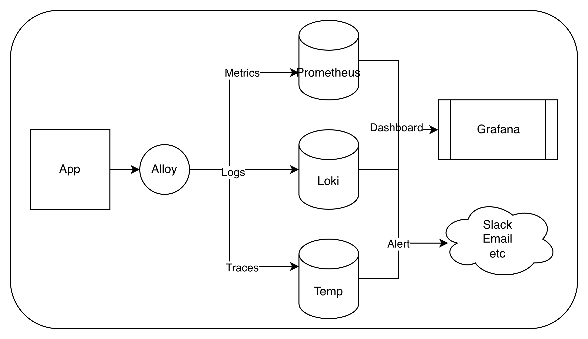

이 글은 **관측성 파이프라인** 시리즈의 출발점입니다.

## 1. 왜 필요한가?
- **배경(기존 모니터링의 한계)**: 과거에는 서버가 "살아있는가(UP/DOWN)?"만 알면 됐지만, 시스템이 복잡해지면서 "살아는 있는데 왜 느리지?", "왜 특정 유저만 에러가 나지?"를 알아야 하는 시대
- **해결책(Observability)**: 시스템 내부에서 무슨 일이 일어나는지 외부에서 출력되는 데이터만으로 유추할 수 있어야함. 단순히 '보는 것'을 넘어 '질문하고 원인을 찾는' 시스템이 필요해짐

## 2. 무엇을 측정하는가?
- **Metrics**: 집계된 수치 (초당 요청 수, p99 지연, 에러율). 추세와 임계치 감시에 사용
- **Logs**: 개별 사건의 기록. "그 요청에 정확히 무슨 일이"를 파고들 때 사용
- **Traces**: 요청이 서비스들을 거친 경로

## 3. 구성 요소

| 이름 | 역할 |
|---|---|
|Grafana Alloy|메트릭·로그·트레이스를 통합 수집하여 각각의 목적지(Prom/Loki/Tempo)로 라우팅하는 차세대 올인원 에이전트|
|Prometheus|메트릭을 주기적으로 스크랩해 시계열로 저장, PromQL로 질의|
|Loki|로그를 label 기반으로 수집·저장, LogQL로 질의|
|Tempo|분산된 앱들의 요청 흐름을 수집·저장하여 병목 구간 추적, TraceQL로 질의|
|Grafana|Prometheus·Loki를 datasource로 묶어 대시보드로 시각화|
|Alertmanager|발생한 알림을 라우팅·그룹핑·중복제거·silence|
|Robusta|알림에 컨텍스트를 붙이고 채널로 전달|

* Alloy 등장 배경
  * 기존 수집기: Metrics(Prometheus직접), Logs(Promtail), Traces(Jaeger Agent)
  * 각 데이터를 수집하는 Agent가 파편화되어 관리가 복잡
  * Alloy 하나만 띄워서 metrics, logs, traces를 모두 모아 각자의 db로 쏴줌(OpenTelemetry 지원)

## 4. 구체적 사례
1. 감지: 금요일 오후 3시 500 에러율이 5%를 넘자 Prometheus가 이상을 감지
2. 전달: Robusta가 알람을 가로채서 에러율이 치솟은 그래프 사진을 첨부해 Slack으로 쏨
3. 분석: 담당자가 알람을 보고 Grafana 접속. 에러가 튄 오후 3시 구간을 확인
4. 해결: 시간이 연동된 하단의 Loki 패널의 해당 1분간의 로그를 통해 원인을 즉시 발견
