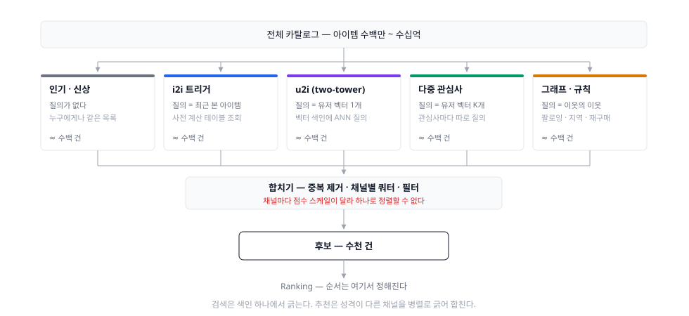
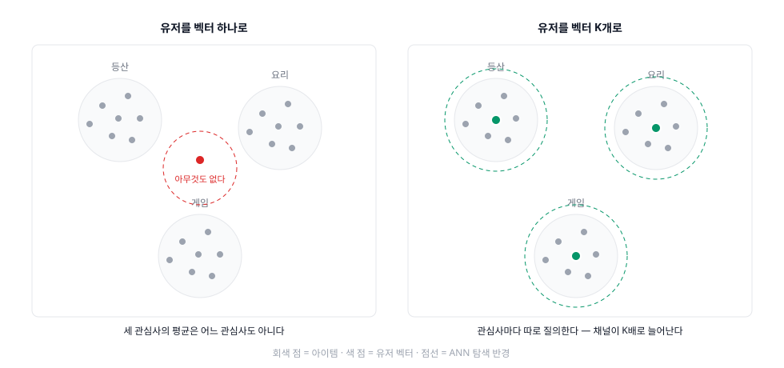

파이프라인 축의 첫 편, Candidate Generation(후보 생성) 편. 앞선 다섯 편이 "**무엇을** 재료로 쓰나"를 나눴다면, 이 편은 그 재료들이 실제로 **어느 칸에서** 쓰이는지를 연다.

## 1. 정의
- 전체 카탈로그에서 "이 유저가 좋아할 법한" 아이템을 **싼 연산으로** 긁어오는 단계. 파이프라인에서 유일하게 **전체 아이템을 상대**한다
- 목표가 다음 단계와 다르다. 여기서 중요한 것은 **재현율(recall)** — 정답을 후보 안에 넣기만 하면 된다. **순서는 Ranking의 일**이다
- 핵심 제약: **여기서 놓친 아이템은 아래에서 복구되지 않는다.** 랭킹은 순서를 바꿀 뿐 없는 것을 만들지 못한다
- 재료: 상호작용 로그, 아이템 속성, 사전 계산된 유사도 테이블·임베딩, 벡터 색인

검색의 Retrieval과 같은 자리이지만, **두 가지가 결정적으로 다르다.**

- **질의가 없다.** 검색은 사용자가 질의를 준다. 추천은 **질의를 우리가 만들어야 한다** — 무엇을 질의로 삼을지가 이 단계의 첫 설계 결정이고, 아래 2장의 분류 축이 곧 그것이다
- **색인이 하나가 아니다.** 검색은 색인 하나에서 긁지만, 추천은 성격이 다른 **채널 여러 개를 병렬로** 긁어 합친다. 그래서 검색에는 없는 "합치기"라는 문제가 하나 더 생긴다

실제 규모는 이렇다.

| 시스템 | 카탈로그 | 후보 생성 후 | 그 뒤 |
|---|---|---|---|
| YouTube (2016) | millions | **hundreds** | Ranking → 노출 |
| Instagram Explore (2023) | billions | **thousands** | 1차 랭킹 hundreds → 2차 랭킹 ~100 → 재정렬 |

## 2. 종류(비교)
1차 분기는 **무엇을 질의로 삼나**이다. 아무것도 안 삼는 데서 시작해, 앞 항목이 놓치는 것을 뒤 항목이 받는 순서로 늘어선다. 그리고 이들은 경쟁 관계가 아니라 **한 요청 안에서 같이 쓰인다.**

- 질의가 없다 (인기 · 신상 · 트렌딩) — **누구에게나 같은 목록**
  - 역할 및 정의: 유저를 보지 않고 전체 집계로 후보를 만든다. 시간 감쇠를 건 인기 순위가 대표적이다 (→ [Popular](../popular/))
  - 유저 하나당 한 번 계산할 필요가 없다. **전체가 목록 하나**라서 캐시가 하나면 끝난다 — 이 채널의 비용은 사실상 0이다
  - 장점: 이력이 0인 유저도 받아 준다(유저 콜드스타트). 다른 모든 채널이 실패해도 여기는 항상 무언가를 낸다 — **최후의 안전망**
  - 결함: 개인화가 없다. 그리고 인기 있는 것을 더 노출해 더 인기 있게 만든다
- 최근 본 아이템 하나 (i2i 트리거) — **질의 = 아이템**
  - 역할 및 정의: 아이템×아이템 유사도를 **배치로 미리 계산해** 테이블에 넣어 두고, 런타임에는 "방금 본 아이템"을 키로 조회만 한다. Amazon의 "이 상품을 산 사람들이 함께 산 상품"이 이 형태다 (→ [Collaborative Filtering](../collaborative-filtering/))
  - 장점 셋: 조회가 **거의 공짜**, 트리거가 방금 클릭이므로 **실시간 반응**, 그리고 "무엇 때문에 추천됐는지"를 그대로 말할 수 있어 **설명 가능**하다
  - 결함: **트리거 하나에 갇힌다.** 유저의 이력 전체가 아니라 마지막 클릭만 반영된다. 사은품 하나 본 것 때문에 지면 전체가 사은품이 되는 사고가 여기서 난다
  - 결함: 공출현이 없는 신상품은 테이블에 아예 없다(아이템 콜드스타트). 속성으로 만드는 i2i가 이 칸을 메운다 (→ [Content-Based](../content-based/))
- 유저 이력 전체를 벡터 하나로 (u2i · two-tower) — **질의 = 유저**
  - 역할 및 정의: 유저 타워가 이력을 벡터 하나로 인코딩하고, 아이템 타워가 아이템을 같은 공간의 벡터로 인코딩한다. 후보 생성은 그 공간에서의 **최근접 이웃 탐색**이 된다
  - YouTube 2016이 이 형태를 정착시켰다. 학습은 "다음에 볼 영상"을 맞히는 **극단적 다중 분류**로 두고, 서빙 시점에는 확률이 필요 없으므로 *"the scoring problem reduces to a nearest neighbor search in the dot product space"*
  - **두 타워를 나눈 이유가 서빙에 있다.** 아이템 타워는 오프라인에서 한 번 돌려 벡터 색인에 박아 두고, 유저 타워만 요청 시점에 돌린다. 유저와 아이템을 한 모델에 같이 넣으면 요청마다 카탈로그 전체를 통과시켜야 해서 성립하지 않는다
  - 장점: 이력 전체가 반영되고, 아이템 타워가 속성을 받으므로 **행동 이력이 없는 새 아이템도 벡터를 갖는다**
  - 결함 1 — **두 타워는 마지막 내적에서만 만난다.** "이 유저가 이 브랜드를 세 번 재구매했다" 같은 유저×아이템 교차 피처를 구조적으로 쓸 수 없다. 그런 피처는 랭킹 단계로 미뤄진다
  - 결함 2 — **in-batch negative의 인기 편향.** 배치 안의 다른 아이템을 오답으로 쓰면 인기 아이템이 오답으로 자주 뽑혀 과도하게 눌린다 (3장·참고 4)
  - 결함 3 — **관심사가 평균된다.** 아래가 이 결함을 받는다
- 벡터 여러 개 · 시퀀스 (multi-interest · sequential) — **질의 = 관심사마다 하나씩**
  - 역할 및 정의: 유저를 벡터 하나가 아니라 **K개**로 인코딩하고, 각각을 독립된 ANN 질의로 쓴다. MIND(Alibaba, CIKM 2019)가 캡슐 네트워크의 dynamic routing으로 행동 시퀀스에서 K개 관심사 벡터를 뽑는 형태를 제시했다
  - 왜 필요한가: 등산·요리·게임을 모두 보는 사람의 이력을 평균하면 **어느 관심사에도 속하지 않는 지점**이 나온다. 벡터 하나로는 구조적으로 못 푸는 문제다

    

  - 유저 타워에 시퀀스 인코더를 쓰면 순서까지 반영된다 — 문제 설정 축의 [Session-based / Sequential](../session-based/)이 파이프라인 축과 여기서 만난다
  - 결함: K를 몇으로 둘지 근거가 약하고, 질의가 K배로 늘어 서빙 비용도 K배가 된다
- 그래프를 걷는다 (random walk · GNN) — **질의 = 이웃의 이웃**
  - 역할 및 정의: 유저-아이템(또는 아이템-보드) 이분 그래프에서 random walk로 도달 가능한 노드를 후보로 삼거나, 그래프 합성곱으로 이웃 정보를 접어 넣은 임베딩을 만든다. PinSage(Pinterest, KDD 2018)가 30억 노드·180억 엣지 규모에서 이 조합을 돌렸다
  - 장점: **한 다리 건너**를 본다. 직접 공출현이 없는 아이템도 이웃의 이웃으로 도달하므로, 2번의 공출현 테이블이 구조적으로 못 하는 롱테일 커버가 된다
  - 결함: 그래프 구축·갱신 비용이 크고, 인기 노드로 걸음이 쏠린다
- 생성한다 (generative retrieval) — **질의 = 시퀀스, 답 = 생성된 ID**
  - 역할 및 정의: 아이템을 RQ-VAE로 양자화해 **semantic ID**(의미가 담긴 토큰 튜플)로 바꾸고, seq2seq 모델이 다음 아이템의 ID를 **토큰 단위로 생성**한다. TIGER(NeurIPS 2023)가 이 형태다
  - 장점: **ANN 색인이 사라진다.** 아이템이 늘어도 색인이 커지지 않고, 비슷한 아이템이 접두 토큰을 공유해 콜드스타트에도 유리하다
  - 결함: 존재하지 않는 ID를 생성할 수 있어 제약 디코딩이 필요하고, 산업 규모 검증이 아직 얇다

### 그리고 남는 문제 — 합치기
채널이 여러 개면 **하나의 후보 집합으로 합쳐야 한다.** 그런데 인기 채널의 조회수와 two-tower의 내적은 **애초에 비교할 수 있는 수가 아니다.**

- 실무의 답은 대개 둘 중 하나다
  - **채널별 쿼터** — "인기에서 200, i2i에서 300, u2i에서 500" 식으로 자리를 나눠 준다. 단순하지만 채널의 기여도를 사람이 정하는 셈이다
  - **순위 기반 융합(RRF)** — 점수 대신 순위만 쓴다. 스케일 문제를 정의상 피해 간다 (→ [Hybrid](../hybrid/))
- 그리고 사실 이 문제의 진짜 해결은 **다음 단계로 미뤄진다.** YouTube 논문의 한 문장이 이것을 정확히 말한다 — *"Ranking is also crucial for ensembling different candidate sources whose scores are not directly comparable."*
- 합치기 직후에 **필터**가 붙는다. 이미 본 것, 품절, 차단, 성인 등급. 쿼터를 채우고 나서 거르면 자리가 비므로 **거른 뒤에 채우는** 순서여야 한다

한눈 비교:

|채널|질의|계산 시점|새 아이템|개인화|설명 가능성|
|---|---|---|---|---|---|
|인기 · 신상|없음|배치 (전체 1개)|잘 받는다|없음|쉬움|
|i2i 트리거|아이템 1개|배치 + 조회|**못 받는다**|얕음 (마지막 클릭)|**쉬움**|
|u2i two-tower|유저 벡터 1개|아이템 배치 + 유저 실시간|받는다 (속성)|이력 전체|어려움|
|다중 관심사|유저 벡터 K개|위와 같음 (질의 K배)|받는다|관심사별|어려움|
|그래프|이웃의 이웃|배치 (무겁다)|이웃이 생기면|이력 전체|중간|
|생성형|시퀀스|모델 추론|유리|시퀀스|어려움|

## 3. 사용 예시
- **채널 구성** — 커머스 홈 지면의 예. 쿼터 합이 최종 후보 수가 된다

  | 채널 | 트리거 | 쿼터 |
  |---|---|---|
  | 실시간 i2i | 최근 본 상품 3개 | 각 100 |
  | u2i two-tower | 유저 임베딩 | 500 |
  | 재구매 | 소모품 주기 도래 | 100 |
  | 인기 (카테고리별) | 선호 카테고리 | 200 |
  | 신상품 | 최근 7일 등록 | 100 |

- **two-tower의 서빙 분업** — 이 분업이 곧 아키텍처다
  - 오프라인(일 배치): 아이템 타워로 전 아이템 벡터화 → 벡터 색인 빌드 → 원자적 교체
  - 온라인(요청): 유저 타워 1회 추론 → ANN 질의 → 상위 k
  - 두 타워가 **다른 시점에 학습된 버전이면 공간이 어긋난다.** 색인과 유저 타워의 모델 버전을 함께 배포해야 한다
- **학습 — in-batch negative와 logQ 보정**
  - 배치 안의 다른 아이템을 오답으로 재사용하는 것이 표준 레시피지만, 인기 분포가 멱법칙이라 인기 아이템이 오답으로 과다 등장한다
  - 보정은 아이템 출현 확률 `Q(i)`를 추정해 로짓에서 `log Q(i)`를 빼는 형태다. Yi et al.(RecSys 2019)은 **스트리밍에서 아이템 빈도를 추정**해 고정 어휘 없이 이 보정을 하는 방법을 제시했고, YouTube 검색·추천의 신경망 리트리벌에 적용했다
  - YouTube 2016은 다른 방식이었다 — 수백만 클래스 중 **"several thousand negatives"** 를 샘플링하고 중요도 가중으로 보정해 *"more than 100 times speedup over traditional softmax"*
- **라벨 설계 — 랜덤 홀드아웃을 쓰지 마라**
  - 이력에서 아이템 하나를 무작위로 빼서 맞히게 하면 **미래 정보가 샌다.** 시청·구매에는 순서가 있고 공출현은 비대칭이다
  - YouTube는 이력을 **되감아(rollback)** 라벨 시점 **이전** 행동만 입력으로 준다. 논문의 표현으로 *"much better performance predicting the user's next watch, rather than predicting a randomly held-out watch"*
  - 유저당 학습 예시 수를 고정해 헤비 유저가 손실을 지배하지 않게 하는 것도 같은 절의 처방이다
- **도구**
  - 라이브러리: [Faiss](https://faiss.ai/) (IVF·PQ·HNSW), [ScaNN](https://github.com/google-research/google-research/tree/master/scann) (anisotropic vector quantization)
  - 손잡이는 검색 편과 같다 — 탐색 폭을 키우면 재현율이 오르고 느려진다

## 4. 참고
1. 재현율은 여기서 결정된다 — 그런데 추천에는 정답 집합이 없다
- 검색은 Recall@k를 재려면 "관련 문서" 집합이 있어야 하고, 판정자를 붙이면 만들 수 있다. **추천은 그 집합이 정의되지 않는다** — 유저가 좋아했을 아이템 전체를 아무도 모른다
- 그래서 실무는 로그된 상호작용을 정답으로 삼는데, **그 로그는 과거 후보 생성기가 보여준 것 안에서만 생긴다.** 자기가 후보에 넣은 것으로 자기를 채점하는 구조다
- 채널을 새로 붙였을 때 오프라인 재현율이 오르지 않는데 A/B에서는 오르는 일이 흔한 이유가 이것이다. 오프라인 지표가 새 채널이 발굴한 아이템을 **오답으로 센다**

2. 학습 목표와 실제 임무가 다르다
- 후보 생성 모델은 "다음에 볼 것"을 맞히도록 학습된다. 그런데 이 단계의 실제 임무는 **랭커에게 좋은 후보 집합을 건네는 것**이다
- 둘은 같지 않다. 랭커가 이미 잘 맞히는 아이템을 후보에 더 넣어 봐야 최종 결과는 그대로다. 후보 생성의 가치는 **랭커가 볼 기회조차 없던 아이템**을 넣을 때 생긴다
- 채널을 늘려서 계속 이득이 나는 것도, 어느 순간 멈추는 것도 이 기준으로 설명된다 — 새 채널이 기존 채널과 **겹치는 만큼** 기여가 0에 가까워진다

3. 로그를 어디서 모으나 — 피드백 루프
- YouTube는 추천으로 발생한 시청만이 아니라 **모든 시청**(다른 사이트에 임베드된 것까지)으로 학습한다. 이유가 논문에 그대로 적혀 있다 — 그러지 않으면 *"it would be very difficult for new content to surface and the recommender would be overly biased towards exploitation"*
- 즉 후보 생성기를 자기 노출 로그로만 학습시키면 **자기가 보여준 것만 다시 배운다.** 검색·외부 유입·다른 지면의 행동을 학습에 함께 넣는 것이 이 루프를 여는 가장 싼 방법이다
- 이걸 정면으로 다루는 것이 평가·학습 축의 **Bandit & Exploration**이다

4. 인기 편향은 세 곳에서 따로 들어온다
- **로그** — 노출이 많았던 것에 상호작용이 많다
- **학습** — in-batch negative에서 인기 아이템이 오답으로 과다 등장한다 (logQ 보정의 대상)
- **채널 쿼터** — 인기 채널에 자리를 준 만큼 무조건 인기 아이템이 들어간다
- 셋의 처방이 다르다. 두 번째는 손실 함수에서, 세 번째는 쿼터 설계에서, 첫 번째는 탐색에서 푼다. **하나를 고쳤다고 편향이 사라지지 않는다**

5. 앞선 다섯 편은 전부 이 칸 안에 있다
- Popular = 비개인화 채널, CF의 i2i 테이블 = 트리거 채널, MF·임베딩 = two-tower의 원형, Content-Based = 콜드스타트 채널, Session-based = 시퀀스 유저 타워
- 즉 **재료 축은 "이 칸에서 무엇을 쓰나"였고, 파이프라인 축은 "그 칸이 어디냐"다.** 두 축은 대체 관계가 아니라 직교한다
- 검색 시리즈에서 BM25와 벡터 검색이 [Retrieval](../../search/retrieval/) 안의 선택지였던 것과 같은 구조다

6. 이 편이 답하지 않는 것
- 채널마다 다른 점수를 어떻게 하나의 순서로 만드나 → [**Ranking**](../ranking/)
- 수천 건을 수백 건으로 줄이는 **사전 랭킹**이 왜 별도 단계로 필요한가 → [**Ranking**](../ranking/). Instagram Explore가 1차 랭커를 따로 두는 이유가 거기 있다
- 노출 분배·다양성·신선도처럼 점수 순서를 깨는 제약 → **Re-ranking**
- 후보에 넣지 않은 것은 데이터가 없다는 문제 → 평가·학습 축의 **Bandit & Exploration**

## 5. 링크
- 파이프라인
  - [Candidate generation overview | Google ML](https://developers.google.com/machine-learning/recommendation/overview/candidate-generation) — candidate generation → retrieval → scoring → re-ranking
  - [Deep Neural Networks for YouTube Recommendations (RecSys 2016)](https://doi.org/10.1145/2959100.2959190) — 2단 구조의 표준 레퍼런스 ([PDF](https://research.google.com/pubs/archive/45530.pdf))
  - [Scaling the Instagram Explore recommendations system (2023)](https://engineering.fb.com/2023/08/09/ml-applications/scaling-instagram-explore-recommendations-system/) — retrieval → 1차 랭킹 → 2차 랭킹 → 재정렬, 단계별 후보 수
- Two-tower · 학습
  - [Sampling-Bias-Corrected Neural Modeling for Large Corpus Item Recommendations (RecSys 2019)](https://dl.acm.org/doi/10.1145/3298689.3346996) — in-batch negative의 편향과 스트리밍 빈도 추정 ([Google Research](https://research.google/pubs/sampling-bias-corrected-neural-modeling-for-large-corpus-item-recommendations/))
  - [A Comprehensive Survey on Retrieval Methods in Recommender Systems (arXiv 2024)](https://arxiv.org/abs/2407.21022)
- 다중 관심사 · 그래프 · 생성형
  - [Multi-Interest Network with Dynamic Routing for Recommendation at Tmall (CIKM 2019)](https://dl.acm.org/doi/10.1145/3357384.3357814) ([arXiv](https://arxiv.org/abs/1904.08030))
  - [Graph Convolutional Neural Networks for Web-Scale Recommender Systems — PinSage (KDD 2018)](https://arxiv.org/abs/1806.01973) ([Pinterest Engineering](https://medium.com/pinterest-engineering/pinsage-a-new-graph-convolutional-neural-network-for-web-scale-recommender-systems-88795a107f48))
  - [Recommender Systems with Generative Retrieval — TIGER (NeurIPS 2023)](https://openreview.net/forum?id=BJ0fQUU32w) ([arXiv](https://arxiv.org/abs/2305.05065))
- 도구
  - [Faiss documentation](https://faiss.ai/) · [facebookresearch/faiss](https://github.com/facebookresearch/faiss) · [The Faiss library (arXiv 2024)](https://arxiv.org/abs/2401.08281)
  - [ScaNN | google-research](https://github.com/google-research/google-research/tree/master/scann) · [Announcing ScaNN | Google Research Blog](https://research.google/blog/announcing-scann-efficient-vector-similarity-search/)
