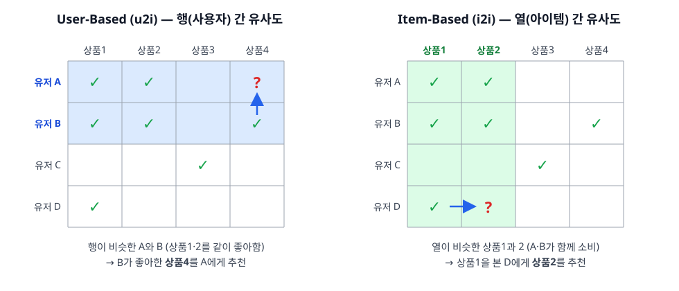
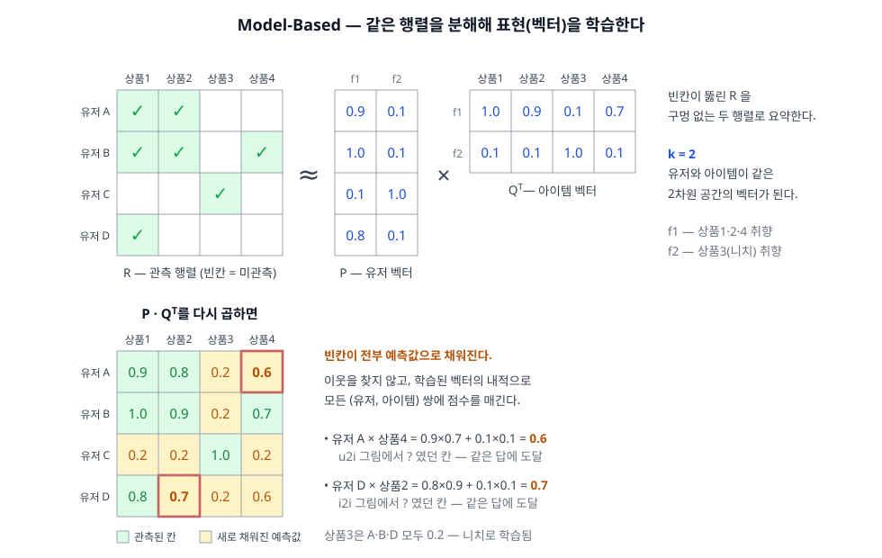

개인화의 출발점, Collaborative Filtering(협업 필터링) 편. 아이템이 무엇인지(속성) 전혀 몰라도, "누가 무엇을 소비했나"만 있으면 추천이 된다는 것이 이 계열의 발견이다.

## 1. 정의
- 아이템 속성을 전혀 사용하지 않고, **행동 이력(user-item 상호작용 행렬)만으로** "너와 비슷한 사람들이 좋아한 것"을 찾는 계열
- 핵심 가정: **과거에 비슷하게 행동한 사용자들은 앞으로도 비슷하게 행동한다** — 취향은 말하지 않아도 행동에 드러난다
- 재료: user × item 행렬. 칸의 값은 평점(explicit feedback) 또는 클릭·구매·시청(implicit feedback)

## 2. 종류(비교)
1차 분기는 행렬을 다루는 방식이다 — 행렬을 **직접 뒤지는** Memory-Based, 행렬로 **모델을 학습하는** Model-Based.

- Memory-Based (이웃 기반)
  - 역할 및 정의: 행렬을 통째로 들고 있다가, 요청 시 유사도(코사인·피어슨)로 가까운 이웃 k개를 찾아(kNN) 그들의 행동을 집계한다 — 학습 단계가 없다
  - 유사도를 재는 방향에 따라 둘로 갈린다:
    - **User-Based (u2i)**: "나와 비슷한 사람들이 좋아한 것" — 유저 행(row) 간 유사도. CF의 원형 그대로라 직관적이지만, 유저 취향은 자주 변해서 미리 계산하기 어렵고 유저 수만큼 무거워진다
    - **Item-Based (i2i)**: "이 아이템과 함께 소비된 것" — 아이템 열(column) 간 유사도. 아이템 간 관계는 유저 취향보다 훨씬 **안정적**이라 오프라인 사전 계산 + 빠른 서빙이 가능 (Amazon이 수천만 유저 스케일을 이 방향 전환으로 풀었다)

    

  - 장점: 구현 단순, 학습 파이프라인 불필요, 이웃이 근거라서 결과를 설명할 수 있다
  - 단점: 행렬이 희소하면 이웃의 질이 나빠지고, 행렬이 커지면 유사도 계산이 스케일을 못 따라간다. 인기 아이템 쏠림(다들 산 것끼리는 다 유사해 보임)
- Model-Based
  - 역할 및 정의: 행렬을 그대로 들고 다니는 대신, 행렬을 요약·일반화하는 **모델을 학습**한다
  - 대표가 **Matrix Factorization**: 행렬을 저차원 잠재 요인(latent factor)으로 분해 — `R ≈ P·Qᵀ`, 유저 벡터와 아이템 벡터의 내적이 선호를 근사

    

  - 장점: 희소한 행렬의 빈칸을 학습된 일반화로 메운다. 이웃 기반보다 정확도·확장성 모두 우수 — Netflix Prize에서 입증
  - 단점: 잠재 요인은 사람이 해석하기 어렵다. 학습 파이프라인 필요

한눈 비교:

|구분|User-Based (u2i)|Item-Based (i2i)|Matrix Factorization|
|---|---|---|---|
|계열|Memory-Based|Memory-Based|Model-Based|
|답하는 질문|나와 비슷한 사람은 무엇을 좋아하나|이 아이템과 함께 소비되는 것은|행렬을 가장 잘 설명하는 잠재 요인은|
|대표 알고리즘|User-kNN|Item-kNN, Slope One|FunkSVD, iALS, BPR-MF|
|유사도 대상|유저 행(row)|아이템 열(column)|— (분해로 학습)|
|사전 계산|어려움 (취향이 자주 변함)|쉬움 (아이템 관계는 안정적)|배치 학습 필요|
|확장성|낮음|높음|높음|
|설명 가능성|"비슷한 사용자가 좋아함"|"함께 산 상품"|낮음 (잠재 요인)|

## 3. 사용 예시
각 계열을 실제로 구현하는 대표 알고리즘들.

- Memory-Based
  - **User-kNN** — 유저 이웃 k명의 평점을 유사도로 가중 평균 (GroupLens의 원형)
  - **Item-kNN** — 아이템 이웃으로 같은 일을 한다. Amazon의 item-to-item이 이 계열
  - **Slope One** — 아이템 쌍의 평점 **편차 평균**만으로 예측하는 극단적 단순화. 유사도 계산조차 생략한다
  - 유사도 척도: 코사인, **adjusted cosine**(유저마다 다른 평점 후함/박함을 제거), 피어슨 상관, 자카드(암시적 피드백에서 집합 겹침만 볼 때)
- Model-Based / MF 계열 — "**무엇을 최소화하도록 P·Q를 학습하나**"로 갈린다
  - **FunkSVD** — Netflix Prize에서 등장. 관측된 칸의 오차만 SGD로 최소화하는 가장 기본형
  - **SVD++** — 여기에 "무엇을 봤는가"라는 암시적 신호를 더해 정확도를 끌어올린 확장
  - **iALS (ALS)** — 암시적 피드백 전용. 빈칸을 "약한 부정"으로 보고 신뢰도(confidence)를 가중, P와 Q를 **번갈아** 최소제곱으로 푼다(그래서 Alternating). 병렬화가 쉬워 산업 표준
  - **BPR-MF** — 점수 자체를 맞히는 대신 "본 것 > 안 본 것"이라는 **순위 쌍**을 맞히도록 학습. 랭킹이 목적일 때 자연스러운 손실 함수
  - **PMF / NMF** — 확률 모델로 본 버전, 요인을 음수 없이 제약한 버전
  - **FM (Factorization Machines)** — 유저·아이템 id를 넘어 임의의 피처까지 분해 대상으로 일반화
- Model-Based / MF 밖의 계열 — MF만 model-based인 것은 아니다
  - **SLIM·EASE** — 아이템 간 가중치 행렬을 회귀로 직접 학습. EASE는 **닫힌 해**로 한 번에 풀리는데도 강력해서 지금도 벤치마크 기준선
  - **RBM·Mult-VAE** — 행렬 복원을 오토인코더/생성 모델로 푸는 계열
  - **NeuMF·GRU4Rec·SASRec** — 내적을 신경망으로 대체하거나, 소비 **순서**까지 모델링하는 시퀀스 계열
- 위 알고리즘들의 손실 함수·학습 디테일과 벡터 서빙(ANN)은 시리즈 뒤의 **딥러닝 축**에서 — MF가 곧 임베딩 학습의 원형이다

## 4. 참고
1. u2i / i2i 는 Memory-Based 전용이 아니다 — 두 축은 직교한다
- **memory vs model**은 "무엇을 질의하는가" — 원본 행렬인가, 학습된 표현인가
- **u2i vs i2i**는 "어느 방향으로 질의하는가" — 유저 기준인가, 아이템 기준인가
- MF로 벡터를 얻고 나면 잠재 공간에서도 두 방향이 그대로 반복된다: 유저 벡터·아이템 벡터 내적이 u2i, 아이템 벡터끼리의 내적이 i2i
- 결정적 차이는 **빈칸의 처리**다. Memory-Based는 관측된 칸만 비교하므로 희소하면 이웃이 부실해지고, Model-Based는 학습된 일반화로 빈칸을 메운다

2. 명시적 vs 암시적 피드백
- 명시적(평점 1–5): 선호의 방향이 분명하지만 **희귀하다** — 대부분의 사용자는 평점을 남기지 않는다
- 암시적(클릭·구매·시청시간): 풍부하지만 **부정 신호가 없다** — 안 봤다는 것이 싫어한다는 뜻이 아니라서, "빈칸"의 해석이 학습의 난점이 된다

3. CF가 자리 잡은 순서
- **GroupLens (1994)** — user-based의 원조. Usenet 뉴스 글에 평점을 매겨 "비슷한 독자"의 평점으로 필터링. 이 연구팀이 만든 MovieLens 데이터셋은 지금도 추천 연구의 표준 벤치마크
- **Amazon (2003)** — "이 상품을 산 사람들이 함께 산 상품". 유저 수천만 × 상품 수백만에서 user-based가 불가능해지자, 안정적인 아이템 유사도를 사전 계산하는 쪽으로 방향을 뒤집었다
- **Netflix Prize (2006–2009)** — "평점 예측을 10% 개선하면 $1M". 우승 계열의 핵심이 MF였고, 이후 추천의 무게중심이 이웃 기반에서 model-based로 넘어갔다
- 서비스에서 "함께 구매한", "비슷한 취향의 회원이 본" 같은 문구가 보이면 CF가 돌고 있다는 신호

4. CF의 구조적 약점 — 다음 편들의 예고
- 콜드스타트: 새 유저는 행이, 새 아이템은 열이 비어 있다 → 속성으로 다루는 Content-Based가 보완
- 희소성(sparsity): 실제 행렬은 99% 이상이 빈칸 — 이웃의 질이 나빠지는 근본 원인
- 인기 편향·필터 버블: 행동이 많은 곳으로 추천이 쏠린다 → Hybrid에서 다룰 주제

## 5. 링크
- 개요
  - [Collaborative filtering — Wikipedia](https://en.wikipedia.org/wiki/Collaborative_filtering)
  - [Matrix factorization (recommender systems) — Wikipedia](https://en.wikipedia.org/wiki/Matrix_factorization_(recommender_systems))
  - [Netflix Prize — Wikipedia](https://en.wikipedia.org/wiki/Netflix_Prize)
- Memory-Based
  - [GroupLens](https://grouplens.org/) — user-based CF의 원조 연구팀, MovieLens 데이터셋
  - [Amazon.com Recommendations: Item-to-Item Collaborative Filtering (Linden et al., 2003)](https://www.cs.umd.edu/~samir/498/Amazon-Recommendations.pdf)
  - [Slope One — Wikipedia](https://en.wikipedia.org/wiki/Slope_One)
- Model-Based (원 논문)
  - [Netflix Update: Try This at Home (Simon Funk, 2006)](https://sifter.org/simon/journal/20061211.html) — FunkSVD
  - [Collaborative Filtering for Implicit Feedback Datasets (Hu, Koren, Volinsky, 2008)](http://yifanhu.net/PUB/cf.pdf) — iALS
  - [BPR: Bayesian Personalized Ranking from Implicit Feedback (Rendle et al., 2009)](https://arxiv.org/abs/1205.2618)
  - [Embarrassingly Shallow Autoencoders for Sparse Data (Steck, 2019)](https://arxiv.org/abs/1905.03375) — EASE
  - [Variational Autoencoders for Collaborative Filtering (Liang et al., 2018)](https://arxiv.org/abs/1802.05814) — Mult-VAE
  - [Neural Collaborative Filtering (He et al., 2017)](https://arxiv.org/abs/1708.05031) — NeuMF
  - [Self-Attentive Sequential Recommendation (Kang & McAuley, 2018)](https://arxiv.org/abs/1808.09781) — SASRec
