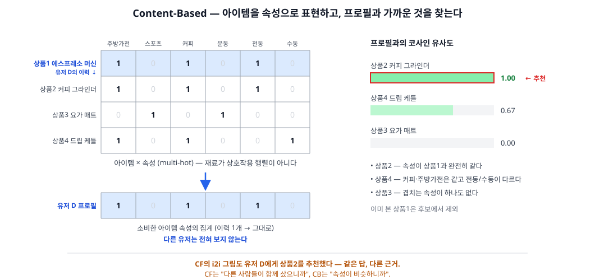
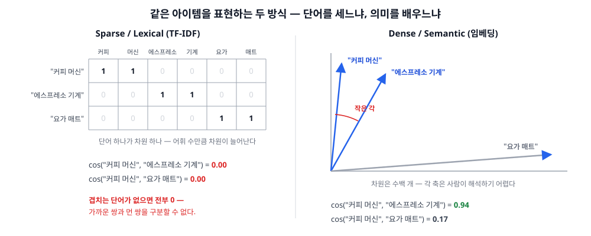

Content-Based(콘텐츠 기반) 편. CF가 "너와 비슷한 **사람들**이 좋아한 것"이었다면, 이쪽은 "네가 좋아한 **것과 비슷한** 것"이다. 결정적 차이는 **다른 유저를 전혀 보지 않는다**는 점 — 유저가 한 명뿐인 서비스에서도 동작한다.

## 1. 정의
- 아이템을 **속성(콘텐츠)** 으로 벡터화하고, 유저 프로필(= 소비한 아이템 벡터들의 집계)과 가까운 아이템을 추천하는 계열
- 핵심 가정: **한 사람의 취향은 그가 소비한 것들의 속성으로 설명된다** — 커피 기구를 산 사람은 커피 기구를 또 살 것이다
- 재료: user × item 상호작용 행렬이 아니라 **item × attribute 테이블**. 텍스트, 카테고리·브랜드·태그, 가격, 이미지
- CF와의 관계: CF는 행렬의 **행/열**을 비교했고, CB는 아이템의 **속성**을 비교한다. 남의 행동이 필요 없다

CF의 i2i 그림과 같은 답(상품2)에 도달하지만 근거가 다르다. CF는 "다른 사람들이 함께 샀으니까", CB는 "속성이 비슷하니까". 그래서 **아무도 사지 않은 신상품도 추천할 수 있다** — CB의 가장 큰 무기다.

## 2. 종류(비교)
CB는 두 단계로 나뉜다. **아이템을 무엇으로 표현하나(2-1)**, 그리고 **프로필과 어떻게 매칭하나(2-2)**. 성능의 대부분은 2-1에서 결정된다.

### 2-1. 아이템 표현
- Sparse / Lexical
  - 역할 및 정의: 단어나 속성 하나가 차원 하나가 된다. **TF-IDF**는 문서 내 빈도(TF)에 전체에서의 희귀도(IDF)를 곱해, 흔한 단어의 힘을 깎고 특징적인 단어에 무게를 준다
  - 장점: 학습이 필요 없고, 각 차원의 의미가 그대로 읽혀서 **왜 추천됐는지 설명 가능**. 어휘가 늘어나도 증분 갱신이 쉽다
  - 단점: **어휘가 겹치지 않으면 유사도가 0**이다. "커피 머신"과 "에스프레소 기계"는 같은 물건인데도 전혀 무관해 보인다(vocabulary mismatch). 차원이 어휘 수만큼 커진다
- Dense / Semantic
  - 역할 및 정의: 아이템을 수백 차원의 학습된 벡터로 표현한다. 텍스트는 word2vec·SBERT, 이미지는 CNN·CLIP
  - 장점: 단어가 안 겹쳐도 **의미가 가까우면 가깝다**. 이미지·오디오처럼 단어로 표현할 수 없는 속성도 벡터가 된다
  - 단점: 각 차원이 무엇인지 사람이 알 수 없어 설명이 어렵다. 사전학습 모델이나 학습 파이프라인이 필요하고, 도메인 용어에 약할 수 있다

### 2-2. 프로필 매칭
CF의 memory / model 축이 여기서도 반복된다.

- 유사도 기반 (학습 없음)
  - 역할 및 정의: 프로필 벡터와 아이템 벡터의 코사인 유사도로 정렬한다. 프로필은 보통 소비한 아이템 벡터의 (가중) 평균
  - 장점: 구현이 단순하고 이력 하나만 있어도 즉시 동작. 이력이 바뀌면 프로필만 다시 평균내면 끝
  - 단점: "싫어함"을 반영하기 어렵다. 이력이 여러 취향에 걸쳐 있으면 평균이 **어느 쪽도 아닌 지점**을 가리킨다
- 분류기 기반 (유저별 지도학습)
  - 역할 및 정의: 그 유저의 좋아요/싫어요를 라벨로 삼아 "이 유저가 좋아할 아이템인가"를 예측하는 모델을 **유저마다** 학습한다
  - 장점: 부정 신호를 정면으로 쓸 수 있고, 속성 간 비선형 관계도 학습된다
  - 단점: 유저 수만큼 모델을 관리해야 하고, 이력이 적은 유저는 학습이 안 된다

한눈 비교:

|구분|Sparse 표현|Dense 표현|유사도 매칭|분류기 매칭|
|---|---|---|---|---|
|축|표현(2-1)|표현(2-1)|매칭(2-2)|매칭(2-2)|
|대표 기법|TF-IDF, BM25|SBERT, CLIP|코사인, Rocchio|Naive Bayes, 로지스틱 회귀|
|학습 필요|없음|사전학습 모델 필요|없음|유저마다 필요|
|설명 가능성|높음 (차원 = 단어)|낮음|중간|중간|
|어휘 불일치|취약|강함|—|—|
|부정 신호|—|—|반영 어려움|반영 가능|

## 3. 사용 예시
- 표현 기법
  - **TF-IDF** — CB의 고전 기본형. 문서 벡터화의 출발점
  - **BM25** — TF의 **포화**(같은 단어가 10번 나와도 2번의 5배는 아니다)와 문서 길이 정규화를 넣은 개선판. 검색 랭킹의 사실상 표준
  - **one-hot / multi-hot 속성** — 카테고리·브랜드·태그처럼 이미 구조화된 속성
  - **word2vec / doc2vec** — 분산 표현의 출발점
  - **Sentence-BERT** — 문장 임베딩. 상품명·설명문의 의미 유사도에 적합
  - **CLIP / CNN 임베딩** — 이미지 기반. 패션·인테리어처럼 "보기에 비슷한 것"이 중요한 도메인의 핵심
- 매칭 기법
  - **Rocchio** — 관련 피드백으로 프로필 벡터를 옮기는 고전 알고리즘. 좋아한 것 쪽으로 당기고 싫어한 것 쪽에서 밀어낸다
  - **Naive Bayes** — 텍스트 분류의 고전. 스팸 필터와 원리가 같다
  - **kNN 분류기 / 로지스틱 회귀 / SVM / 결정 트리** — 유저별 지도학습의 흔한 선택지
- 서비스 사례
  - **Pandora, Music Genome Project** — 음악 전문가가 곡마다 수백 개 속성을 **수동 태깅**해 CB를 돌린 가장 순수한 산업 사례. 속성의 질이 성능이라는 것을 비용으로 증명했다
  - **뉴스 추천** — 기사는 수명이 짧아 행동이 쌓이기 전에 낡는다. 아이템 콜드스타트가 상수인 도메인이라 CB가 본진
  - **구인·부동산** — 아이템 회전이 빠르고 속성(직무·연봉·지역·평수)이 풍부해서 CB가 잘 맞는다
  - **음악의 오디오 기반 CB** — 스펙트로그램에 CNN을 걸어 곡 자체에서 표현을 학습하면, 재생 이력이 없는 신곡도 추천 후보가 된다
- 임베딩의 **학습 방법**과 벡터 서빙(ANN)은 시리즈 뒤의 **딥러닝 축**에서 — 여기서는 "속성을 벡터로 만들어 쓴다"는 개념까지

## 4. 참고
1. CB는 검색(IR)에서 왔다
- TF-IDF·BM25·Rocchio는 모두 정보 검색(Information Retrieval)의 도구다
- CB는 **질의(query)를 유저 프로필로 바꾼 검색**으로 이해하면 계보가 잡힌다 — 사용자가 검색어를 입력하는 대신, 과거 행동이 검색어 역할을 한다

2. 콜드스타트는 CF와 정확히 반대다

|상황|CF|CB|
|---|---|---|
|신규 **아이템** (행동 0)|추천 불가 — 열이 비어 있다|**가능** — 속성만 있으면 된다|
|신규 **유저** (이력 0)|추천 불가 — 행이 비어 있다|추천 불가 — 프로필을 만들 수 없다|

- 두 계열의 약점이 서로 반대라서 상보적이다. 이게 **Hybrid**의 존재 이유
- 유저 콜드스타트는 CB도 못 푼다 — 이 구간은 결국 Popular(비개인화)가 받는다

3. CB의 구조적 약점
- **Over-specialization (필터 버블)** — 이력과 비슷한 것만 나온다. 커피 기구를 사면 계속 커피 기구만 보이고, 뜻밖의 발견(serendipity)이 구조적으로 생기지 않는다. CF는 "나와 비슷한 사람이 산 엉뚱한 것"을 통해 이걸 넘어설 수 있다
- **속성의 질이 성능의 상한** — 메타데이터가 부실하면 방법이 없다. 태깅에 사람이 붙어야 하는 경우가 많다
- **속성은 품질을 담지 않는다** — 같은 카테고리·브랜드·가격대의 좋은 상품과 나쁜 상품을 CB는 구분하지 못한다. 평점·판매량 같은 행동 신호가 필요한 지점
- 이 셋 모두 "행동 신호를 섞으면 완화된다"로 수렴한다 → Hybrid 편

## 5. 링크
- 개요
  - [Recommender system — Wikipedia](https://en.wikipedia.org/wiki/Recommender_system) — content-based filtering 절
  - [Introduction to Information Retrieval (Manning, Raghavan, Schütze)](https://nlp.stanford.edu/IR-book/html/htmledition/irbook.html) — TF-IDF·BM25·Rocchio의 교과서
- Sparse 표현
  - [tf–idf — Wikipedia](https://en.wikipedia.org/wiki/Tf%E2%80%93idf)
  - [Okapi BM25 — Wikipedia](https://en.wikipedia.org/wiki/Okapi_BM25)
- Dense 표현
  - [Distributed Representations of Sentences and Documents (Le & Mikolov, 2014)](https://arxiv.org/abs/1405.4053) — doc2vec
  - [Sentence-BERT (Reimers & Gurevych, 2019)](https://arxiv.org/abs/1908.10084)
  - [Learning Transferable Visual Models From Natural Language Supervision (Radford et al., 2021)](https://arxiv.org/abs/2103.00020) — CLIP
  - [word2vec — Wikipedia](https://en.wikipedia.org/wiki/Word2vec)
- 매칭
  - [Rocchio algorithm — Wikipedia](https://en.wikipedia.org/wiki/Rocchio_algorithm)
  - [Naive Bayes classifier — Wikipedia](https://en.wikipedia.org/wiki/Naive_Bayes_classifier)
- 사례
  - [Music Genome Project — Wikipedia](https://en.wikipedia.org/wiki/Music_Genome_Project) — Pandora
  - [Deep content-based music recommendation (van den Oord et al., 2013)](https://papers.nips.cc/paper_files/paper/2013/hash/b3ba8f1bee1238a2f37603d90b58898d-Abstract.html)
