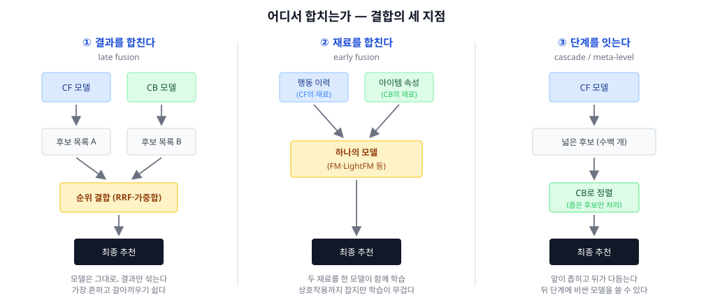
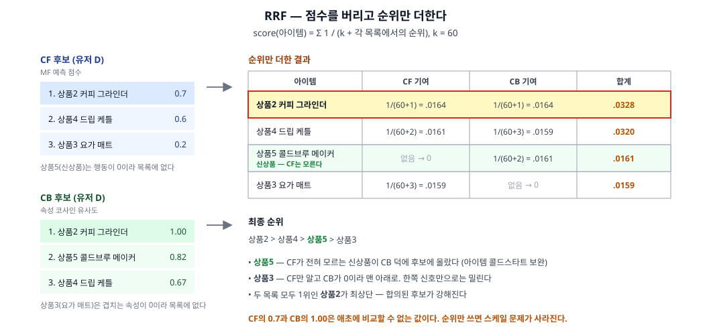

고전 분류의 마지막, Hybrid(하이브리드) 편. 앞의 세 편에서 계열마다 강한 구간과 약한 구간이 갈렸다. 실제 서비스가 하나의 계열만 쓰지 않는 이유, 그리고 섞는 방법들을 정리한다.

## 1. 정의
- 둘 이상의 추천 계열을 결합해, **한 계열의 약점을 다른 계열의 강점으로 메우는** 방식
- 섞는 근거는 취향이 아니라 구조다 — 앞선 편들에서 확인한 약점이 서로 **어긋나 있다**:
  - CF는 신규 아이템을 못 다루고(열이 빈다), CB는 신규 유저를 못 다룬다(프로필을 못 만든다)
  - CF는 인기 편향이 있고, CB는 필터 버블이 있다
  - CF는 속성을 못 보고, CB는 품질을 못 본다
- 그래서 Hybrid는 "성능을 더 짜내는 기법"이기 전에 **커버리지를 메우는 구조적 선택**이다

## 2. 종류(비교)
1차 분기는 **어디서 합치는가**다 — 결과, 재료, 단계.

- ① 결과를 합친다 (late fusion)
  - 역할 및 정의: 각 계열이 독립적으로 후보 목록을 만들고, 그 **출력만** 결합한다. 순위를 더하거나(RRF), 점수에 가중치를 주거나, 지면을 나눠 배치한다
  - 장점: 각 모델이 완전히 독립이라 따로 학습·배포·교체할 수 있다. 한 계열이 죽어도 나머지가 동작한다. 구현이 가장 단순해서 대부분의 서비스가 여기서 시작한다
  - 단점: 계열 간 **상호작용을 학습하지 못한다** — "이 유저에게는 CB를 더 믿어야 한다" 같은 판단을 사람이 가중치로 넣어야 한다. 가중치 튜닝이 곧 운영 부담
- ② 재료를 합친다 (early fusion)
  - 역할 및 정의: 결과를 섞는 게 아니라, 행동 이력과 아이템 속성을 **하나의 모델에 함께 입력**한다. 모델이 둘의 관계까지 학습한다
  - 장점: "속성이 이럴 때는 행동 신호를 이렇게 해석한다"는 상호작용을 모델이 잡아낸다. 콜드스타트가 자연스럽게 풀린다 — 행동이 없어도 속성만으로 벡터가 나오니까
  - 단점: 학습 파이프라인이 하나로 묶여 무거워지고, 어느 신호가 결과를 만들었는지 분리해서 설명하기 어렵다. 피처가 늘면 학습 비용이 빠르게 커진다
- ③ 단계를 잇는다 (cascade / meta-level)
  - 역할 및 정의: 한 계열의 출력이 다음 계열의 **입력**이 된다. CF로 후보를 수백 개로 좁히고 CB(또는 더 비싼 모델)로 정렬하거나, CB로 만든 아이템 벡터를 CF 모델에 투입한다
  - 장점: 뒤 단계는 후보가 적어서 **비싼 모델을 쓸 수 있다**. 현대 추천의 2단계 구조(retrieval → ranking)가 정확히 이 형태
  - 단점: 앞 단계에서 떨어진 아이템은 뒤에서 되살릴 수 없다 — 앞 단계의 재현율(recall)이 전체 성능의 천장이 된다

한눈 비교:

|구분|① 결과 (late)|② 재료 (early)|③ 단계 (cascade)|
|---|---|---|---|
|무엇을 합치나|각 모델의 출력 순위|입력 피처|앞 모델의 출력을 뒤 모델의 입력으로|
|대표 기법|RRF, 가중합, switching|FM, LightFM|retrieval → ranking, 임베딩 투입|
|모델 독립성|완전 독립|하나로 묶임|느슨하게 연결|
|계열 간 상호작용|학습 못 함 (사람이 가중치)|학습함|부분적|
|콜드스타트 대응|한쪽 목록이 비면 다른 쪽이 채움|속성만으로 벡터 생성|앞 단계가 놓치면 끝|
|운영 난이도|낮음|높음|중간|

## 3. 사용 예시
- 결과 결합
  - **RRF (Reciprocal Rank Fusion)** — 점수를 버리고 순위만 더한다. `Σ 1/(k + rank)`, 보통 k=60. 스케일이 다른 목록을 섞는 가장 견고한 기본형
  - **가중합 (weighted)** — 점수를 정규화한 뒤 `α·CF + (1-α)·CB`. 직관적이지만 정규화 방식에 결과가 민감하다
  - **Switching** — 상황에 따라 하나를 고른다. "이력 3개 미만이면 CB, 그 이상이면 CF" 같은 규칙
  - **Mixed** — 섞지 않고 나란히 보여준다. "함께 본 상품" 줄과 "당신을 위한 추천" 줄을 따로 두는 지면 구성
  - **Stacking (learning to rank)** — 가중치를 사람이 정하지 않고 모델이 학습한다. Netflix Prize 우승 솔루션이 100개 이상의 모델을 이렇게 결합했다
- 재료 결합
  - **FM (Factorization Machines)** — 유저·아이템 id와 속성·컨텍스트를 모두 한 벡터에 넣고 2차 상호작용을 분해로 학습. id만 넣으면 MF가 되므로 **MF의 일반화**다
  - **LightFM** — 유저·아이템을 "속성 임베딩의 합"으로 표현한다. 행동이 없는 신규 아이템도 속성만으로 벡터를 얻어 콜드스타트가 구조적으로 해결된다
- 단계 연결
  - **retrieval → ranking** — 수백만 개에서 수백 개를 싸게 골라낸 뒤, 비싼 모델로 정렬하는 현대 추천의 표준 구조
  - **meta-level** — CB로 학습한 아이템 표현을 CF 모델의 입력으로 넣는 방식. 두 계열이 순차적으로 쌓인다

### RRF를 숫자로

CF와 CB의 점수는 애초에 비교할 수 없는 값이다. 순위만 쓰면 그 문제가 사라진다.

이 예시가 Hybrid의 두 방향을 동시에 보여준다. **상품5(신상품)** 는 행동 이력이 0이라 CF 목록에 아예 없지만 CB 덕에 후보에 올랐고, **상품3**은 CF만 알고 CB 점수가 0이라 맨 아래로 밀렸다. 한쪽 신호만 가진 아이템은 약해지고, 두 목록이 합의한 아이템은 강해진다.

## 4. 참고
1. Burke의 7분류 (2002) — 이 글의 3분류가 나온 곳
- 하이브리드의 표준 분류는 Burke의 7가지다. 위의 3분류는 "어디서 합치는가"로 이것을 압축한 것

|Burke 분류|내용|이 글의 묶음|
|---|---|---|
|Weighted|각 계열의 점수를 가중합|① 결과|
|Switching|상황에 따라 한 계열을 선택|① 결과|
|Mixed|여러 계열의 결과를 나란히 제시|① 결과|
|Feature Combination|여러 계열의 피처를 한 모델에 투입|② 재료|
|Feature Augmentation|한 계열의 출력을 피처로 만들어 다음 계열에 투입|②·③ 경계|
|Cascade|앞 계열이 후보를 좁히고 뒤 계열이 정렬|③ 단계|
|Meta-level|한 계열이 학습한 **모델**을 다음 계열의 입력으로|③ 단계|

2. 앞선 편들이 남긴 약점 3종은 어떻게 풀리나

|약점|어느 편에서 나왔나|어떤 결합이 푸나|
|---|---|---|
|아이템 콜드스타트|CF (열이 빈다)|② 재료 — 속성만으로 벡터 생성 (LightFM). ① 결과 — CB 목록이 채운다|
|유저 콜드스타트|CF·CB 공통 (이력이 없다)|① 결과 중 switching — 이력이 없으면 Popular로. 근본적으로는 Hybrid도 못 풀고 비개인화가 받는다|
|필터 버블 (over-specialization)|CB (비슷한 것만)|① 결과 — CF 목록이 "엉뚱하지만 남들이 좋아한 것"을 주입. mixed로 탐색 지면을 따로 두는 방법도|
|인기 편향|CF (행동이 많은 쪽으로 쏠림)|① 결과 — 순위 결합 시 인기 목록의 가중치를 낮추거나, 다양성 제약을 후처리로|
|품질을 못 봄|CB (속성은 품질이 아니다)|② 재료 — 평점·판매량 같은 행동 신호를 피처로 함께 투입|

3. RRF의 k는 무엇을 하는가
- `1/(k + rank)`의 k는 **상위권의 기울기**를 조절한다. k가 작으면 1위와 2위의 점수 차가 커져 상위권이 지배적이고, k가 크면 순위 간 차이가 완만해져 여러 목록에 등장하는 것이 유리해진다
- k=60은 원 논문의 실험값이다. "1위만 몰아주기"와 "널리 등장하는 것 우대" 사이의 손잡이로 이해하면 된다

4. 앙상블은 왜 거의 항상 이기는가 — 그리고 그 대가
- 서로 다른 오류를 내는 모델들을 합치면 오류가 상쇄된다. Netflix Prize에서 우승 팀이 수백 개 모델을 쌓아 올린 이유
- 다만 Netflix는 **우승 솔루션을 그대로 서비스에 넣지 않았다** — 운영 복잡도가 성능 이득을 넘어섰기 때문. Hybrid 설계에서 "몇 개까지 섞을 것인가"는 정확도가 아니라 운영 비용의 문제가 된다

## 5. 링크
- 개요
  - [Hybrid Recommender Systems: Survey and Experiments (Burke, 2002)](https://link.springer.com/article/10.1023/A:1021240730564) — 7분류의 원 논문
  - [Recommender system — Wikipedia](https://en.wikipedia.org/wiki/Recommender_system) — hybrid 절
  - [Ensemble learning — Wikipedia](https://en.wikipedia.org/wiki/Ensemble_learning)
- 결과 결합
  - [Reciprocal Rank Fusion outperforms Condorcet and individual Rank Learning Methods (Cormack et al., 2009)](https://plg.uwaterloo.ca/~gvcormac/cormacksigir09-rrf.pdf) — RRF 원 논문, k=60의 출처
  - [The BellKor Solution to the Netflix Grand Prize (Koren, 2009)](https://www.asc.ohio-state.edu/statistics/dmsl/GrandPrize2009_BPC_BellKor.pdf)
  - [Feature-Weighted Linear Stacking (Sill et al., 2009)](https://arxiv.org/abs/0911.0460) — Netflix Prize의 결합 기법
- 재료 결합
  - [Factorization Machines (Rendle, 2010)](https://cseweb.ucsd.edu/classes/fa17/cse291-b/reading/Rendle2010FM.pdf)
  - [Metadata Embeddings for User and Item Cold-start Recommendations (Kula, 2015)](https://arxiv.org/abs/1507.08439) — LightFM
