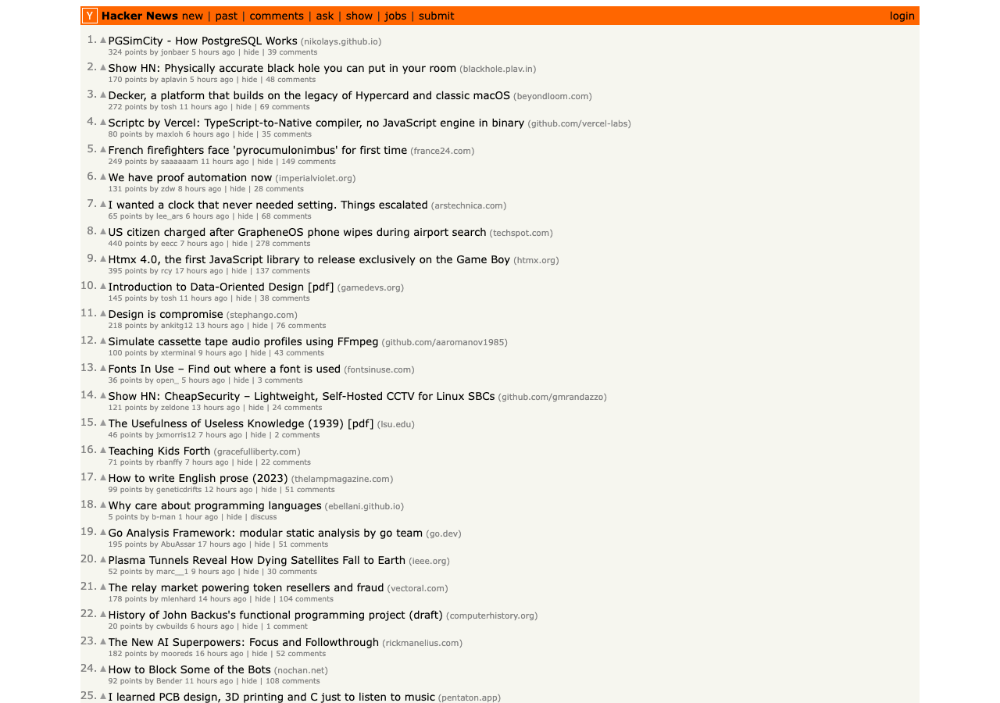

추천의 첫 지면, 인기(popular) 편. 조회수·판매량 누적치를 그대로 정렬하면 **한번 1등이 영원한 1등** — 사람들이 기대하는 것은 "역대 인기"가 아니라 "**요즘** 인기"이므로, 인기 지면의 핵심은 시간 감쇠다.

## 1. 정의
- 인기 신호(조회·구매·투표)에 시간 감쇠를 적용해, 같은 인기라면 최근 항목이 위로 오게 만드는 랭킹 함수

## 2. 종류(비교)
- Hacker News gravity
  - 공식: `score = s / (T + 2)^G` — G=gravity, 클수록 급감쇠. +2는 T=0에서의 0-나눗셈 방지와 게시 직후 점수 급변 완화
  - 역할 및 정의: 누적 점수를 경과 시간의 거듭제곱으로 나눈다. 버킷별 기여를 합산하면 velocity 근사
  - 장점: 공식 하나·튜닝 손잡이 하나(G). `G=0`이면 누적 인기 정렬, `G→∞`면 최신순 — **인기순과 최신순 사이를 G 하나로 보간**. 결과 설명이 쉽다("점수를 시간으로 나눴다")
  - 단점: 점수 절대량에 민감 — 트래픽이 적은 카테고리에서는 소수의 이벤트로 순위가 출렁인다. G가 지면 성격에 맞는지는 데이터로 확인해야 함
- Reddit Hot
  - 공식: `log10(max(|s|, 1)) + sign(s)·(t - t0)/45000`
  - 역할 및 정의: 점수는 로그로 압축하고, 시간은 나누는 대신 게시 시각을 **가산**한다
  - 장점: 로그로 magnitude 압축 — 초기 표 폭주 억제(첫 10표가 다음 100표와 같은 무게). 시간항이 절대시간이라 점수 이벤트가 없으면 재계산이 필요 없다
  - 단점: 45000초(약 12.5시간) 상수가 뉴스 피드 템포에 고정되어 있고, 시간항이 선형으로 계속 커져 최신 항목이 구조적으로 유리
- 지수감쇠 / Newton's cooling
  - 공식: `score = Σ_i w_i · e^(-λ(t - t_i))`, 반감기 h ↔ `λ = ln2 / h`
  - 역할 및 정의: 이벤트 하나하나가 발생 시점부터 지수적으로 식는다 — 이벤트별 연속 감쇠(버킷 불필요)
  - 장점: 반감기로 튜닝이 직관적("h 지나면 기여가 절반"). 버킷 경계에서 점수가 튀는 아티팩트가 없다
  - 단점: 이벤트별 타임스탬프를 유지해야 해서 상태가 무겁다 (전체 재계산 또는 이벤트 로그 필요)
- EWMA (지수이동평균)
  - 공식: `S_t = α·x_t + (1-α)·S_{t-1}`
  - 역할 및 정의: 버킷(일별) 수요를 재귀식으로 누적 — 일별 수요를 매끄럽게 + 최신 가중
  - 장점: 직전 상태 하나만 이월하면 되어 **배치 상태 이월에 적합**. 이벤트 로그 불필요, 노이즈 스무딩까지 겸함
  - 단점: 버킷 단위로만 갱신되어 버킷 내부의 시간차는 구분 못 함. α의 직관이 반감기보다 떨어진다

한눈 비교:

|구분|HN gravity|Reddit hot|지수감쇠|EWMA|
|---|---|---|---|---|
|시간 처리|경과 시간으로 나눗셈(거듭제곱)|절대시간 가산|이벤트별 지수 감쇠|버킷별 재귀 감쇠|
|튜닝 손잡이|G (기본 1.8)|45000 상수|반감기 h|α|
|필요한 상태|버킷별 기여 합산|점수 + 게시 시각|이벤트 로그|직전 상태 1개|
|갱신 시점|버킷 배치마다|점수 이벤트 때만|이벤트 도착마다|버킷 배치마다|

## 3. 사용 예시
- Hacker News gravity
  - HN 프론트페이지 (G≈1.8, age는 hour 단위) — 각 항목에 points와 경과 시간("N hours ago")이 그대로 노출된다. 상위권에 points가 적어도 최신인 글이 섞여 있는 것이 시간 감쇠의 흔적

    

  - 커머스 인기 지면: points를 조회·구매 같은 행동 신호로 바꾸고, age 단위를 지면의 템포(일간·주간)에 맞춰 조절 — 단위를 키우는 것은 gravity를 줄이는 것과 같은 효과 (Formula와 한 몸이라는 참고 항목 참조)
- Reddit Hot
  - Reddit 프론트페이지 — 기본 정렬 탭이 **hot**이다. 점수가 게시 시각에 크게 좌우되고, 투표가 들어올 때만 갱신하면 되는 대규모 투표형 피드

    

- 지수감쇠 / Newton's cooling
  - 실시간 트렌딩·스트림 처리 — 이벤트가 도착할 때마다 연속으로 점수를 갱신해야 하는 지면
- EWMA
  - 일 단위 배치 파이프라인의 수요 집계 — 어제 상태 하나만 읽어 오늘 값과 섞으면 끝. 모니터링 지표 스무딩에도 널리 쓰임

## 4. 참고
1. EWMA는 지수감쇠의 이산(버킷) 버전
- k 버킷 전 수요의 가중치가 `α(1-α)^k` — 버킷 단위로 보면 지수감쇠와 같은 곡선
- 연속(이벤트별)으로 감쇠할지, 버킷으로 뭉쳐 감쇠할지의 차이일 뿐 문제의식은 동일

2. 공통 주제는 하나 — **원시 누적치를 그대로 정렬하지 말 것**

3. 링크
- Hacker News gravity
  - [news.arc — HN 랭킹 원본 구현 (Arc)](https://github.com/arclanguage/anarki/blob/master/apps/news/news.arc) — `gravity* 1.8`, `frontpage-rank` 정의
  - [How Hacker News ranking algorithm works](https://medium.com/hacking-and-gonzo/how-hacker-news-ranking-algorithm-works-1d9b0cf2c08d) — 위 소스 해설
- Reddit Hot
  - [_sorts.pyx — Reddit 랭킹 원본 구현](https://github.com/reddit-archive/reddit/blob/master/r2/r2/lib/db/_sorts.pyx) — `hot()` 함수 정의
  - [How Reddit ranking algorithms work](https://medium.com/hacking-and-gonzo/how-reddit-ranking-algorithms-work-ef111e33d0d9) — 위 소스 해설
- 지수감쇠 / Newton's cooling
  - [Exponential decay — Wikipedia](https://en.wikipedia.org/wiki/Exponential_decay) — 반감기 ↔ λ 관계 포함
  - [Newton's law of cooling — Wikipedia](https://en.wikipedia.org/wiki/Newton%27s_law_of_cooling)
- EWMA
  - [Exponential smoothing — Wikipedia](https://en.wikipedia.org/wiki/Exponential_smoothing) — `S_t = α·x_t + (1-α)·S_{t-1}` 정의
  - [EWMA — NIST/SEMATECH e-Handbook](https://www.itl.nist.gov/div898/handbook/pmc/section4/pmc431.htm)
