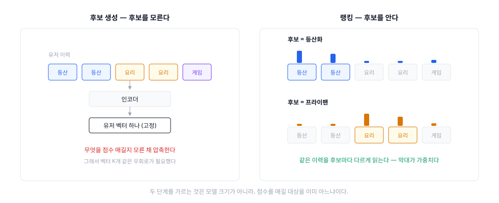
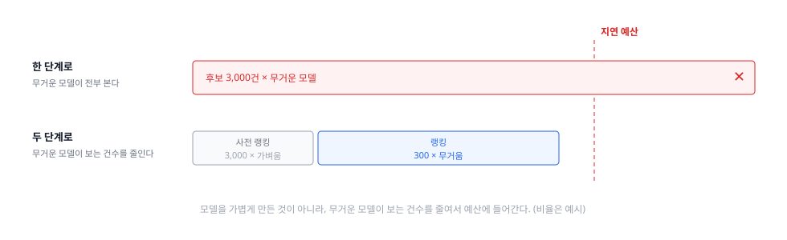

파이프라인 축의 두 번째, Ranking 편. 앞 편이 넘긴 후보 수천 건을 **노출 순서**로 바꾸는 단계다. 그리고 그 사이에 왜 "사전 랭킹"이라는 칸이 하나 더 끼는지도 여기서 답한다.

## 1. 정의
- 후보 각각에 점수를 매겨 **하나의 순서**로 정렬하는 단계. 전체 카탈로그가 아니라 후보만 상대하므로 **비싼 모델을 쓸 수 있다**
- 목표가 앞 단계와 뒤집힌다. 후보 생성은 재현율이었지만, 여기서는 **상위 몇 개의 정확도**가 전부다. 3,000등을 4,000등으로 옮기는 것은 아무 의미가 없다
- 앞 편이 미뤄 둔 숙제를 여기서 받는다 — **채널마다 스케일이 다른 점수를 하나의 순서로 통일하는 것**이 이 단계의 임무다
- 재료: 후보 집합, 유저·아이템·컨텍스트 피처, **유저×아이템 교차 피처**, 그리고 여러 종류의 라벨(클릭 · 구매 · 시청 시간 · 좋아요 · 신고)

### 두 단계를 가르는 것은 모델 크기가 아니다
흔한 설명은 "후보 생성은 싸고 랭킹은 비싸다"이다. 맞지만 **원인이 아니라 결과**다. 진짜 차이는 정보에 있다.

- 후보 생성은 **점수를 매길 대상을 모른 채** 유저를 인코딩해야 한다. 유저 벡터는 어떤 아이템이 올지와 무관하게 고정된다 — 앞 편의 다중 관심사 벡터는 이 제약을 우회하려는 시도였다
- 랭킹은 **아이템을 이미 손에 쥐고** 있다. 그래서 유저 이력을 그 아이템 기준으로 다시 읽을 수 있고, "이 유저가 이 브랜드를 세 번 재구매했다" 같은 교차 피처를 쓸 수 있다

YouTube 논문이 이 단계의 역할을 이렇게 적는다 — *"The primary role of ranking is to use impression data to specialize and calibrate candidate predictions for the particular user interface"*, 그리고 그것이 가능한 이유는 *"because only a few hundred videos are being scored rather than the millions scored in candidate generation."*

## 2. 종류(비교)
분기가 둘이다. **무엇을 맞히나**(목표)와 **어떻게 맞히나**(모델). 순서가 중요하다 — 모델을 아무리 좋게 만들어도 목표가 틀리면 **틀린 것을 정확히 맞히게 된다.**

### 2-1. 무엇을 맞히나 — 목표의 계보
- 클릭 (CTR) — **가장 흔하고 가장 많다**
  - 역할 및 정의: 노출 대비 클릭 확률을 맞힌다. 라벨이 저절로 쌓이고 밀도가 높다
  - 장점: 데이터가 압도적으로 많다. 즉시 관측되고, 지면 어디서나 정의가 같다
  - 결함: **클릭은 만족이 아니다.** YouTube 논문의 문장이 그대로다 — *"Ranking by click-through rate often promotes deceptive videos that the user does not complete ('clickbait')"*
- 체류 · 시청 시간 — 클릭 이후를 본다
  - 역할 및 정의: 노출당 **기대 시청 시간**을 맞힌다. YouTube 2016은 이것을 **가중 로지스틱 회귀**로 푼다 — 클릭된 노출에 관측 시청 시간을 가중치로 주고, 클릭되지 않은 노출은 가중치 1을 준다. 그러면 학습된 odds가 기대 시청 시간에 근사하고, 추론 시 `exp`를 씌워 그 값을 낸다
  - 장점: 낚시를 구조적으로 벌준다. 클릭까지만 유도한 콘텐츠는 분자가 커지지 않는다
  - 결함: 긴 콘텐츠에 유리하다. 그리고 커머스에는 대응물이 애매하다 — 오래 보는 것이 좋은 신호인지 결정을 못 해서 헤매는 신호인지 구분되지 않는다
- 전환 (구매 · 예약) — 사업 지표에 가장 가깝다
  - 장점: 대리 지표가 아니라 **진짜 목표**에 가깝다
  - 결함 둘: 라벨이 **희소**하고(클릭의 수십 분의 일), **지연**된다. 오늘의 노출이 일주일 뒤 구매로 돌아오면 학습 시점에 그 라벨은 아직 음성이다 (delayed feedback)
- 다중 목표 (멀티태스크) — **여러 개를 동시에 맞힌다**
  - 역할 및 정의: 하나를 고르는 대신 클릭·시청·구매·좋아요·공유·신고를 **각각의 헤드**로 함께 예측한다. YouTube 2019는 목표들을 참여(engagement)와 만족(satisfaction) 두 군으로 나누고, 서로 충돌하는 목표를 **MMoE**(Multi-gate Mixture-of-Experts)로 학습한다
  - 같은 논문이 **shallow tower**를 따로 두어 위치 편향 같은 선택 편향을 본 모델에서 **분리**한다 (참고 3)
  - 장점: 한 지표를 밀다가 다른 지표가 무너지는 것을 학습 단계에서 본다
  - 결함: 예측이 여러 개면 **하나의 점수로 합쳐야** 하는데, 그 가중치는 학습되지 않는다 (참고 2)

### 2-2. 어떻게 맞히나 — 피처 교차를 누가 만드나
목표가 정해지면 남는 문제는 하나다. **"20대 × 주말 × 캠핑용품"처럼 조합에서만 드러나는 신호를 누가 만드나.**

- 로지스틱 회귀 + 손으로 만든 교차 — **사람이 만든다**
  - 장점: 빠르고, 계수를 그대로 읽을 수 있고, 대규모 희소 피처에 강하다
  - 결함: 조합 폭발. 그리고 **학습에서 못 본 조합은 계수가 없다**
- Factorization Machines — **분해로 자동 생성한다**
  - 각 피처에 잠재 벡터를 주고 교차항을 내적으로 대신한다. 못 본 조합도 벡터끼리는 계산된다
  - 결함: 대개 2차 교차에 머문다
- Wide & Deep (2016) — **암기와 일반화를 함께 학습한다**
  - wide 쪽(손으로 만든 교차)은 본 조합을 **암기**하고, deep 쪽(임베딩)은 못 본 조합으로 **일반화**한다. 둘을 따로 학습해 앙상블하는 것이 아니라 **함께** 학습하는 것이 핵심
  - 결함: wide 쪽 교차는 여전히 사람이 설계한다
- DCN / DCN-V2 — **교차를 층으로 쌓는다**
  - 교차 연산 자체를 레이어로 만들어 층 수만큼 고차 교차를 **명시적으로** 만든다. DCN-V2는 이 교차 네트워크의 표현력을 웹 스케일에서 쓸 수 있게 개선한 판이고, 구글의 랭킹 시스템들에 배포됐다
  - 결함: 교차는 자동이지만 **어떤 이력을 볼지**는 여전히 고정이다
- DIN (2018) — **후보에 따라 이력을 다르게 읽는다**
  - 문제의식이 정확히 앞 편과 이어진다: 유저 피처를 후보와 무관한 **고정 길이 벡터**로 압축하는 것이 병목이라는 것. DIN은 local activation unit으로 후보 아이템에 대해 이력 각각의 가중치를 계산하고, 그 가중 합을 유저 표현으로 쓴다
  - 즉 유저 표현이 **후보마다 달라진다.** 후보 생성은 구조적으로 할 수 없고 랭킹만 할 수 있는 일이다
  - 이후는 시퀀스 인코더·트랜스포머로 이어진다

### 2-3. 그래서 단계가 하나 더 생긴다 — 사전 랭킹
후보 3,000건에 무거운 모델을 그대로 붙이면 지연 예산을 넘는다. 그렇다고 모델을 가볍게 만들면 랭킹을 하는 의미가 없다. 답은 **건수를 줄이는 것**이다.

- Instagram Explore는 1차 랭커를 **two-tower로 만들어 캐시 가능하게** 하고, **2차 랭커의 출력을 맞히도록** 학습시킨다 — 정답을 맞히는 게 아니라 **최종 랭커를 흉내 내도록** 학습한다는 뜻이다
- Alibaba의 **COLD**(2020)는 모델 구조와 **연산 비용을 함께 최적화**하는 쪽으로 문제를 다시 세웠다. 2019년부터 알리바바 디스플레이 광고의 사전 랭킹 모듈 대부분에 배포됐다
- 이 단계의 목표는 **정확도가 아니라 일관성**이다. 사전 랭커가 최종 랭커와 다른 순서를 내면 최종 랭커가 높게 봤을 아이템을 **미리 버린다.** 사전 랭커 단독 AUC가 올라도 최종 결과는 나빠질 수 있다

한눈 비교:

|구분|후보 생성|사전 랭킹|랭킹|
|---|---|---|---|
|입력 건수|전체 (수백만~)|수천|수백|
|후보를 아나|**모른다**|안다|안다|
|교차 피처|못 쓴다|제한적|**쓴다**|
|목표|재현율|**최종 랭커와의 일치**|상위 정확도|
|모델|two-tower · 테이블|경량 (증류·비용 제약)|무거운 다중 목표|
|건당 비용|~0 (사전 계산)|낮음|높음|

## 3. 사용 예시
- **단계를 나누는 산수** — 숫자는 예시지만 구조는 그대로다

  | 단계 | 건수 | 건당 비용 | 합 |
  |---|---|---|---|
  | 랭킹만 | 3,000 | 1.0 | 3,000 |
  | 사전 랭킹 | 3,000 | 0.02 | 60 |
  | 랭킹 | 300 | 1.0 | 300 |
  | | | | **360** |

  - 무거운 모델을 가볍게 만든 것이 아니다. **무거운 모델이 보는 건수**를 10분의 1로 줄였다
- **다중 목표를 하나의 점수로** — 커머스 예
  - 가중합 `w1·p_click + w2·p_purchase + w3·E[가격]` — 해석이 쉽고 튜닝이 직관적. 대신 한 항이 0이어도 다른 항으로 상쇄된다
  - 곱셈형 `p_click^a · p_purchase^b · value^c` — 하나가 0이면 전체가 0. "클릭은 되는데 절대 안 사는 것"을 확실히 죽인다
  - 어느 쪽이든 **지수·가중치는 실험으로 정한다.** 오프라인으로는 결정할 수 없다
- **위치 편향 다루기**
  - 학습: 노출 위치를 피처로 넣는다. 그러면 "상위에 있어서 클릭됐다"를 모델이 위치 피처로 흡수한다
  - 서빙: 위치를 **상수로 고정**한다(예: 전부 1위라고 가정). 아직 정해지지 않은 값을 넣을 수 없으니 당연하지만, 학습과 서빙이 달라지는 지점이라 사고가 자주 난다
  - YouTube 2019의 shallow tower가 이 처리를 구조로 분리한 형태다
- **피처 시점(point-in-time)**
  - "이 상품의 최근 7일 판매량" 같은 피처를 **오늘 값으로** 과거 학습 샘플에 붙이면 미래가 샌다
  - 학습 샘플마다 **그 시점의 값**을 붙여야 하고, 그러려면 피처 스토어가 시점 조회를 지원해야 한다
  - 오프라인 AUC가 비현실적으로 높으면 대개 여기부터 의심한다
- **라벨 정의의 함정**
  - 클릭 후 즉시 이탈, 구매 후 반품, 좋아요 후 언팔로우. **양성으로 셀지 말지가 곧 시스템의 목표를 정한다**

## 4. 참고
1. 대리 지표는 반드시 최적화된다
- 클릭을 목표로 주면 클릭을 최대화하는 것이 나온다 — 그것이 낚시라도. 시청 시간을 주면 긴 콘텐츠가, 구매를 주면 저가 반복 구매가 올라온다
- 목표를 고르는 일은 모델링이 아니라 **제품 결정**이다. 그리고 다중 목표는 이 결정을 없애 주지 않고 **가중치로 옮길** 뿐이다

2. 가중치는 학습되지 않는다
- 예측 헤드가 여섯 개면 결합 공식의 계수도 여섯 개인데, 이것을 학습할 라벨이 없다. "클릭 하나와 구매 하나 중 무엇이 몇 배 중요한가"는 데이터에 적혀 있지 않다
- 그래서 실무에서 이 숫자는 **조직이 정한다.** 랭킹 논의가 자주 정치적으로 보이는 이유이고, A/B 테스트가 유일한 심판인 이유다

3. 위치 편향 — 좋아서 클릭한 것인가, 위에 있어서 클릭한 것인가
- 로그는 이 둘을 구분해 주지 않는다. 그대로 학습하면 모델은 "상위에 노출되던 아이템이 좋다"를 배우고, 그 예측이 다시 상위 노출을 만든다
- 처방은 편향을 **모델 안에서 분리**하거나(shallow tower, 위치 피처), 노출 확률로 **역가중**하거나, 아예 무작위 노출로 **깨는 것**이다. 마지막이 평가·학습 축의 주제다

4. 사전 랭킹의 목표는 정확도가 아니다
- 사전 랭커를 "가벼운 랭커"로 이해하면 튜닝 방향이 틀어진다. 임무는 **최종 랭커가 고를 것을 살려 보내는 것**이므로, 지표도 최종 랭커와의 **순서 일치**여야 한다
- 그래서 증류(최종 랭커의 출력을 라벨로)가 자연스러운 해법이 된다

5. 오프라인 AUC가 올라도 온라인이 안 오르는 흔한 이유
- **후보 집합이 다르다** — 오프라인 평가는 과거 로그의 후보 안에서 재는데, 실제 서빙에서는 후보 생성기가 바뀌어 있다
- **위쪽만 중요하다** — AUC는 전체 순서쌍을 세지만 유저는 상위 몇 개만 본다
- **노출된 것만 라벨이 있다** — 노출되지 않은 아이템은 오답도 정답도 아닌데, 평가에서는 대개 오답으로 센다
- 셋 다 랭킹 모델의 문제가 아니라 **평가의 문제**다. 평가·학습 축에서 따로 다룬다

6. 광고의 예측과 이름은 같지만 요구가 다르다
- 광고의 pCTR·pCVR은 **절대값이 맞아야 한다** — 입찰가가 그 확률의 함수라서, 순서만 맞고 값이 2배 틀리면 돈이 2배 틀린다 (캘리브레이션)
- 추천의 랭킹은 대부분 **순서만 맞으면 된다.** 같은 모델 계보를 쓰면서도 평가 기준이 갈리는 지점이고, 그래서 캘리브레이션은 Advertising 시리즈의 몫이다

7. 이 편이 답하지 않는 것
- 점수 순서를 **일부러 깨야 하는** 이유 — 다양성, 노출 분배, 신선도, 같은 판매자 연속 노출 → **Re-ranking**
- 순서가 좋은지 어떻게 재나, 오프라인과 온라인이 어긋날 때 무엇을 믿나 → 평가·학습 축
- 무거운 모델을 지연 예산 안에서 어떻게 돌리나 — 무엇을 미리 계산해 두나 → 서빙 축

## 5. 링크
- 파이프라인 · 목표
  - [Deep Neural Networks for YouTube Recommendations (RecSys 2016)](https://doi.org/10.1145/2959100.2959190) — 4장이 랭킹. 낚시 문제와 가중 로지스틱 회귀 ([PDF](https://research.google.com/pubs/archive/45530.pdf))
  - [Recommending What Video to Watch Next: A Multitask Ranking System (RecSys 2019)](https://dl.acm.org/doi/10.1145/3298689.3346997) — MMoE 다중 목표 + shallow tower로 선택 편향 분리 ([Google Research](https://research.google/pubs/recommending-what-video-to-watch-next-a-multitask-ranking-system/))
- 모델
  - [Wide & Deep Learning for Recommender Systems (2016)](https://arxiv.org/abs/1606.07792) — 암기와 일반화의 공동 학습
  - [DCN V2: Improved Deep & Cross Network (WWW 2021)](https://arxiv.org/abs/2008.13535) — 교차를 층으로
  - [Deep Interest Network for CTR Prediction (KDD 2018)](https://arxiv.org/abs/1706.06978) — 고정 길이 유저 벡터가 병목이라는 문제의식
- 사전 랭킹
  - [COLD: Towards the Next Generation of Pre-Ranking System (2020)](https://arxiv.org/abs/2007.16122) — 모델과 연산 비용의 공동 최적화
  - [Scaling the Instagram Explore recommendations system (2023)](https://engineering.fb.com/2023/08/09/ml-applications/scaling-instagram-explore-recommendations-system/) — 1차 랭커를 2차 랭커의 출력으로 학습
