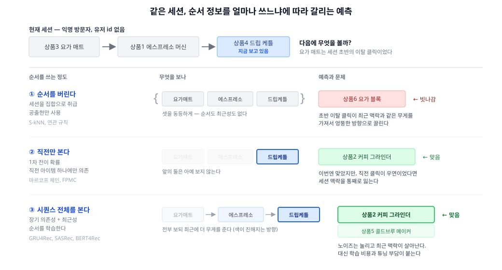

두 번째 축, **문제를 어떻게 정의하나**의 첫 편. 앞선 네 편은 "무엇을 재료로 쓰나"로 갈렸지만, 이 편은 재료가 아니라 **입력의 모양**을 바꾼다. 그리고 이 축은 특정 모델과 무관하다 — 딥러닝 없이도 성립한다.

## 1. 정의
- 유저의 행동을 **순서 있는 시퀀스**로 보고, "다음에 무엇을 소비할지"를 예측하는 문제 설정
- 문제의식: CF의 user-item 행렬은 **순서 없는 집합(bag)** 이다. A→B→C를 봤는지 C→B→A를 봤는지 구분하지 못한다. 그런데 실제로는 "**지금** 냉장고를 보고 있다"가 "6개월 전에 책을 샀다"보다 압도적으로 중요하다
- 자주 뭉뚱그려지는 두 설정을 구분해야 한다:

|구분|Sequential rec|Session-based rec|
|---|---|---|
|유저 id|있음|**없음**|
|무엇을 보나|그 유저의 전체 이력을 순서대로|현재 세션의 클릭 몇 개만|
|전형적 상황|로그인 유저의 장기 취향 + 최근 흐름|익명 방문자, 첫 방문|
|CF 적용 가능성|가능 (행렬에 행이 있다)|**불가** — 유저 id가 없어 행이 아예 없다|

- 두 번째가 실무에서 특히 중요하다. 커머스 트래픽의 상당 부분이 비로그인이고, CF는 유저 id가 없으면 원리적으로 동작하지 않는다

## 2. 종류(비교)
1차 분기는 모델 종류가 아니라 **순서 정보를 얼마나 쓰는가**다. 스펙트럼의 양 끝이 "전혀 안 쓴다"와 "전부 쓴다"이고, 딥러닝은 마지막 층 하나일 뿐이다.

- ① 순서를 버린다 — 공출현 기반
  - 역할 및 정의: 세션을 **집합**으로 취급하고, "같은 세션에 함께 등장했다"만 센다. 세션 간 유사도로 이웃 세션을 찾아(kNN) 그들이 본 아이템을 추천한다
  - 장점: 학습이 없어 구현·운영이 가볍고, 새 아이템도 세션에 한 번 등장하면 즉시 후보가 된다. **잘 튜닝하면 딥러닝을 이기는 경우가 흔하다**(4-1 참고)
  - 단점: 순서와 최근성을 못 본다. 세션 초반의 이탈 클릭이 방금 본 아이템과 같은 무게를 가져서 엉뚱한 방향으로 끌린다
- ② 직전만 본다 — 전이 기반
  - 역할 및 정의: 아이템 간 **전이 확률**을 센다. 마르코프 체인의 1차 의존성 — "케틀을 본 다음에는 무엇을 보는가"
  - 장점: "다음 클릭" 예측에 직관적으로 잘 맞고, 전이 행렬이라 계산이 단순하다. FPMC처럼 MF와 결합하면 개인화까지 얹힌다
  - 단점: 직전 하나에만 의존하므로 그 클릭이 우연이면 세션 맥락을 통째로 잃는다. 긴 의존성(세션 앞부분의 신호)을 표현할 수 없다
- ③ 시퀀스 전체를 본다 — 딥러닝
  - 역할 및 정의: 시퀀스 전체를 입력으로 받아 순서와 최근성을 함께 학습한다. RNN 계열(GRU4Rec)에서 시작해 Transformer 계열(SASRec, BERT4Rec)로 옮겨갔다
  - 장점: 장기 의존성과 최근성을 동시에 다뤄, 초반 노이즈는 눌리고 최근 맥락이 살아난다. 반복·주기 패턴도 포착한다
  - 단점: 학습 비용이 크고 하이퍼파라미터에 민감하다. 무엇보다 **기준선 대비 이득이 논문만큼 크지 않을 수 있다**
  - 아키텍처 디테일(어텐션이 어떻게 동작하는지)은 **표현 학습 축**에서 — 여기서는 "시퀀스 전체를 본다"는 성격까지

한눈 비교:

|구분|① 공출현|② 전이|③ 시퀀스 전체|
|---|---|---|---|
|보는 범위|세션 전체 (순서 무시)|직전 아이템 1개|세션 전체 (순서 포함)|
|대표 기법|S-kNN, V-SkNN, 연관 규칙|마르코프 체인, FPMC|GRU4Rec, SASRec, BERT4Rec|
|학습 필요|없음|전이 통계만|배치 학습|
|최근성 반영|없음|직전만|가중 학습|
|노이즈 내성|낮음 (초반 클릭에 끌림)|낮음 (직전이 우연이면 무너짐)|높음|
|운영 난이도|낮음|낮음|높음|

## 3. 사용 예시
- 공출현 기반
  - **S-kNN (session kNN)** — 현재 세션과 아이템 구성이 비슷한 과거 세션을 찾아 그들이 본 아이템을 추천. 가장 단순하면서 가장 강한 기준선
  - **V-SkNN** — 세션 내 위치에 가중치를 줘서 최근 클릭을 더 반영한 kNN 변형. ①과 ③ 사이를 메우는 절충
  - **연관 규칙 / sequential pattern** — `A → B` 규칙 추출. market basket analysis의 계보
- 전이 기반
  - **마르코프 체인** — 아이템 전이 행렬. 개인화 없이 "다음 아이템"만 본다
  - **FPMC** — 마르코프 체인과 MF를 결합해 전이를 **개인화**한다. 딥러닝이 아니면서 순서와 취향을 함께 다룬 초기 시도
  - **Fossil** — 유사도 모델과 마르코프 체인을 융합. 희소한 시퀀스에 강하다
- 시퀀스 전체
  - **GRU4Rec** — 세션 추천에 RNN을 처음 본격적으로 적용. 이 분야를 열었다
  - **SASRec** — self-attention으로 시퀀스 내 어느 위치든 직접 참조. 단방향(다음 아이템 예측)
  - **BERT4Rec** — 양방향 마스킹 학습을 도입. 시퀀스 중간을 가리고 맞히는 방식으로 표현을 학습
- 도메인
  - **뉴스** — 기사 수명이 짧아 장기 취향보다 지금 세션의 관심이 지배적
  - **음악 플레이리스트** — 다음 곡 예측이 곧 순서 문제. 반복 청취까지 다뤄야 한다
  - **이커머스** — 비로그인 세션 비중이 크고, 한 세션 안에서 목적이 뚜렷하다("이번엔 커피 기구를 본다")

## 4. 참고
1. 단순한 기법이 자주 이긴다
- Ludewig & Jannach의 체계적 비교(2018)에서 잘 튜닝된 **session kNN이 여러 데이터셋에서 신경망 모델과 대등하거나 우위**였다
- 더 넓게는 Dacrema et al.(2019)의 재현성 분석이 있다 — 신경망 추천 논문 18편 중 재현 가능한 것이 7편이었고, 그마저 대부분 **잘 튜닝된 단순 기준선에 졌다**
- 교훈은 "딥러닝이 무의미하다"가 아니라 **기준선을 제대로 튜닝하고 비교하라**는 것이다. 이 편에서 ①을 맨 앞에 둔 이유도 그것 — 순서를 아예 버려도 놀랄 만큼 잘 동작한다

2. 세션을 어디서 끊는가
- 세션의 경계는 데이터에 주어진 것이 아니라 **정의하는 것**이다. 30분 무활동? 탭 종료? 하루 단위?
- 경계를 길게 잡으면 서로 다른 목적이 한 세션에 섞이고, 짧게 잡으면 맥락이 잘려 시퀀스가 너무 짧아진다
- 논문은 보통 데이터셋이 정해준 경계를 그대로 쓰지만, 실무에서는 이 정의 하나가 모델 교체보다 성능에 크게 작용한다

3. 평가가 특히 까다롭다
- **시간순 분할이 필수**다. 랜덤 분할을 하면 미래 데이터로 학습해 과거를 맞히는 누수가 생기고, 점수가 비현실적으로 높게 나온다
- next-item prediction은 정답이 하나뿐이라 지표가 가혹하다. 실제로는 "그 다음 클릭"이 아닌 추천도 좋은 추천일 수 있는데 오답으로 집계된다
- 이 때문에 논문 간 숫자 비교가 어렵다 — 분할 방식, 세션 경계, 네거티브 샘플링이 조금만 달라도 순위가 뒤집힌다

4. CF·CB와의 관계
- 이 축은 재료를 바꾸지 않는다. 여전히 **행동 이력**이 재료이므로 CF의 확장으로 볼 수 있다
- 다만 아이템 속성을 시퀀스 모델에 함께 넣으면 CB와도 결합된다 — 축이 서로 직교하기 때문에 조합이 자유롭다
- 유저 콜드스타트에 강하다는 점이 실용적 가치의 핵심이다. 이력이 전혀 없는 익명 방문자도 **클릭 두세 번이면** 추천 대상이 된다

## 5. 링크
- 공출현·전이 기반
  - [Association rule learning — Wikipedia](https://en.wikipedia.org/wiki/Association_rule_learning)
  - [Markov chain — Wikipedia](https://en.wikipedia.org/wiki/Markov_chain)
  - [Factorizing Personalized Markov Chains for Next-Basket Recommendation (Rendle et al., 2010)](https://www.ismll.uni-hildesheim.de/pub/pdfs/RendleFreudenthaler2010-FPMC.pdf) — FPMC
  - [Fusing Similarity Models with Markov Chains for Sparse Sequential Recommendation (He & McAuley, 2016)](https://arxiv.org/abs/1609.09152) — Fossil
- 시퀀스 전체
  - [Session-based Recommendations with Recurrent Neural Networks (Hidasi et al., 2016)](https://arxiv.org/abs/1511.06939) — GRU4Rec
  - [Self-Attentive Sequential Recommendation (Kang & McAuley, 2018)](https://arxiv.org/abs/1808.09781) — SASRec
  - [BERT4Rec (Sun et al., 2019)](https://arxiv.org/abs/1904.06690)
- 비교·재현성
  - [Evaluation of Session-based Recommendation Algorithms (Ludewig & Jannach, 2018)](https://arxiv.org/abs/1803.09587) — 단순 kNN이 강한 기준선임을 보인 체계적 비교
  - [Are We Really Making Much Progress? (Dacrema et al., 2019)](https://arxiv.org/abs/1907.06902) — 신경망 추천 논문의 재현성 분석
