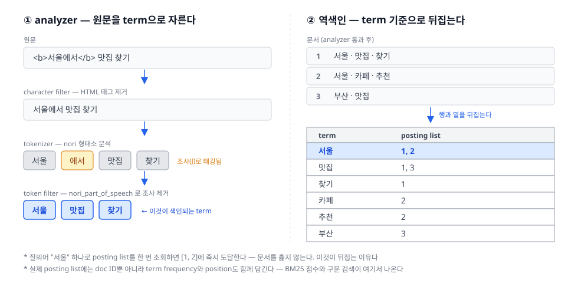

파이프라인의 첫 단계, Indexing(색인) 편. 검색이 빠른 것은 질의 알고리즘이 영리해서가 아니라, **할 일의 대부분을 미리 해뒀기** 때문이다.

## 1. 정의
- 질의 시점에 해야 할 일을 **색인 시점으로 미리 당겨두는** 오프라인 단계 — 파이프라인에서 유일하게 사용자를 기다리게 하지 않는 구간
- 핵심 가정: **문서는 질의보다 훨씬 드물게 바뀐다** — 그래서 쓰기를 비싸게 만들고 읽기를 싸게 만드는 맞바꿈이 언제나 이득이다
- 재료: 원본 문서 + **매핑(mapping)** — 어떤 필드를 어떤 타입으로 다룰지의 선언. 이 선언이 곧 그 필드에 던질 수 있는 질문의 범위를 정한다
- 이 편의 기준은 **텍스트 색인**이다. 역색인과 형태소 분석이 중심이라는 뜻 — 재료가 이미지·음성이면 analyzer 자리를 인코더 모델이 대신하고, 그 이야기는 매칭 축에서 다룬다

## 2. 종류(비교)
1차 분기는 **무엇을 미리 만들어 두나**이다. 만들어 둔 자료구조가 그 필드에 **어떤 질문을 던질 수 있는지**를 결정한다.

- Inverted Index (역색인)
  - 역할 및 정의: `term → [doc ID, ...]` 형태의 목록. "이 단어가 든 문서는?"에 답한다
  - **왜 뒤집나**: 정방향(`doc → terms`)으로 두면 질의마다 전 문서를 훑어야 한다. 뒤집으면 단어 하나로 후보 목록에 즉시 도달한다 — 비용이 **문서 수**가 아니라 **질의어 수**에 비례하게 바뀐다
  - posting list에 doc ID만 담기는 게 아니다. **term frequency**(그 문서에 몇 번 나왔나)와 **position**(몇 번째 토큰인가)까지 들어간다 → BM25 점수와 구문 검색("서울 맛집"이 붙어 있는 경우만)이 여기서 가능해진다
  - 장점: 전문 검색의 사실상 유일한 해법. 단점: **단어가 겹쳐야만 찾는다** — 이 한계가 뒤의 시맨틱 매칭 편의 출발점이다

    

- Forward Index / Doc Values
  - 역할 및 정의: `doc → field value`. "이 문서의 가격은?" — 역색인과 정확히 **반대 방향**이다
  - 왜 필요한가: 정렬·집계·패싯은 접근 패턴이 반대다. 역색인으로 "가격순 정렬"을 하려면 모든 가격 term을 훑어야 한다. 그래서 Lucene은 같은 값을 **필드별 열 지향(columnar)** 으로 한 번 더 저장한다
  - 색인 시점에 만들어지고, 지원하는 필드 타입에서는 **기본으로 켜져 있다**. 정렬·집계할 일이 없다고 확신하면 꺼서 디스크를 아낄 수 있다
  - 함정: **`text` 필드에는 doc values가 없다.** 정렬·집계하려면 `keyword`가 필요하다 (4장의 가장 흔한 실수)
- Vector Index (ANN)
  - 역할 및 정의: 임베딩 벡터 → 근접 이웃. "이 벡터와 가까운 것은?"
  - 정확한 최근접은 전수 비교라 수억 건에서 불가능하다 → 그래프(**HNSW**)나 클러스터(IVF)로 **근사(approximate)** 한다. 정확도를 속도와 맞바꾸는 것이 설계의 전제다
  - 장점: 단어가 하나도 안 겹쳐도 찾는다. 단점: 메모리가 비싸고, 그래프 파라미터(`m`·`ef_construction`)가 품질을 좌우한다

### analyzer — 역색인의 term은 원문이 아니다
역색인을 만들려면 먼저 문서를 term으로 잘라야 한다. 그 단계가 analyzer이고, 정확히 세 부품으로 이루어진다.

1. **character filter** (0개 이상) — 문자 스트림 자체를 손본다. HTML 태그 제거, 문자 치환
2. **tokenizer** (**정확히 1개**) — 문자 스트림을 토큰으로 쪼갠다
3. **token filter** (0개 이상) — 토큰을 더하고 빼고 바꾼다. 소문자화, 불용어 제거, 어간 추출, 동의어 확장

- 결정적 규칙: **색인과 질의에 같은 analyzer가 걸려야 한다.** 색인은 `달리기`로 잘랐는데 질의는 `달린다`로 자르면 두 토큰은 영원히 만나지 못한다. Elasticsearch가 기본적으로 양쪽에 같은 analyzer를 쓰는 이유다
- 다르게 쓰는 경우는 드물다 — 자동완성처럼 색인 쪽에서 접두사를 잔뜩 만들어 두고 질의는 원형만 쓰는 경우 정도

한국어는 여기서 난이도가 한 단계 올라간다.

- 영어는 공백으로 잘라도 대충 통하지만, 한국어는 **교착어**라 안 된다. `학교에서`를 통째로 색인하면 `학교`로 검색해도 나오지 않는다
- 그래서 **형태소 분석**이 필수다. Elasticsearch의 `nori`는 Lucene nori 모듈을 감싼 플러그인이고, **mecab-ko-dic** 사전으로 한국어를 분석한다
- `nori_tokenizer`의 `decompound_mode`가 복합명사를 어떻게 다룰지 정한다 — `none`(`가곡역` 그대로) / `discard`(`가곡`, `역` — **기본값**) / `mixed`(`가곡역`, `가곡`, `역` 셋 다)
- `nori_part_of_speech` 필터로 조사·어미처럼 검색에 쓸모없는 품사를 stoptags로 걸러낸다
- 트레이드오프가 분명하다: 분해를 세게 할수록 **재현율은 오르고 정밀도는 내린다**. `역` 한 글자로 검색했을 때 `가곡역`이 걸리는 것이 좋은가 — 서비스가 답할 문제다

한눈 비교:

|구분|Inverted Index|Doc Values|Vector Index|
|---|---|---|---|
|방향|term → doc|doc → value|vector → 근접 vector|
|답하는 질문|이 단어가 든 문서는?|이 문서의 값은?|이 벡터와 가까운 것은?|
|쓰임|매칭·전문 검색·BM25|정렬·집계·패싯|시맨틱 검색|
|정확성|정확|정확|**근사(ANN)**|
|`text` 필드|O|X|—|
|analyzer 영향|받는다|받지 않는다|받지 않는다 (모델이 대신)|

## 3. 사용 예시
- 색인 엔진
  - **Lucene** — Elasticsearch·OpenSearch·Solr가 **공유하는** 실제 색인 엔진. "ES의 색인"이라 부르는 것의 대부분이 사실 Lucene의 것이다
  - **Tantivy**(Rust), **Vespa** — Lucene 밖의 구현
  - **PostgreSQL GIN + tsvector**, **SQLite FTS5** — DB에 내장된 역색인. 별도 엔진 없이 감당되는 규모라면 이걸로 충분하다
- 한국어 형태소 분석기
  - **nori** — Elasticsearch 공식 플러그인. mecab-ko-dic 기반
  - **은전한닢(mecab-ko)** — 사전 그 자체. 다른 분석기들의 뿌리
  - **Kiwi**, **Okt**, **Khaiii** — 파이썬 생태계의 대안들
  - **사용자 사전(user dictionary)이 실무의 핵심**이다 — 브랜드명·신조어·상품 코드는 어떤 범용 사전에도 없다. 검색 품질 개선의 상당 부분이 결국 사전 관리다
- 매핑에서의 선택
  - `text` — 분석해서 역색인을 만든다. 검색용. 정렬·집계 불가
  - `keyword` — 분석하지 않고 통째로 하나의 term. 필터·정렬·집계용
  - 실무에서는 **multi-field**로 둘 다 만든다: `name`은 `text`, `name.keyword`는 `keyword`
- 벡터 필드
  - Elasticsearch `dense_vector` — Lucene HNSW 사용
  - OpenSearch `knn_vector` — Faiss(기본)와 Lucene 엔진 선택
  - 엔진 밖이라면 **Faiss**·**ScaNN**

## 4. 참고
1. 색인한 문서는 즉시 검색되지 않는다 — near real-time
- 새 문서는 먼저 인메모리 버퍼에 쌓인다. **refresh**가 그 버퍼를 닫아 검색 가능한 세그먼트로 열어준다. 기본 주기가 `1s`라서, T에 색인한 문서는 대략 **T+1초**에 보인다
- Lucene **세그먼트는 불변(immutable)** 이다. 한 번 쓰면 제자리에서 고치지 않는다. 삭제조차 지우는 게 아니라 tombstone 표시고, 실제 정리는 세그먼트 **병합(merge)** 때 일어난다
- 왜 불변인가: 고치지 않으면 락 없이 읽을 수 있고 캐시가 안전하다. **읽기를 싸게 만들려고 쓰기를 비싸게 만든** 1장의 맞바꿈이 여기서 한 번 더 나타난다
- 대량 색인 시 `refresh_interval`을 늘리는 것이 표준 튜닝인 이유도 같다 — 세그먼트를 덜 만들면 병합 부담이 줄어든다

2. `text` vs `keyword` — 가장 흔한 실수
- `text`로 매핑하면 분석되므로 `"서울 강남점"`이 `서울`, `강남점`으로 쪼개진다. **정확히 일치**하는 필터가 먹지 않고, doc values가 없어 정렬·집계도 안 된다
- 반대로 `keyword`로만 매핑하면 통째로 하나의 term이라 `강남점`으로는 절대 찾히지 않는다
- 둘 다 필요한 것이 정상이다. multi-field가 사실상 기본값처럼 쓰이는 이유

3. 재색인(reindex) — 색인의 가장 비싼 제약
- analyzer나 매핑을 바꿔도 **이미 색인된 문서에는 소급되지 않는다**. 그 문서의 역색인은 색인 당시의 analyzer로 이미 만들어졌기 때문이다
- 그래서 사용자 사전에 단어 하나를 추가해도 원칙적으로 **전체 재색인**이 필요하다
- 무중단 전환의 표준은 **alias**다. 새 인덱스에 재색인해 두고 alias를 원자적으로 옮긴다 — 서비스는 alias만 바라보므로 전환을 알지 못한다
- 색인 설계가 되돌리기 어렵다는 이 사실이, 매핑을 처음에 신중히 정해야 하는 이유다

4. 이 편이 다루지 않은 것 — 다음 편들의 예고
- posting list를 **어떻게 압축하고 건너뛰는가**(skip list), 세그먼트를 어떻게 병합하고 샤딩하는가는 **서빙 축** 편에서 — 여기서는 posting list의 존재와 역할까지만 다뤘다
- 역색인이 준비돼도 "무슨 단어로 찾을지"는 여전히 질의 쪽 문제로 남는다 → 다음 편 **Query Understanding**
- 단어가 겹쳐야만 찾는다는 역색인의 한계는 **매칭 축**(Lexical → Semantic → Hybrid)에서 정면으로 다룬다

## 5. 링크
- 개요
  - [Inverted index — Wikipedia](https://en.wikipedia.org/wiki/Inverted_index)
  - [Apache Lucene](https://lucene.apache.org/) — ES·OpenSearch·Solr가 공유하는 색인 엔진
- Analyzer
  - [Anatomy of an analyzer | Elastic Docs](https://www.elastic.co/docs/manage-data/data-store/text-analysis/anatomy-of-an-analyzer) — character filter · tokenizer · token filter
  - [Index time vs. search time analysis | Elastic Docs](https://www.elastic.co/docs/manage-data/data-store/text-analysis/index-search-analysis)
- 한국어
  - [Korean (nori) analysis plugin | Elastic Docs](https://www.elastic.co/docs/reference/elasticsearch/plugins/analysis-nori)
  - [nori_tokenizer | Elastic Docs](https://www.elastic.co/docs/reference/elasticsearch/plugins/analysis-nori-tokenizer) — `decompound_mode`
  - [mecab-ko-dic (은전한닢)](https://bitbucket.org/eunjeon/mecab-ko-dic) — nori가 쓰는 사전
- 자료구조
  - [doc_values | Elasticsearch Reference](https://www.elastic.co/docs/reference/elasticsearch/mapping-reference/doc-values)
  - [Dense vector field type | Elasticsearch Reference](https://www.elastic.co/docs/reference/elasticsearch/mapping-reference/dense-vector)
  - [k-NN vector | OpenSearch Documentation](https://docs.opensearch.org/latest/mappings/supported-field-types/knn-vector/)
  - [Efficient and robust approximate nearest neighbor search using HNSW (Malkov & Yashunin, 2016)](https://arxiv.org/abs/1603.09320)
- 세그먼트·갱신
  - [Near real-time search | Elastic Docs](https://www.elastic.co/docs/manage-data/data-store/near-real-time-search)
