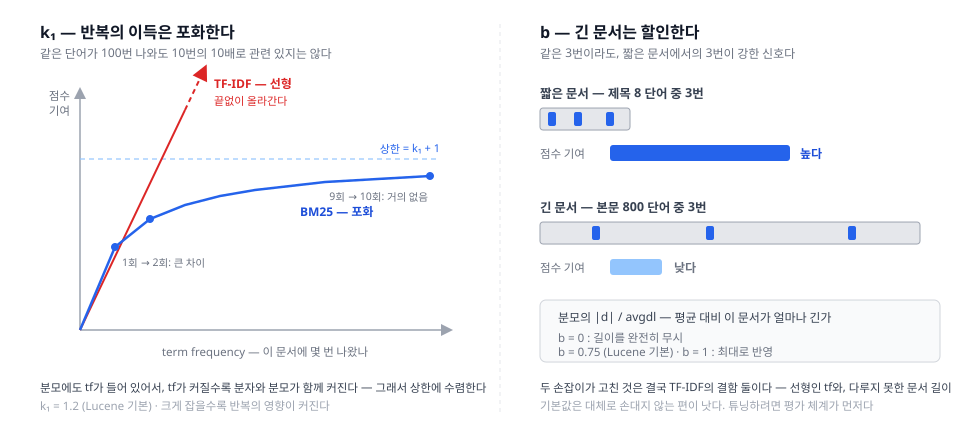

매칭 축의 첫 편, Lexical Matching(어휘 매칭). 파이프라인 축에서 "Retrieval이 후보를 긁는다"고만 하고 넘어간 그 안을 연다 — **무엇으로 관련성을 재는가**.

## 1. 정의
- 질의와 문서가 **같은 단어를 공유하는가**로 관련성을 재는 계열. 의미는 전혀 모르고 **표기만 본다**
- 핵심 가정: **사람은 자기가 찾는 것을, 그것이 쓰인 단어로 부른다.** 이 가정이 맞는 만큼 잘 작동하고, 틀리는 만큼 실패한다
- 재료: 역색인이 이미 준비해 둔 것들 — posting list의 **term frequency**(이 문서에 몇 번), **document frequency**(몇 개 문서에), 그리고 **문서 길이**
- 이 계열이 답하는 질문: 이 문서가 이 질의어를 **얼마나 잘 대표하는가**

## 2. 종류(비교)
1차 분기는 **단어의 무게를 무엇으로 재나**이다. 이 계열은 경쟁하는 갈래가 아니라 **하나의 계보**다 — 앞의 결함을 뒤가 고치면서 BM25에 도달한다.

- 단순 빈도 (Term Frequency)
  - 역할 및 정의: 질의어가 문서에 나온 **횟수**를 센다. 많이 나오면 관련 있다
  - 두 가지가 즉시 무너진다. **긴 문서가 무조건 유리**하고, `그리고`·`있다` 같은 **흔한 단어가 점수를 지배**한다
- TF-IDF
  - 역할 및 정의: 두 직관을 곱한다
    - **TF** — 이 문서에 자주 나오면 중요하다
    - **IDF** — 여러 문서에 흔하게 나오는 단어는 변별력이 없다. `의`는 어디에나 있으니 무게가 0에 가깝고, `나이키`는 드무니 무겁다
  - IDF 하나로 불용어 문제가 대부분 해결된다 — 사전 없이, 데이터가 스스로 흔한 단어를 깎는다
  - 남은 결함 첫째: **tf가 커지는 만큼 점수도 끝없이 커진다.** 가장 단순한 형태(raw tf)에서는 점수 기여가 `tf × IDF`라서, 같은 단어를 찾는 한 **tf 배수가 그대로 점수 배수**가 된다 — `고양이`가 100번 나온 문서를 10번 나온 문서보다 정확히 10배 관련 있다고 계산한다
    - 두 문서 다 이미 "고양이에 관한 글"인데도 그렇다. **11번째 언급이 알려주는 새 정보는 거의 없는데** 계산은 그것을 모른다. 제목에 같은 단어를 도배한 문서가 상위를 차지하는 고전적 키워드 스팸이 여기서 나온다
    - 완화책은 있었다. `log(1 + tf)`나 `√tf`(Lucene의 classic similarity가 쓰던 것)로 증가를 눌러 준다. 하지만 **누른 것일 뿐 멈추지는 않는다** — `√tf`도 tf가 10,000이면 100까지 올라간다
  - 남은 결함 둘째: **문서 길이를 제대로 다루지 못한다**
- BM25
  - 역할 및 정의: TF-IDF의 남은 두 결함을, **파라미터 두 개**로 고친 것이다

    ```
    score(q, d) = Σ  IDF(qᵢ) ·        tf · (k₁ + 1)
                  i           ─────────────────────────────
                              tf + k₁ · (1 − b + b · |d|/avgdl)
    ```

  - **k₁ — 포화(saturation)**: 같은 단어가 반복될수록 추가 이득이 줄어든다. 분모에도 `tf`가 있어서 분자와 함께 커지고, 그래서 점수가 **`k₁+1`이라는 상한에 수렴**한다. 한 번 나온 것과 두 번 나온 것의 차이는 크지만, 아흔아홉 번과 백 번의 차이는 거의 없다 — 사람의 직관과 같다
  - 숫자로 보면 분명하다. IDF는 같으므로 생략하고, `k₁ = 1.2`, 길이는 무시(`b = 0`), tf=1을 1.0으로 맞춰 비교하면:

    |tf|raw tf|√tf (Lucene classic)|BM25|
    |---|---|---|---|
    |1|1|1.00|1.00|
    |10|10|3.16|1.96|
    |100|100|10.00|2.17|
    |**100 ÷ 10**|**10.0배**|**3.2배**|**1.1배**|

  - BM25에서는 100번이 10번보다 **11% 더** 관련 있을 뿐이다. tf=10에서 이미 상한(2.2)의 89%에 닿았고, tf가 100만이어도 2.2를 넘지 못한다
  - 그래서 TF-IDF 계열과 BM25의 진짜 차이는 "선형이냐 아니냐"가 아니라 **상한이 있느냐 없느냐**다. `√tf`도 증가를 누르지만 끝이 없고, BM25는 멈춘다. 그리고 이 "멈춘다"는 성질이 뒤에서 성능까지 좌우한다 (4장)
  - **b — 길이 정규화**: `|d|/avgdl`, 즉 평균 대비 이 문서가 얼마나 긴가로 `tf`를 할인한다. 800단어 본문에서 3번 나온 것보다 8단어 제목에서 3번 나온 것이 강한 신호다. `b=0`이면 길이를 완전히 무시하고, `b=1`이면 최대로 반영한다
  - Lucene 기본값은 **`k₁ = 1.2`, `b = 0.75`**. 그리고 이 값은 대체로 손대지 않는 것이 낫다 (4장)
  - 장점: **학습이 필요 없고**, 파라미터 둘로, 30년 가까이 강력한 기준선으로 남아 있다. 새 방법은 언제나 BM25와 비교되고, 이기지 못하는 경우도 흔하다
  - 단점: 단어가 겹치지 않으면 **점수가 0이다**. 의미를 모르기 때문

    

- 확장들 — 같은 계열 안에서의 정교화
  - **BM25F** — 필드마다 다른 가중치. 제목의 한 번은 본문의 한 번보다 무겁다
  - **근접도(proximity) · 구문 매칭** — posting list의 **position**을 써서 "붙어 있는가"를 본다. `서울 맛집`이 나란히 나온 문서를 우대
  - **학습된 희소 표현 (SPLADE 등)** — 어휘 공간(term 단위)을 유지한 채 **가중치와 확장어를 신경망이 학습**한다. 역색인을 그대로 쓸 수 있으면서 의미를 조금 담는, 렉시컬과 시맨틱의 경계에 있는 계열

한눈 비교:

|구분|단순 빈도|TF-IDF|BM25|
|---|---|---|---|
|흔한 단어 처리|못 한다|IDF로 해결|IDF로 해결|
|반복의 이득|선형 — 상한 없음|`√tf`·`log`로 눌러도 상한 없음|**포화 — 상한 있음 (k₁)**|
|문서 길이|무시|미흡|**정규화 (b)**|
|학습 필요|없음|없음|없음|
|현재 위치|교과서용|기준선의 기준선|**사실상 표준**|

## 3. 사용 예시
- 엔진 기본값
  - Lucene은 **6.0부터 BM25가 기본**이다. 그 전에는 TF-IDF 계열(classic)이었다
  - Elasticsearch·OpenSearch 모두 `BM25`가 기본 similarity
- 파라미터 조정
  - 인덱스 설정에 커스텀 similarity를 정의하고, **필드 매핑에서 `similarity`로 참조**한다 — 필드마다 다른 모델을 쓸 수 있다
  - 예: 제목처럼 길이 편차가 의미 없는 필드는 `b`를 낮춘다
- 필드 가중
  - `multi_match`의 `best_fields`(가장 잘 맞는 필드 하나) / `most_fields`(여러 필드 합산) / `cross_fields`(여러 필드를 한 덩어리로) — BM25F가 하려던 일을 질의 쪽에서 근사한다
  - `^` 부스트: `"fields": ["title^3", "body"]`
- 위치 기반
  - `match_phrase` — 정확히 붙어 있는 경우만. `slop`으로 허용 거리를 준다
  - `match_phrase_prefix` — 마지막 단어를 접두사로. 자동완성 흉내에 자주 쓰인다
- 점수 확인
  - `explain: true` — 왜 이 점수가 나왔는지 BM25 항 단위로 분해해 보여준다. 랭킹 디버깅의 출발점

## 4. 참고
1. IDF는 **샤드별로** 계산된다
- Elasticsearch는 성능을 위해 각 샤드가 **자기 샤드의 통계**로 점수를 매긴다. 그래서 같은 문서라도 어느 샤드에 있느냐에 따라 점수가 달라질 수 있다
- 문서가 많으면 샤드 간 분포가 비슷해져 문제가 드러나지 않지만, **문서가 적거나 분포가 치우치면** 순위가 이상해진다
- 해결책이 `dfs_query_then_fetch`다. 질의 전에 **모든 샤드에 통계를 한 번 물어보는 왕복**을 추가하고, coordinating node가 합친 전역 통계를 나눠 준 뒤 query phase를 돈다 — overview에서 본 `query_then_fetch` 앞에 단계가 하나 더 붙는 셈이다
- 대가는 왕복 한 번의 지연. 그래서 기본값이 아니다

2. 상한이 있다는 성질이 **검색 속도**까지 좌우한다
- Retrieval 편의 **Block-Max WAND**는 posting list 블록마다 "이 블록이 낼 수 있는 최대 점수"를 적어 두고, 그 최대치가 현재 k번째 점수를 못 이기면 블록을 통째로 건너뛴다
- 그 최대치는 블록 안 문서들의 실제 점수에서 계산한다. 그런데 **점수에 상한이 없다면** 그 단어가 유난히 많이 나온 문서 하나가 블록 최대치를 천장까지 끌어올리고, 그러면 "못 이긴다"는 판정이 나오지 않아 **가지치기가 무력해진다**
- 포화가 있으면 어떤 문서도 `IDF × (k₁+1)`을 넘지 못하므로 블록 최대치가 낮게 유지되고, 건너뛰기가 실제로 먹힌다
- **매칭 축의 선택(어떤 점수 함수를 쓰나)이 파이프라인 축의 성능 기법(어떻게 건너뛰나)까지 규정하는 지점**이다. 두 축이 직교한다는 말은 서로 무관하다는 뜻이 아니라, 각자 고를 수 있되 **고른 결과가 서로에게 영향을 준다**는 뜻이다

3. `k₁`과 `b`는 대체로 건드리지 마라
- 기본값(1.2 / 0.75)은 수십 년의 실험에서 나온 값이고, 대부분의 코퍼스에서 잘 작동한다
- 건드릴 만한 경우는 필드 성격이 극단적일 때다 — **길이 편차가 의미 없는 짧은 필드**(상품명·태그)라면 `b`를 낮추는 것이 합리적이다
- 그리고 튜닝하려면 **평가 체계가 먼저**다. `b`를 0.75에서 0.5로 바꾼 것이 나아진 것인지 잴 수 없다면, 그것은 튜닝이 아니라 취향이다

4. 점수는 질의 간 비교가 불가능하다 (Ranking 편에서 예고한 것)
- IDF가 질의어의 희귀도에 좌우되므로, **흔한 단어로 검색하면 점수가 낮게, 희귀한 단어로 검색하면 높게** 나온다
- 그래서 `점수 5.0 이상만 노출` 같은 절대 임계치는 질의마다 다르게 동작한다
- 그리고 이 성질 때문에 BM25 점수와 코사인 유사도를 **그냥 더할 수 없다** — Hybrid 편의 출발점이다

5. 이 계열의 구조적 한계 — 어휘 불일치
- `저렴한 노트북`으로 검색하면 `가성비 랩탑`이라고 쓰인 문서는 **점수가 0이다**. 단어가 하나도 겹치지 않기 때문
- 동의어 사전으로 메울 수 있지만(Query Understanding 편), 사전은 사람이 관리해야 하고 조합은 무한하다
- 근본적인 해결은 **단어가 아니라 의미를 재는 것** → 다음 편 **Semantic**

6. 그럼에도 BM25로 시작해야 하는 이유
- 학습 데이터가 없어도 오늘 당장 돌아간다. 결과를 완전히 설명할 수 있다. 그리고 **놀랄 만큼 강하다**
- 새 방법을 도입할 때 BM25를 이기는지 재는 것이 사실상의 검증 절차다. 시맨틱 검색 논문들이 언제나 BM25 기준선을 함께 싣는 이유

## 5. 링크
- 개요
  - [Okapi BM25 — Wikipedia](https://en.wikipedia.org/wiki/Okapi_BM25)
  - [tf–idf — Wikipedia](https://en.wikipedia.org/wiki/Tf%E2%80%93idf)
  - [The Probabilistic Relevance Framework: BM25 and Beyond (Robertson & Zaragoza, 2009)](https://www.staff.city.ac.uk/~sbrp622/papers/foundations_bm25_review.pdf) — BM25의 표준 리뷰 논문
- Elasticsearch
  - [Similarity module | Elasticsearch Reference](https://www.elastic.co/docs/reference/elasticsearch/index-settings/similarity) — `k1`·`b` 기본값과 필드별 설정
  - [Getting consistent scoring | Elastic Docs](https://www.elastic.co/docs/solutions/search/full-text/search-relevance/consistent-scoring) — 샤드별 IDF 문제
  - [Understanding Query Then Fetch vs DFS Query Then Fetch | Elastic Blog](https://www.elastic.co/blog/understanding-query-then-fetch-vs-dfs-query-then-fetch)
  - [Multi-match query | Elasticsearch Reference](https://www.elastic.co/docs/reference/query-languages/query-dsl/query-dsl-multi-match-query) — `best_fields`·`most_fields`·`cross_fields`
- 학습된 희소 표현
  - [SPLADE: Sparse Lexical and Expansion Model for First Stage Ranking (Formal et al., 2021)](https://arxiv.org/abs/2107.05720)
