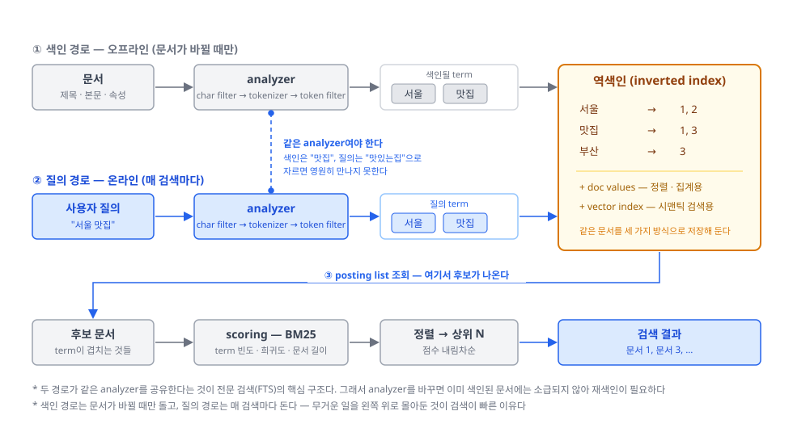
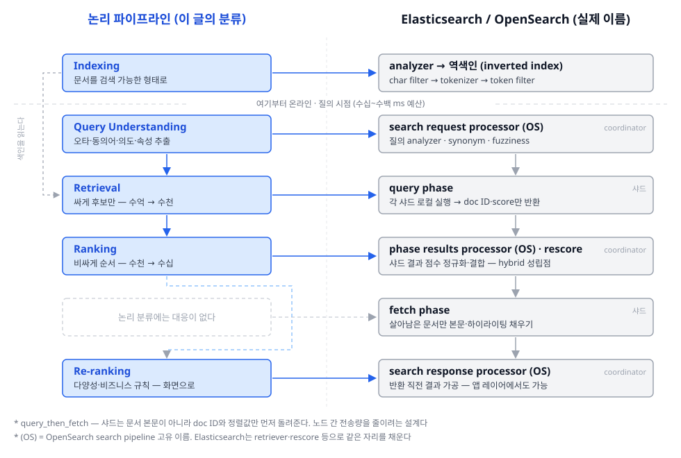

이 글은 **Search** 시리즈의 출발점입니다. 특정 엔진(Elasticsearch 등)의 사용법이 아니라, 검색 시스템을 이루는 각 단계의 개념 — 무엇을 하는가, 왜 필요한가, 무엇이 어려운가 — 을 정리합니다.

## 1. 왜 필요한가?
- **배경(전수 탐색의 불가능)**: 문서가 수억 개면 질의마다 전부 훑어 관련성을 재는 것은 불가능하다. 게다가 사용자 질의는 짧고(보통 2~3 단어), 모호하고, 오타가 섞여 있다 — **입력은 빈약한데 후보는 방대하다**
- **해결책(검색 시스템)**: 문서를 미리 뒤집어 색인해 두고, 질의를 해석하고, 후보를 싸게 좁힌 뒤, 좁혀진 것만 비싸게 순서 매겨 상위 몇 개를 돌려주는 **파이프라인**
- **추천과의 관계**: 추천은 "무엇을 원하는지 모르는" 사용자를 위한 장치다. 검색은 반대로 **의도가 이미 질의에 담겨** 있다. 그래서 검색의 난이도는 "이 사람이 무엇을 좋아할까"의 예측이 아니라, **"이 질의가 무슨 뜻인가"의 해석**과 **"무엇이 더 관련 있나"의 순서** 문제로 옮겨간다

**이 시리즈의 범위** — 여기서 다루는 것은 **후보가 많아 순위를 매겨야 하는 검색**이다. 아래 어느 하나라도 해당하면 이 시리즈의 파이프라인은 과하거나 아예 필요 없다.

- **PK 조회·KV 스토어** — 답이 하나로 정해져 있어 관련성이라는 개념 자체가 없다. B-tree·해시로 끝난다
- **SQL 필터 검색** — 결과가 순위 매겨진 목록이 아니라 **집합**이다. 조건이 결정적이라 "무엇이 더 관련 있나"를 물을 이유가 없다
- **소규모 검색** — 문서가 1만 건이면 전수 스캔이 더 빠르고 단순하다. **깔때기는 규모가 만드는 문제**지 검색의 본질이 아니다

재료는 **텍스트를 기본**으로 삼는다(역색인·형태소 분석). 다만 그것은 1축의 기본형일 뿐이고, 매칭 축에서 벡터로 넘어가면 텍스트라는 전제도 풀린다 — 이미지·음성 검색이 같은 파이프라인에 올라타는 지점이다.

## 2. 무엇을 재료로 쓰는가?
- **문서(코퍼스)**: 제목·본문 같은 텍스트뿐 아니라 카테고리·가격·색상·재고 같은 **구조화 필드**까지 — 앞은 매칭에, 뒤는 필터와 랭킹 신호에 쓰인다
- **질의**: 짧고 모호하고 오타가 섞인 자연어 조각. 같은 의도를 사람마다 다르게 적는다 ("운동화" / "런닝화" / "스니커즈")
- **상호작용 로그**: 어떤 질의에 어떤 결과를 클릭·구매했나 — **관련성의 정답지** 역할을 하는 가장 값싼 라벨. 단, 위에 놓였기 때문에 눌린 것인지(위치 편향) 관련 있어서 눌린 것인지 구분되지 않는다

## 3. 구성 요소
먼저 가장 표준적인 형태인 **전문 검색(full-text search)** 의 전체 구조를 보자. 이 그림 하나에 검색 시스템의 골격이 다 들어 있다.

- 경로가 **둘**이다. 문서가 들어오는 **색인 경로**와 사용자가 들어오는 **질의 경로**. 둘은 역색인에서 만난다
- 두 경로가 **같은 analyzer를 공유**한다는 것이 전문 검색의 핵심 구조다. 문서를 `맛집`으로 잘라 색인했는데 질의를 `맛있는집`으로 자르면 두 토큰은 영원히 만나지 못한다
- 무거운 일은 전부 **왼쪽 위(오프라인)** 에 몰려 있다. 색인 경로는 문서가 바뀔 때만 돌고, 질의 경로는 매 검색마다 돈다 — 검색이 빠른 이유가 이 배치에 있다

검색은 하나의 알고리즘이 아니라 **질의가 결과가 되기까지의 단계들**이다. 위 그림을 단계로 쪼개면 이렇게 된다.

| 단계 | 역할 | 규모 |
|---|---|---|
| Indexing (색인) | 문서를 검색 가능한 자료구조로 뒤집어 저장 — 유일하게 오프라인 단계 | 전체 코퍼스 |
| Query Understanding (질의 이해) | 오타 교정·토큰화·동의어 확장·의도 분류·속성 추출 — 사람의 말을 시스템이 다룰 형태로 | 질의 1건 |
| Retrieval (검색·후보 생성) | 색인에서 "관련 있을 법한 것"을 **싼 연산으로** 긁어온다 | 수억 → 수천 |
| Ranking (랭킹) | 좁혀진 후보에만 **비싼 모델**을 적용해 순서를 매긴다 | 수천 → 수십 |
| Re-ranking (재정렬) | 다양성·중복 제거·비즈니스 규칙(품절·광고·개인화) | 수십 → 화면 |

* 이 다섯 줄이 곧 **파이프라인 분류**이고, 시리즈의 첫 다섯 편이다.

핵심은 **깔때기**다. Retrieval과 Ranking을 굳이 나누는 이유는 하나 — 정확한 모델은 비싸서 전체 문서에 돌릴 수 없고, 싼 방법은 순서가 나쁘다. 그래서 **싸게 많이 거르고, 비싸게 조금 정렬한다**. 검색이 수십~수백 ms 안에 답해야 한다는 지연시간 예산이 이 분할을 강제한다.

이 다섯 단계는 교과서적 구분이 아니라 실제 엔진이 그렇게 생겼다. Elasticsearch·OpenSearch가 부르는 이름과 나란히 놓으면 이렇다:

- 엔진은 **query_then_fetch** 두 국면으로 돈다. 요청을 받은 노드가 coordinating node가 되어 샤드 전부에 질의를 뿌리고(**query phase**), 각 샤드는 문서 본문이 아니라 **doc ID와 정렬값만** 돌려준다. 전역 정렬이 끝난 뒤 살아남은 문서에 대해서만 본문을 가지러 다시 간다(**fetch phase**)
- 즉 엔진 안에도 같은 원리가 한 겹 더 있다 — **싼 것을 넓게, 비싼 것을 좁게**. 깔때기는 논리적 비유가 아니라 구현 그 자체다
- `fetch phase`에 대응하는 논리 단계가 없는 것은 그것이 관련성 판단이 아니라 **데이터 조회**이기 때문이다. 순서는 이미 정해졌고, 화면에 뿌릴 내용을 채우는 일만 남았다

## 4. 시리즈 로드맵 — 네 개의 축
파이프라인은 "**어디서** 일어나나" **한 축**을 나눈 것이다. BM25·임베딩·NDCG·HNSW 같은 주제들은 이 축의 6번째 항목이 아니라, **다른 축**에 놓인다.

| 축 | 답하는 질문 | 편 |
|---|---|---|
| 파이프라인 | 어떤 순서로 좁히나 | Indexing, Query Understanding, Retrieval, Ranking, Re-ranking |
| 매칭 방식 | 무엇으로 관련성을 재나 | Lexical (BM25), Semantic (Embedding), Hybrid |
| 평가·학습 | 좋은지 어떻게 알고, 어떻게 나아지나 | Evaluation (NDCG·MRR·Recall@k), Learning-to-Rank |
| 서빙 | 스케일을 어떻게 감당하나 | 역색인 구조, ANN (HNSW·IVF), 샤딩·지연시간 예산 |

- **매칭 방식** 축은 파이프라인과 직교한다. BM25와 임베딩은 파이프라인의 다음 단계가 아니라 **Retrieval 단계 안의 선택지**이고, 같은 선택이 Ranking 단계에서 한 번 더 나타난다(bi-encoder로 긁고 cross-encoder로 다시 재는 식). 축이 다르다는 것은 이런 뜻이다 — 단계마다 매칭 방식을 따로 고를 수 있다
- **평가·학습** 축은 검색에 정답이 없다는 데서 출발한다. 오프라인 지표(NDCG·MRR·Recall@k)를 재려면 관련성 라벨이 필요한데, 사람이 붙이기엔 너무 비싸서 현실적 원천은 클릭 로그다. 그런데 클릭은 위치 편향에 오염돼 있다 — 이 편향을 다루는 문제와, 그 로그로 랭킹 함수 자체를 학습하는 Learning-to-Rank가 여기 속한다
- **서빙** 축은 알고리즘이 정해진 뒤에도 남는 제약이다. 수억 문서를 수만 QPS로 수십 ms 안에 답하려면 자료구조와 분산이 알고리즘만큼 중요해진다. 역색인이 왜 그 모양인지, 벡터 검색이 왜 정확한 최근접이 아니라 **근사(ANN)**로 가는지가 이 축의 질문이다

## 5. 구체적 사례 — 왜 한 단계로는 안 되는가
질의 `"나이키 운도화 검정"` 하나가 파이프라인을 통과하며 부딪히는 지점들:

1. **오타**: 색인에 "운도화"는 없다. 문자열 그대로 찾으면 0건 → **Query Understanding**의 오타 교정이 받는다
2. **속성**: "검정"은 상품명이 아니라 `color` 필드에 있다. 텍스트로 매칭할 게 아니라 **필터로 빼내야** 한다 → 역시 Query Understanding
3. **후보 폭발**: 교정된 "나이키 운동화"로 색인을 긁으면 12만 건. 전부에 랭킹 모델을 돌릴 시간이 없다 → **Retrieval**이 싼 점수로 상위 1,000건만 통과시킨다
4. **단어가 안 겹치는 문서**: "러닝화"라고만 적힌 상품은 단어가 겹치지 않아 후보에 아예 못 든다 — 렉시컬 매칭의 구조적 한계 → 같은 Retrieval 단계에 **Semantic 매칭**을 병행한다 (Hybrid)
5. **순서**: 1,000건을 단어 빈도로만 세우면 제목에 "나이키"를 열 번 박은 스팸이 위로 온다. 관련성은 판매량·평점·클릭률까지 섞어야 나온다 → **Ranking**
6. **쏠림**: 상위 10개가 전부 같은 모델의 색상 변형이면 사용자는 선택지가 없다고 느낀다 → **Re-ranking**의 다양성 제어

- 단계마다 실패하는 이유가 다르다. 그래서 검색은 한 알고리즘이 아니라 파이프라인이다
- 그리고 이 파이프라인은 **한 방향**이다. Retrieval이 놓친 문서는 Ranking이 아무리 좋아도 영원히 나오지 않는다 — 재현율은 위에서 결정되고, 아래로 갈수록 되돌릴 수 없다
