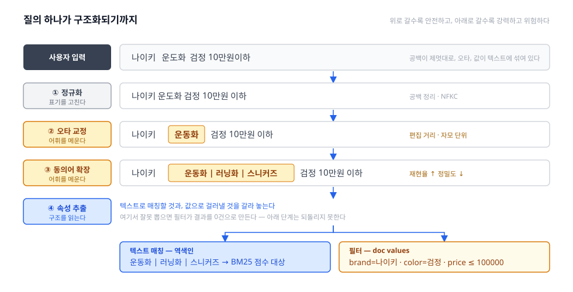

파이프라인의 두 번째, Query Understanding(질의 이해) 편. 색인이 **문서 쪽**을 준비하는 일이었다면, 여기는 **질의 쪽**을 준비하는 일이다.

## 1. 정의
- 사용자가 친 문자열을 시스템이 다룰 수 있는 형태로 **해석**하는 단계 — 검색에서 유일하게 "사람의 말"을 상대하는 구간
- 핵심 문제는 **어휘 불일치(vocabulary mismatch)** 다. 사용자의 말과 문서의 말이 다르다. 사용자는 `런닝화`라 치는데 상품명은 `러닝화`이고 카테고리는 `운동화`다
- 질의의 조건은 가혹하다: 평균 2~3 단어, 오타가 섞이고, 띄어쓰기가 제멋대로고, 문법이 없다. **입력이 빈약할수록 해석이 감당할 몫이 커진다**
- 재료: 질의 문자열 + 사전(동의어·불용어·사용자 사전) + **질의 로그** — 무엇을 치고 무엇을 클릭했나가 가장 값싼 정답지다

## 2. 종류(비교)
1차 분기는 **무엇을 고치나**이다. 표기를 고치는가, 어휘를 메우는가, 구조를 읽는가 — 뒤로 갈수록 의미에 가까워지고, **틀렸을 때 손해도 커진다.**

- 정규화 (Normalization) — **표기**의 차이를 없앤다
  - 역할 및 정의: 같은 것을 같게 만든다. 대소문자, 전각/반각, 유니코드 정규화(NFKC), 공백·특수문자 정리
  - 색인 쪽 character filter·token filter와 **대칭**이어야 한다. 이 대칭이 깨지면 뒤의 모든 것이 무의미해진다 — Indexing 편의 그 규칙이 질의 쪽에서 반복된다
  - 한국어 고유 문제들: **자모 분리**(`ㅅㅓㅇㅜㄹ` 형태로 들어온 입력), **초성 검색**(`ㅅㅇ` → 서울), **한영 오입력**(`tjdnf` → `서울` — 한영 전환을 잊은 채 친 것)
  - 장점: 싸고 안전하다 — 의미를 건드리지 않는다. 단점: 여기서 해결되는 것은 표면뿐이다
- 교정·확장 (Correction & Expansion) — **어휘**의 차이를 메운다
  - 역할 및 정의: 사용자의 단어를 문서의 단어로 잇는다
  - **오타 교정**: 편집 거리(Levenshtein)로 가까운 색인 term을 찾는다. Elasticsearch의 `fuzziness: AUTO`는 term 길이에 따라 허용 거리를 정한다 — 2자 이하는 0, 3~5자는 1, 6자 이상은 2
    - 한국어는 음절이 아니라 **자모 단위**로 거리를 재야 정확하다. `운도화`와 `운동화`는 음절로 보면 통째로 다른 글자지만 자모로 보면 종성 하나 차이다
  - **동의어(synonym)**: `런닝화 = 러닝화 = 운동화`. 사전으로 명시하거나 **질의 로그에서 발굴**한다 — 서로 다른 질의가 같은 결과를 클릭했다면 동의어일 가능성이 높다
  - **질의 확장(query expansion)**: 관련어를 더해 재현율을 올린다. 상위 결과의 빈출어를 다시 질의에 넣는 의사 관련성 피드백(PRF)이 고전적 방법
  - 장점: 어휘 불일치를 정면으로 푼다. 단점: **재현율을 올리는 대신 정밀도를 깎는다** — 확장은 언제나 이 줄다리기다
- 해석 (Interpretation) — **구조**를 읽는다
  - 역할 및 정의: 질의를 문자열이 아니라 **의미의 조합**으로 본다
  - **의도 분류(intent)**: 브랜드를 찾는가, 카테고리를 찾는가, 특정 상품을 찍어 찾는가. 의도가 정해지면 이후 랭킹 가중치가 달라진다
  - **개체명·속성 추출(NER)**: `나이키 검정 운동화 10만원 이하` → `brand=나이키`, `color=검정`, `price ≤ 100000`. 본질은 **텍스트 매칭에서 필터로 옮기는 작업**이다 — Indexing 편의 doc values가 여기서 쓰인다
  - **질의 분할(segmentation)**: 한국어는 띄어쓰기가 불안정하다. `삼성전자주식`을 어디서 자를지가 결과를 바꾼다
  - 장점: 정밀도를 크게 올린다. 단점: **틀리면 크게 틀린다** — 없는 속성을 추출하면 필터가 결과를 0건으로 만든다
- 0건 대응 (Relaxation) — 위를 다 해도 결과가 없을 때
  - 조건을 하나씩 푼다: 필터 완화 → `AND`를 `OR`로 → 마지막 단어 제거
  - "결과 없음" 대신 "이건 어떠세요"를 만드는 것도 이 단계의 일이다

한눈 비교:

|구분|정규화|교정·확장|해석|
|---|---|---|---|
|고치는 것|표기|어휘|구조|
|대표 기법|NFKC · 자모 · 초성|편집 거리 · 동의어 · PRF|의도 분류 · NER · 분할|
|재현율/정밀도|거의 영향 없음|재현율 ↑ 정밀도 ↓|정밀도 ↑ (틀리면 급락)|
|틀렸을 때|거의 무해|잡음이 늘어난다|0건이 되거나 엉뚱해진다|
|근거|규칙 · 사전|사전 + 질의 로그|모델 + 라벨|

## 3. 사용 예시
- 오타·제안 — Elasticsearch는 네 종류의 suggester를 제공한다
  - **term suggester** — 단어 단위 교정
  - **phrase suggester** — 문장 전체 맥락으로 교정. "did you mean"이 이것
  - **completion suggester** — 자동완성. FST 기반이라 매우 빠르다
  - **context suggester** — 카테고리·위치 같은 조건이 붙은 자동완성
  - 질의 쪽에서는 `fuzzy` 쿼리, 또는 `match`의 `fuzziness` 파라미터
- 동의어
  - `synonym` 토큰 필터 — 색인 시점용
  - `synonym_graph` 토큰 필터 — **검색 시점 전용**. 여러 단어로 된 동의어를 그래프 토큰 스트림으로 다뤄야 하기 때문이다
- 한국어
  - **초성 검색**: 색인 시점에 초성 필드를 multi-field로 따로 만들어 두는 것이 일반적이다 (`서울` → `ㅅㅇ`)
  - **한영 오타**: 자판 배열 매핑 테이블로 `tjdnf` ↔ `서울` 양방향 변환. 규칙 몇 줄로 큰 효과를 보는 대표 사례
  - 형태소 분석기의 **사용자 사전**이 질의 쪽에서도 그대로 핵심이다
- **자동완성은 질의 이해의 일부다** — 사용자가 오타를 치기 **전에** 올바른 질의를 고르게 만드는 것이 가장 값싸고 정확한 교정이다
- 로그 활용: 질의–클릭 로그로 동의어를 발굴하고, **0건 질의 목록이 곧 개선 백로그**가 된다

## 4. 참고
1. 동의어를 색인에서 펼칠까, 질의에서 펼칠까
- **색인 시점**: 미리 펼쳐 두니 검색이 빠르다. 대신 사전을 고치면 **재색인**이 필요하고, 펼쳐 넣은 term이 문서 빈도를 부풀려 IDF를 왜곡한다
- **질의 시점**: 사전 변경이 즉시 반영되고 색인이 깨끗하게 유지된다. 대신 질의가 무거워진다
- Elasticsearch가 `synonym_graph`를 **검색 분석기 전용**으로 규정한 것이 방향을 말해 준다 — `뉴욕` = `뉴 욕`처럼 여러 단어로 된 동의어를 제대로 다루려면 질의 시점이어야 한다
- 실무 기본값은 **질의 시점**이다. 사전은 계속 바뀌는데 재색인은 비싸기 때문

2. 확장은 공짜가 아니다
- 동의어를 넓게 걸면 `애플`이 과일과 회사를 함께 끌고 온다
- 그래서 확장으로 추가한 term에는 보통 **가중치를 낮춰서** 넣는다 — 찾히긴 하되 위로 올라오지는 않게
- 정답은 서비스마다 다르다. 결과가 부족한 롱테일 질의에는 공격적으로, 결과가 넘치는 인기 질의에는 보수적으로

3. 이 단계가 위험한 이유
- overview에서 말한 파이프라인의 비대칭이 여기서 가장 아프게 작동한다 — **여기서 잘못 고치면 아래 단계가 복구하지 못한다**
- `아이폰 15`를 `아이폰 5`로 "교정"해 버리면, 그 아래 어떤 랭킹 모델도 되돌릴 수 없다
- 그래서 원칙: **사용자가 정확히 친 것은 함부로 고치지 않는다.** 색인에 실제로 존재하는 term이면 교정 대상에서 뺀다
- 널리 쓰이는 절충은 결정을 사용자에게 돌려주는 것이다 — 고친 결과를 보여주되 "`운동화`로 검색했습니다 / `운도화`로 그대로 검색하기"를 남긴다

4. 다음 편 예고
- 질의가 term으로 정리됐으니 이제 색인에서 후보를 긁어올 차례다 → **Retrieval**
- 동의어로도 메워지지 않는 어휘 불일치가 있다. `저렴한 노트북`과 `가성비 랩탑`은 사전으로 잇기 어렵다 — 이건 **매칭 축**의 Semantic 편에서 다룬다

## 5. 링크
- 개요
  - [Query understanding — Wikipedia](https://en.wikipedia.org/wiki/Query_understanding)
  - [Levenshtein distance — Wikipedia](https://en.wikipedia.org/wiki/Levenshtein_distance)
- 오타·자동완성
  - [Suggesters | Elasticsearch Reference](https://www.elastic.co/guide/en/elasticsearch/reference/current/search-suggesters.html) — term · phrase · completion · context
  - [Fuzzy query | Elasticsearch Reference](https://www.elastic.co/docs/reference/query-languages/query-dsl/query-dsl-fuzzy-query) — `fuzziness: AUTO`
- 동의어
  - [Synonym graph token filter | Elastic Docs](https://www.elastic.co/docs/reference/text-analysis/analysis-synonym-graph-tokenfilter) — 검색 분석기 전용인 이유
  - [Synonym token filter | Elastic Docs](https://www.elastic.co/docs/reference/text-analysis/analysis-synonym-tokenfilter)
- 확장·해석
  - [Query expansion — Wikipedia](https://en.wikipedia.org/wiki/Query_expansion)
  - [Relevance feedback (Rocchio, PRF) — Wikipedia](https://en.wikipedia.org/wiki/Relevance_feedback)
