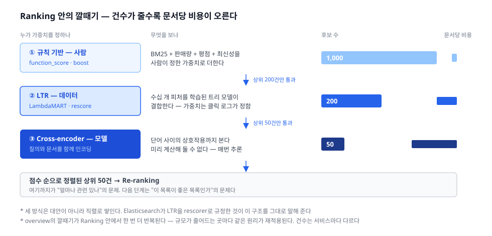

파이프라인의 네 번째, Ranking(랭킹) 편. Retrieval이 후보를 좁혀 놓았으니, **이제 비싼 계산을 해도 되는 구간**이다.

## 1. 정의
- 좁혀진 후보(수천 건)에 점수를 매겨 순서를 정하는 단계. 수천 → 수십
- 목표가 앞 단계와 **뒤집힌다**. Retrieval의 목표가 재현율이었다면 여기는 **정밀도**다. 1,000등이 900등이 되는 것은 아무 의미가 없고, 3등이 1등이 되는 것은 큰 의미가 있다
- 그래서 Ranking은 **상위에 집중된 문제**다. 평가 지표(NDCG·MRR)가 위쪽에 가중치를 몰아 주는 것도 같은 이유다
- 재료: 후보 문서 + 질의 + **신호(feature)** 들

점수는 하나의 값이지만, 그 값을 만드는 신호는 성격이 다른 네 종류다.

|신호|예시|성질|
|---|---|---|
|질의–문서|BM25 점수, 어느 필드에서 맞았나, 벡터 유사도|질의마다 다시 계산해야 한다|
|문서 자체 (정적)|판매량 · 평점 · 리뷰 수 · 최신성 · PageRank|질의와 무관해 **미리 계산해 둘 수 있다**|
|사용자–문서 (개인화)|이전에 본 브랜드, 위치, 재구매 이력|사용자마다 다르다|
|비즈니스|마진 · 재고 · 광고|관련성과 무관한 의도적 개입|

## 2. 종류(비교)
1차 분기는 **누가 가중치를 정하나**이다. 사람이 정하는가, 데이터가 정하는가, 모델이 표현까지 정하는가 — 뒤로 갈수록 정확하고, 비싸고, 설명하기 어려워진다.

- 규칙 기반 결합 — **사람이 정한다**
  - 역할 및 정의: `점수 = BM25 × 1.0 + log(판매량) × 0.3 + 최신성 × 0.2` 같은 식을 사람이 직접 쓴다
  - 장점: 즉시 반영되고, 완전히 설명되며, 학습 데이터가 필요 없다. "품절 상품은 뒤로" 같은 사업 요구를 그대로 넣을 수 있다
  - 단점: **신호가 늘면 손으로 정할 수 없다.** 서너 개까지는 감으로 되지만 스무 개는 불가능하다. 게다가 가중치 하나를 바꿨을 때 어디가 좋아지고 어디가 나빠지는지 알 방법이 없다
- Learning-to-Rank — **데이터가 정한다**
  - 역할 및 정의: 같은 신호들을 **피처**로 넣고, 가중치를 클릭 로그에서 학습한다. 산업 표준은 GBDT 계열, 특히 **LambdaMART**(XGBoost·LightGBM 구현)
  - 피처는 세 종류로 나뉜다 — **문서 피처**(가격), **질의 피처**(질의 단어 수), **질의–문서 피처**(제목 필드의 BM25 점수)
  - 학습에는 **판단 목록(judgment list)** 이 필요하다. 질의–문서 쌍에 매긴 관련성 등급이고, **그 품질이 모델 성능을 사실상 결정한다** — 모델을 고르는 것보다 라벨을 잘 만드는 쪽이 대개 이득이 크다
  - Elasticsearch는 8.13부터 LTR을 내장했다. 다만 **학습은 밖에서** 하고 학습된 모델만 올린다
  - 장점: 신호가 많아질수록 강해진다. 단점: 라벨이 필요하고, 왜 이 순서인지 설명하기 어렵다
  - 학습 방법론(pointwise · pairwise · listwise, 손실 함수)은 **평가·학습 축**의 별도 편에서 다룬다
- Cross-encoder 재점수 — **모델이 표현까지 정한다**
  - 역할 및 정의: 질의와 문서를 **함께** 하나의 모델에 넣어 점수를 낸다. 둘을 따로 인코딩해 내적하는 벡터 검색의 bi-encoder와 대조적이다
  - 함께 넣으니 단어 사이의 상호작용을 볼 수 있어 정확도가 훨씬 높다. 대신 **문서마다 모델을 한 번씩 돌려야 한다** — 미리 계산해 둘 수 없다는 것이 결정적 차이다
  - 그래서 상위 수십~수백 건에만 쓴다
  - 장점: 현재 가장 정확한 관련성 판단. 단점: 비용이 자릿수로 다르다

### Ranking은 다시 깔때기다
셋은 대안이 아니라 **직렬로 쌓인다**. 후보 1,000건 전부에 싼 점수를 매기고, 상위 200건에 LTR을, 상위 50건에 cross-encoder를 적용하는 식이다.

- Elasticsearch가 LTR을 **rescorer**로, cross-encoder를 상위 k건 재정렬로 규정한 것이 이 구조를 그대로 말해 준다. `rescore`의 `window_size`가 곧 **"몇 건까지 비싼 계산을 허용할까"의 손잡이**다
- overview에서 본 깔때기가 Ranking 안에서 **한 번 더 반복**된다. 파이프라인은 프랙탈이다 — 규모가 줄어드는 곳마다 같은 원리가 재적용된다

한눈 비교:

|구분|규칙 기반|Learning-to-Rank|Cross-encoder|
|---|---|---|---|
|가중치를 정하는 주체|사람|데이터 (클릭 로그)|모델|
|필요한 것|도메인 감각|판단 목록 (라벨)|사전학습 모델 + 추론 자원|
|적용 대상|후보 전부|상위 수백|상위 수십|
|문서당 비용|아주 쌈|중간|아주 비쌈|
|설명 가능성|완전|낮음|거의 없음|
|사업 규칙 반영|즉시|재학습 필요|어렵다|

## 3. 사용 예시
- 규칙 기반
  - `function_score` — BM25 점수에 함수를 곱하거나 더한다
  - `field_value_factor` — 판매량 같은 필드 값을 점수에 반영
  - `script_score` — 임의의 수식을 직접 쓴다
  - `multi_match` + `boost` — 제목에 3배, 본문에 1배
  - **decay 함수**(`gauss`·`exp`·`linear`) — 최신성이나 거리에 따라 점수를 감쇠시킨다. "가까울수록·최근일수록"을 표현하는 표준 도구
- Learning-to-Rank
  - **Elasticsearch LTR** (8.13+) — eland로 `XGBRanker`(LambdaMART) 모델을 올려 rescorer로 사용
  - **OpenSearch LTR 플러그인** — ranklib·xgboost 등 직렬화 형식으로 모델 업로드
  - 피처 추출은 **템플릿 질의**로 정의한다. 학습 데이터를 만들 때와 추론할 때 같은 정의를 쓰는 것이 핵심 — 여기가 어긋나면 오프라인 성능이 온라인에서 재현되지 않는다
- Cross-encoder 재점수
  - ES `text_similarity_reranker` retriever — 기본 추론 엔드포인트 `.rerank-v1-elasticsearch`(Elastic Rerank 모델)
  - Cohere Rerank 같은 API, 또는 오픈소스 cross-encoder(ms-marco MiniLM 계열)
- 단계 분할
  - `rescorer` retriever의 `window_size` — 상위 몇 건을 다시 점수 매길지. 기본 retriever에서는 **샤드당**, `rrf` 같은 복합 retriever에서는 **전역** 기준이라는 점을 헷갈리기 쉽다

## 4. 참고
1. 점수는 질의를 넘어 비교할 수 있는 값이 아니다
- BM25 점수는 질의마다 스케일이 다르다. 흔한 단어로 검색하면 낮게, 희귀한 단어로 검색하면 높게 나온다
- 그래서 `점수 5.0 이상만 보여줘` 같은 **절대 임계치는 위험하다**. 같은 임계치가 어떤 질의에서는 전부 통과시키고 어떤 질의에서는 전부 잘라낸다
- 이 성질이 **Hybrid의 근본 문제**로 이어진다 — 스케일이 다른 두 점수(BM25와 코사인 유사도)를 그냥 더할 수 없는 이유가 여기 있다

2. Elastic이 말하는 "rerank"와 이 시리즈의 Re-ranking은 다르다
- `text_similarity_reranker`도, LTR의 "second-stage re-ranker"도 하는 일은 **관련성을 더 정밀하게 다시 재는 것**이다. 이 시리즈의 분류로는 전부 **Ranking**에 속한다
- 이 시리즈에서 Re-ranking이라 부르는 것은 관련성이 아니라 **목록 전체의 성질**을 손보는 일이다 — 다양성, 중복 제거, 비즈니스 규칙
- 이름이 겹치니 문서를 읽을 때 **"무엇을 다시 하는가"** 를 보면 된다. 점수를 다시 매기면 Ranking, 목록을 다시 짜면 Re-ranking

3. 규칙에서 학습으로 넘어가는 지점
- 신호가 서너 개일 때는 사람이 정하는 편이 낫다. 빠르고, 설명되고, 라벨이 필요 없다
- 넘어갈 때가 왔다는 신호: 가중치를 바꿔도 좋아지는지 나빠지는지 **말할 수 없을 때**, 질의 유형마다 다른 가중치가 필요해질 때
- 그리고 학습으로 넘어가려면 **평가 체계가 먼저** 있어야 한다. 좋아졌는지 잴 수 없으면 학습한 모델을 배포할 근거도 없다 — 로드맵에서 평가가 학습보다 앞에 놓인 이유다

4. 개인화·비즈니스 신호는 피드백 루프를 만든다
- 클릭 로그로 학습하면 **이미 위에 있던 것이 더 위로 간다**. 노출되지 않은 문서는 클릭이 없고, 클릭이 없으니 계속 올라오지 못한다
- 추천 시리즈에서 밴딧과 탐색(exploration)이 필요했던 것과 정확히 같은 문제다. 검색도 결국 같은 자리에서 만난다

5. 다음 편 예고
- 점수 순으로 세운 목록이 **좋은 목록인가**는 다른 질문이다. 1위부터 10위까지가 전부 같은 상품의 색상 변형이라면 점수는 옳고 목록은 틀렸다 → **Re-ranking**
- 점수 스케일이 다른 목록들을 어떻게 합치나 → 매칭 축의 **Hybrid**
- 좋아졌는지 어떻게 재나, 판단 목록은 어떻게 만드나 → 평가 축의 **Evaluation**

## 5. 링크
- 개요
  - [Learning to rank — Wikipedia](https://en.wikipedia.org/wiki/Learning_to_rank)
  - [LambdaMART / LambdaRank (Burges, 2010) — From RankNet to LambdaRank to LambdaMART](https://www.microsoft.com/en-us/research/publication/from-ranknet-to-lambdarank-to-lambdamart-an-overview/)
- 규칙 기반
  - [Function score query | Elasticsearch Reference](https://www.elastic.co/docs/reference/query-languages/query-dsl/query-dsl-function-score-query) — decay 함수 포함
- Learning-to-Rank
  - [Learning To Rank (LTR) | Elastic Docs](https://www.elastic.co/docs/solutions/search/ranking/learning-to-rank-ltr) — 판단 목록, 피처 3종, rescorer로서의 위치
  - [Elasticsearch Learning to Rank: Improving search ranking | Elasticsearch Labs](https://www.elastic.co/search-labs/blog/elasticsearch-learning-to-rank-introduction)
  - [Learning to Rank — XGBoost documentation](https://xgboost.readthedocs.io/en/latest/tutorials/learning_to_rank.html)
- Cross-encoder 재점수
  - [Semantic reranking | Elastic Docs](https://www.elastic.co/docs/solutions/search/ranking/semantic-reranking) — cross-encoder vs bi-encoder
  - [Text similarity re-ranker retriever | Elasticsearch Reference](https://www.elastic.co/docs/reference/elasticsearch/rest-apis/retrievers/text-similarity-reranker-retriever)
  - [Rescorer retriever | Elasticsearch Reference](https://www.elastic.co/docs/reference/elasticsearch/rest-apis/retrievers/rescorer-retriever) — `window_size`
