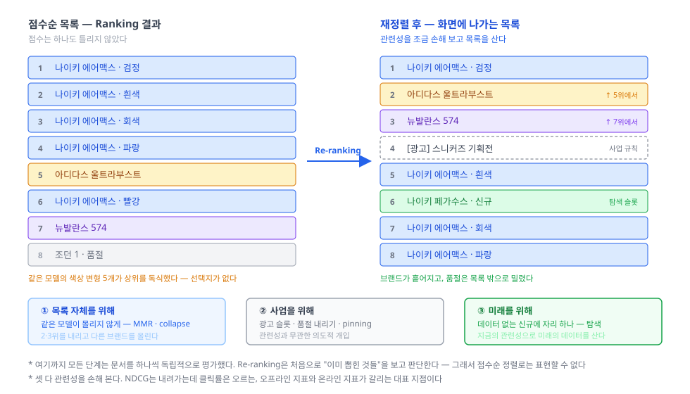

파이프라인의 마지막, Re-ranking(재정렬) 편. Ranking이 매긴 **점수가 옳아도 목록은 나쁠 수 있다**는 데서 출발한다.

## 1. 정의
- 점수 순으로 세워진 목록을 받아, **목록 전체의 성질**을 손보는 단계. 수십 → 화면
- 결정적 차이는 시야다. 여기까지 모든 단계는 문서를 **하나씩 독립적으로** 평가했다. Re-ranking은 처음으로 **문서들 사이의 관계**를 본다
  - Ranking의 질문: "이 문서가 얼마나 관련 있나" — 다른 문서와 무관하게 답할 수 있다
  - Re-ranking의 질문: "이 문서가 **이미 뽑힌 것들** 옆에 놓일 만한가" — 앞의 선택이 정해져야 답이 나온다
- 그래서 점수순 정렬로는 표현할 수 없다. 1위를 뽑고 나서야 2위 후보의 가치가 정해진다 — **탐욕적 선택(greedy)** 이 이 단계 알고리즘의 기본 형태인 이유다
- 재료: 점수 순 목록 + 문서 간 유사도 + 사업 규칙 + 노출 이력

## 2. 종류(비교)
1차 분기는 **무엇을 위해 순서를 흔드나**이다. 목록 자체를 위해서인가, 사업을 위해서인가, 미래를 위해서인가 — 셋 다 **지금 이 질의의 관련성을 조금 손해 보면서** 다른 것을 얻는다.

- 목록 자체를 위해 — **다양성 · 중복 제거**
  - 문제: 점수가 옳아도 목록이 나쁠 수 있다. 상위 10개가 전부 같은 상품의 색상 변형이면 사용자는 **선택지가 없다고 느낀다**. 관련성은 만점인데 검색은 실패한 것이다
  - **MMR (Maximal Marginal Relevance)**: `argmax[ λ · 관련성 − (1−λ) · 이미 뽑힌 것과의 최대 유사도 ]`. 하나 뽑을 때마다 이미 뽑힌 것과 겹치는 만큼 벌점을 준다. **λ=1이면 순수 관련성, λ=0이면 순수 다양성** — 손잡이 하나로 조절된다 (Carbonell & Goldstein, 1998)
  - **접기(collapse)**: 같은 판매자·같은 모델·같은 도메인을 한 그룹으로 묶어 대표 하나만 올린다. 유사도를 계산하지 않고 **키로 잘라 버리는** 값싼 방법
  - 장점: 목록의 체감 품질이 크게 오른다. 단점: 관련성 지표는 내려간다
- 사업을 위해 — **비즈니스 규칙**
  - 품절·판매 중지 상품 내리기, 광고 슬롯 삽입, 특정 상품 고정(pinning), 금지 상품 차단, 판매자별 노출 상한
  - 관련성과 무관한 **의도적 개입**이다. 검색 엔진이 정하는 것이 아니라 서비스가 정한다
  - 장점: 즉시 반영되고 의도가 명확하다. 단점: **규칙이 쌓이면 서로 충돌**하고, 결국 왜 이 순서인지 아무도 설명하지 못하게 된다
- 미래를 위해 — **탐색 · 노출 분배**
  - 신규 문서는 클릭 데이터가 없어 점수가 낮고, 점수가 낮으니 노출되지 않고, 노출이 없으니 영원히 데이터가 쌓이지 않는다
  - 그래서 상위 목록에 **일부러 자리를 내준다**. 지금의 관련성을 조금 손해 보고 **미래의 데이터**를 사는 것이다
  - 공정성(fairness)도 같은 자리에 있다 — 노출 기회를 특정 판매자가 독식하지 않도록 분배한다
  - 추천 시리즈의 **밴딧·탐색**과 정확히 같은 문제다. 검색에서는 이 단계가 그 개입 지점이 된다

한눈 비교:

|구분|다양성·중복 제거|비즈니스 규칙|탐색·노출 분배|
|---|---|---|---|
|무엇을 위해|목록 자체|사업|미래|
|근거|문서 간 유사도|사람이 정한 규칙|노출·데이터의 부족|
|대표 기법|MMR · collapse · DPP|pinning · 광고 슬롯 · 상한|ε-탐색 · 고정 슬롯|
|관련성 손해|있다|있다|있다|
|조절 방법|파라미터 하나 (λ)|규칙 수정|비율 조정|
|효과 확인|A/B 테스트|즉시 눈으로|장기 지표|

## 3. 사용 예시
- 접기
  - Elasticsearch `collapse` — 지정한 필드로 접어 그룹당 최상위 문서 하나만 반환한다. `inner_hits`로 그룹 안의 문서 몇 개를 함께 보여줄 수 있다
  - 제약이 많은 기능이다: **doc values가 있는 단일 값 `keyword`·숫자 필드**여야 하고(Indexing 편의 그 doc values다), `scroll`과 함께 쓸 수 없으며, 응답의 총 건수는 **접기 전 기준**이라 그룹이 몇 개인지는 알 수 없다
- 다양성
  - **MMR** — 후보 임베딩 간 코사인 유사도로 벌점을 준다. 벡터 검색을 이미 쓰고 있다면 추가 비용이 거의 없다
  - **DPP (Determinantal Point Process)** — 다양성을 확률 모델로 정식화한 방법. 대규모 서비스에서 쓴다
  - **라운드로빈** — 브랜드별로 한 개씩 번갈아 뽑는다. 구현이 몇 줄이고 효과는 큰, 가장 먼저 시도할 방법
- 비즈니스 규칙
  - Elasticsearch `pinned` 쿼리 — 특정 문서를 최상단에 고정
  - 앞 단계 `filter`로 아예 빼는 것과, 목록에 두되 아래로 내리는 것은 다른 결정이다. **품절 상품을 숨길지 회색으로 보여줄지**는 서비스가 답할 문제
- 탐색
  - 상위 N개 중 한 자리를 신규·저노출 문서에 배정한다. 확률적으로 섞기보다 **고정 슬롯**이 운영하기 쉽다 — 효과를 재기도 쉽다
  - 판매자별 상위 노출 개수 상한도 같은 계열

## 4. 참고
1. 이 단계는 오프라인 지표를 **나쁘게** 만든다
- NDCG는 "관련성 높은 것이 위에 있나"만 본다. 다양성을 넣으면 관련성 2위가 아래로 밀리므로 **NDCG는 내려간다**
- 그런데 클릭률과 만족도는 올라가는 경우가 많다. **오프라인 지표와 온라인 지표가 정면으로 갈리는 대표 지점**이다
- 그래서 Re-ranking의 효과는 오프라인 계산으로 증명할 수 없고 **A/B 테스트로만** 확인된다 → 평가 축에서 두 종류의 지표를 나눠 다루는 이유

2. 왜 하필 파이프라인 끝에서 하나
- 다양성 계산은 문서 쌍마다 유사도를 봐야 해서 후보 수의 **제곱**에 비례한다. 1,000건이면 부담스럽지만 50건이면 무시할 만하다
- 그래서 가장 적은 문서만 남았을 때, 맨 끝에서 한다
- 다만 **너무 늦어도 안 된다**. Ranking이 딱 10건만 넘겨주면 다양화할 재료 자체가 없다. Re-ranking에 넘길 목록은 최종 노출 수보다 여유 있게 잡아야 한다 — 앞 편들의 "10개를 보여주려고 1,000개를 긁는다"가 여기서 회수된다

3. 규칙 지옥을 조심할 것
- "품절은 뒤로, 단 재입고 예정이면 예외, 단 프리미엄 브랜드면 예외의 예외…" — 규칙은 반드시 쌓인다
- 열 개를 넘어가면 규칙끼리 충돌하고, 어떤 규칙이 어떤 결과를 만들었는지 추적할 수 없게 된다
- 신호가 많아지면 학습으로 넘긴다는 Ranking 편의 답이 여기서도 유효하다. 다만 **반드시 지켜야 하는 것**(법적 제한, 판매 중지, 안전)은 학습에 맡기지 말고 규칙으로 남겨 둔다 — 확률적으로 지켜지면 안 되는 것들이다

4. 파이프라인 축을 마치며
- Indexing → Query Understanding → Retrieval → Ranking → Re-ranking, 다섯 단계를 모두 지났다
- 관통한 원리는 하나다. **싼 것을 넓게, 비싼 것을 좁게.** 이 원리는 파이프라인 전체에서도, Ranking 안에서도, 엔진의 query/fetch 두 국면에서도 똑같이 반복됐다
- 그리고 각 단계는 **앞 단계가 넘겨준 것 안에서만** 일할 수 있다. Retrieval이 놓친 문서는 Ranking이 못 살리고, Ranking이 안 넘긴 문서는 Re-ranking이 못 섞는다
- 다음은 **매칭 축**이다. 지금까지 "Retrieval에서 후보를 긁는다"고만 말하고 넘어간 그 안을 연다 — 무엇으로 관련성을 재는가: BM25 → 임베딩 → Hybrid

## 5. 링크
- 다양성
  - [The Use of MMR, Diversity-Based Reranking for Reordering Documents and Producing Summaries (Carbonell & Goldstein, SIGIR 1998)](https://www.cs.cmu.edu/~jgc/publication/The_Use_MMR_Diversity_Based_LTMIR_1998.pdf)
  - [Determinantal point process — Wikipedia](https://en.wikipedia.org/wiki/Determinantal_point_process)
  - [Practical Diversified Recommendations on YouTube with Determinantal Point Processes (Chen et al., 2018)](https://jgillenw.com/cikm2018.pdf)
- 접기·고정
  - [Collapse search results | Elasticsearch Reference](https://www.elastic.co/docs/reference/elasticsearch/rest-apis/collapse-search-results) — `inner_hits`와 제약들
  - [Pinned query | Elasticsearch Reference](https://www.elastic.co/docs/reference/query-languages/query-dsl/query-dsl-pinned-query)
- 공정성·노출
  - [Fairness of Exposure in Rankings (Singh & Joachims, 2018)](https://arxiv.org/abs/1802.07281)
