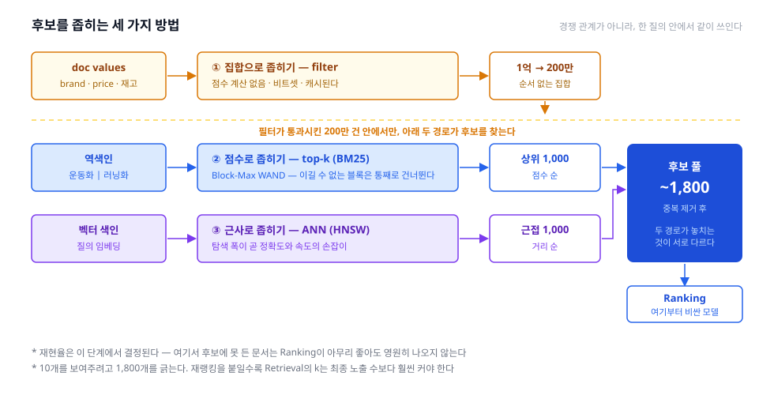

파이프라인의 세 번째, Retrieval(후보 생성) 편. 여기서부터 **규모가 줄기 시작한다** — 수억 건에서 수천 건으로.

## 1. 정의
- 색인에서 "관련 있을 법한" 문서를 **싼 연산으로** 긁어오는 단계. 파이프라인에서 유일하게 **전체 코퍼스를 상대**하는 구간이다
- 목표가 다음 단계와 다르다. 여기서 중요한 것은 **재현율(recall)** — 정답을 후보 안에 넣기만 하면 된다. **순서는 Ranking의 일**이다
- 핵심 제약: **여기서 놓친 문서는 아래에서 복구되지 않는다.** overview에서 말한 파이프라인의 비대칭이 실제로 결정되는 지점이 여기다
- 재료: 색인(역색인·doc values·벡터 색인) + 구조화된 질의(앞 편의 결과물)

## 2. 종류(비교)
1차 분기는 **어떻게 좁히나**이다. 조건으로 자르는가, 점수로 자르는가, 근사로 자르는가 — 셋은 경쟁 관계가 아니라 **한 질의 안에서 같이 쓰인다.**

- 집합으로 좁히기 (Boolean · Filter) — **조건에 맞나, 안 맞나**
  - 역할 및 정의: `brand=나이키`, `price ≤ 100000` 같은 조건으로 문서를 걸러낸다. 결과는 순위가 아니라 **집합**이다
  - posting list의 교집합·합집합·차집합으로 계산되고, 결과를 비트셋으로 들고 다닌다
  - **점수를 계산하지 않는다**는 것이 결정적이다. 그래서 싸고, **캐시할 수 있다** — 같은 필터가 반복되면 두 번째부터는 거의 공짜다
  - Elasticsearch의 `bool` 쿼리가 이 구분을 그대로 드러낸다: `must`·`should`는 점수를 매기는 query context(캐시 안 됨), `filter`·`must_not`은 점수를 무시하는 filter context(캐시 대상)
  - 장점: 가장 싸고 정확하다. 단점: "얼마나 관련 있나"를 말해 주지 못한다
- 점수로 좁히기 (Top-k) — **점수 상위 k개만**
  - 역할 및 정의: BM25 같은 점수를 매겨 상위 k개만 남긴다. 매칭되는 문서가 100만 건이어도 필요한 건 1,000건뿐이다
  - 순진하게 하면 100만 건 전부 점수를 매겨야 한다. 그래서 **가지치기(pruning)** 가 등장한다
  - **WAND / Block-Max WAND**: posting list의 블록마다 "이 블록이 낼 수 있는 최대 점수"를 미리 적어 둔다. 그 최대치가 현재 k번째 점수보다 낮으면 **블록을 통째로 건너뛴다**. 스킵 리스트는 posting list보다 훨씬 작고 빨라서, 안 읽고 넘기는 것만으로 큰 이득이 난다
  - Lucene 8·Elasticsearch 7부터 기본 동작이다
  - 장점: 관련성 순으로 후보를 만든다. 단점: 건너뛴 만큼 **총 건수를 정확히 셀 수 없어진다** (4장)
- 근사로 좁히기 (ANN) — **벡터 공간의 근접 이웃**
  - 역할 및 정의: 질의 임베딩과 가까운 문서 임베딩을 찾는다. 정확한 최근접은 전수 비교라 불가능하므로 **근사**한다
  - HNSW는 그래프를 따라 탐색하고, IVF는 클러스터 몇 개만 열어 본다. 탐색 폭(`ef_search`·`num_candidates`)이 곧 **정확도와 속도의 손잡이**다
  - 장점: 단어가 겹치지 않아도 후보에 든다 — 렉시컬이 구조적으로 놓치는 것을 건진다. 단점: 재현율이 확률적이다. "왜 이게 안 나왔나"를 설명하기 어렵다
- 여러 경로를 함께 쓴다 (Multi-source candidate generation)
  - 실무의 Retrieval은 하나가 아니다. 렉시컬 top-k와 벡터 ANN을 **병렬로** 돌리고, 여기에 인기 상품·최근 본 상품 같은 경로를 더하기도 한다
  - 각 경로가 놓치는 것이 다르기 때문에, 합치면 재현율이 올라간다
  - 다만 **합치는 방법**(점수 스케일이 다른 목록을 어떻게 섞나)은 그 자체로 큰 주제라 매칭 축의 **Hybrid** 편에서 다룬다

한눈 비교:

|구분|Filter (집합)|Top-k (점수)|ANN (근사)|
|---|---|---|---|
|자르는 기준|조건 충족 여부|점수 상위 k|벡터 거리|
|결과|집합 (순서 없음)|순위 있는 k개|근접 k개|
|점수 계산|안 한다|한다|거리로 대신|
|캐시|가능|어렵다|어렵다|
|사용 색인|doc values · 역색인|역색인|벡터 색인|
|정확성|정확|정확 (상위 k 한정)|**근사**|

## 3. 사용 예시
- Elasticsearch `bool` 쿼리 — 네 절이 곧 위의 분류다
  - `must` / `should` — 점수를 매긴다. 관련성에 기여
  - `filter` / `must_not` — 점수를 무시하고 걸러내기만. **캐시된다**
  - 실무 규칙은 단순하다: **점수에 기여해야 할 것만 `must`에, 나머지는 전부 `filter`에** 넣는다
- 가지치기
  - Lucene의 **Block-Max WAND** — 기본으로 켜져 있다. 개발자가 할 일은 이걸 방해하지 않는 것뿐
  - `track_total_hits: false`(또는 기본값 10,000) — 정확한 총 건수를 요구하지 않아야 가지치기가 작동한다
  - `terminate_after` — 샤드별로 문서 몇 건을 본 뒤 강제로 멈춘다. 최후의 수단
- 벡터
  - Elasticsearch `knn` 절의 `num_candidates` — 샤드별로 몇 개까지 탐색할지. 크게 잡으면 재현율이 오르고 느려진다
  - `filter`와 함께 쓰는 것이 까다롭다. 필터를 먼저 적용하면 그래프 탐색이 끊기고, 나중에 적용하면 k개가 다 걸러질 수 있다 (pre-filter vs post-filter)
- 후보 수 정하기
  - Elasticsearch는 샤드마다 `from + size`를 모아 coordinating node에서 합친다 — 샤드가 많을수록 실제로 읽는 문서가 늘어난다
  - 재랭킹을 붙일 거라면 Retrieval의 k는 최종 노출 수보다 훨씬 커야 한다 (10개 보여주려고 1,000개를 긁는다)

## 4. 참고
1. 재현율은 여기서 결정된다
- Retrieval이 놓친 문서는 Ranking에도, Re-ranking에도 존재하지 않는다. **아래 단계는 순서만 바꿀 뿐 없는 것을 만들지 못한다**
- 그래서 검색 품질 조사는 항상 여기부터 본다 — "순위가 나쁜가"보다 "**애초에 후보에 있었나**"를 먼저 확인해야 한다
- 후보 안에 정답이 있었는지 재는 지표가 **Recall@k**다. 평가 편에서 다시 나온다

2. 정확한 총 건수는 비싸다
- "약 12,345건" 같은 숫자를 정확히 내려면 매칭되는 문서를 **전부** 세야 하고, 그러면 가지치기가 무의미해진다
- Lucene 8이 Block-Max WAND를 넣으면서 총 건수를 기본으로 포기한 것이 이 때문이다. Elasticsearch도 기본값이 "10,000건 이상"에서 멈춘다
- 검색이 빠른 대신 정확한 건수를 잃었다 — 시리즈에서 반복되는 그 맞바꿈이 여기서도 나타난다
- 실무 결론: **총 건수를 요구하지 마라.** 페이지네이션도 "다음 페이지 있음" 정도면 충분한 경우가 많다

3. `filter`에 넣을 것을 `must`에 넣지 마라
- 재고 여부나 카테고리 같은 조건은 관련성과 무관하다. `must`에 넣으면 점수를 계산하느라 느려지고 캐시도 못 쓴다
- 반대로 진짜 관련성 신호를 `filter`에 넣으면 점수가 사라져 순위가 무너진다
- 이 구분이 Elasticsearch 성능 튜닝에서 가장 자주 나오는 항목인 이유

4. 다음 편 예고
- 후보 수천 건이 준비됐다. 이제 비싼 모델을 써도 되는 구간이다 → **Ranking**
- 여러 경로에서 나온 목록을 어떻게 하나로 합치는가 → 매칭 축의 **Hybrid**
- 후보에 정답이 들어 있었는지 재는 법 → 평가 축의 **Evaluation**

## 5. 링크
- 개요
  - [Boolean model of information retrieval — Wikipedia](https://en.wikipedia.org/wiki/Boolean_model_of_information_retrieval)
  - [Okapi BM25 — Wikipedia](https://en.wikipedia.org/wiki/Okapi_BM25)
- Boolean · 필터
  - [Boolean query | Elasticsearch Reference](https://www.elastic.co/docs/reference/query-languages/query-dsl/query-dsl-bool-query) — query context vs filter context
- Top-k 가지치기
  - [Faster Retrieval of Top Hits in Elasticsearch with Block-Max WAND | Elastic Blog](https://www.elastic.co/blog/faster-retrieval-of-top-hits-in-elasticsearch-with-block-max-wand)
  - [What's new in Apache Lucene 8 | Elastic Blog](https://www.elastic.co/blog/whats-new-in-lucene-8) — 총 건수를 포기한 배경
  - [MAXSCORE & block-max MAXSCORE | Elasticsearch Labs](https://www.elastic.co/search-labs/blog/more-skipping-with-bm-maxscore)
- 벡터
  - [kNN search in Elasticsearch | Elastic Docs](https://www.elastic.co/docs/solutions/search/vector/knn) — `num_candidates`, 필터와의 조합
